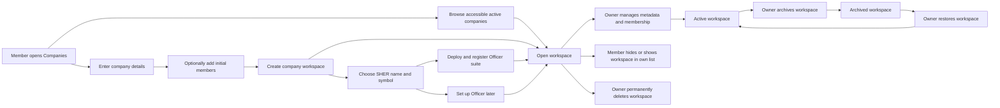

# Companies and Workspace — User Stories

**Scope:** Finding, creating, opening, managing, pausing, hiding, and permanently deleting a company workspace, including its initial
Officer-contract setup and membership

**Last reviewed:** 2026-08-27

These acceptance criteria follow the
[feature documentation review contract](../../platform/feature-specification-guide.md#human-review-contract).

## Product Model

- A **company workspace** is a company represented by the technical `team` record. Members can discover it from the Companies route and open
  it at `/teams/:id`; this document uses _company_ for the product outcome and _team_ only for technical identifiers.
- A **company owner** is the connected creator. The owner can change the company metadata, manage membership, archive or restore the
  workspace, and delete it. A **company member** can open its workspace and choose whether it appears in their own Companies list.
- **Hidden** is a per-member list preference: it does not change the workspace or another member's list. **Archived** is a workspace
  lifecycle state: it removes the company from the normal list and freezes company writes until its owner restores it.
- The connected creator becomes the company owner and is added to the company's members. A company can share a display name with another
  company; the backend assigns a unique slug for routing and storage.
- The Companies client always requests the connected member's explicitly scoped list. Platform-wide company inspection is an
  administrator-only Backoffice capability, not another way for a member to discover companies.
- Initial **Officer-contract setup** is separate from company creation. The owner supplies the SHER name and symbol, deploys the Officer
  suite, and registers the resulting Officer generation with the company.
- The owner may defer Officer setup or Safe setup. Safe deployment and import are documented by
  [US-SAFE-001](../accounts/README.md#us-safe-001-set-up-a-safe).
- The shared `/teams/:id/...` route namespace also hosts feature-specific child routes. Community Credit's optional round-view segment is
  specified in the [Community Credit documentation](../community-credit/README.md).

## Lifecycle

## Status Overview

| User Story       | Title                                     | Actor           | Status  |
| ---------------- | ----------------------------------------- | --------------- | ------- |
| US-COMPANIES-001 | Create a company workspace                | Company creator | ✅ Done |
| US-COMPANIES-002 | Deploy the initial Officer contract suite | Company owner   | ✅ Done |
| US-COMPANIES-003 | Browse and open my companies              | Company member  | ✅ Done |
| US-COMPANIES-004 | Update company details                    | Company owner   | ✅ Done |
| US-COMPANIES-005 | Manage company members                    | Company owner   | ✅ Done |
| US-COMPANIES-006 | Archive or restore a company              | Company owner   | ✅ Done |
| US-COMPANIES-007 | Control my company-list visibility        | Company member  | ✅ Done |
| US-COMPANIES-008 | Permanently delete a company              | Company owner   | ✅ Done |

## Test Coverage Overview

Representative counts below come from direct `AC-US-*` references in tracked tests. They show evidence by layer, not exhaustive coverage or
the result of the latest test run. E2E status is assessed against the stated integration boundary.

| User Story       | Representative AC Coverage              | E2E Status | E2E Boundary                                                   |
| ---------------- | --------------------------------------- | ---------- | -------------------------------------------------------------- |
| US-COMPANIES-001 | integrated E2E 3/8 · mocked browser 4/8 | 🚧 Partial | Real backend and PostgreSQL on the main path; mocked variants  |
| US-COMPANIES-002 | integrated E2E 3/8 · mocked browser 2/8 | 🚧 Partial | Real local-chain deployment on the main path; mocked variants  |
| US-COMPANIES-003 | integrated E2E 2/9 · backend 2/9        | 🚧 Partial | Real browser, backend, and PostgreSQL                          |
| US-COMPANIES-004 | integrated E2E 1/6 · mocked browser 1/6 | 🚧 Partial | Real persistence on the main path; mocked validation variant   |
| US-COMPANIES-005 | integrated E2E 3/10                     | 🚧 Partial | Two real browser identities, backend, and PostgreSQL           |
| US-COMPANIES-006 | integrated E2E 3/7 · backend 1/7        | 🚧 Partial | Real browser, backend, and PostgreSQL                          |
| US-COMPANIES-007 | integrated E2E 2/6 · backend 1/6        | 🚧 Partial | Real browser, member-scoped backend state, and PostgreSQL      |
| US-COMPANIES-008 | integrated E2E 3/6                      | 🚧 Partial | Real browser, backend, and permanent PostgreSQL record removal |

## US-COMPANIES-001: Create a Company Workspace

**As a** company creator\
**I want to** create a workspace and choose its initial members\
**So that** I can begin managing my company in CNC Portal

### Acceptance Criteria

#### Happy Path

- [x] `AC-US-COMPANIES-001-01` A creator can enter a required company name and an optional description.
- [x] `AC-US-COMPANIES-001-02` A creator can add zero or more members by wallet address before creating the workspace.
- [x] `AC-US-COMPANIES-001-03` A successful creation adds the creator as company owner and member, persists the workspace, and advances to
      initial Officer setup.

#### Business Rules

- [x] `AC-US-COMPANIES-001-04` A company name is required before the form can advance or submit.
- [x] `AC-US-COMPANIES-001-05` Every selected member address must be a valid wallet address before the workspace can be created.
- [x] `AC-US-COMPANIES-001-06` Companies with the same display name remain distinguishable by a generated unique slug.

#### Edge & Error Cases

- [x] `AC-US-COMPANIES-001-07` Returning to the previous setup step preserves the entered company details.
- [x] `AC-US-COMPANIES-001-08` A failed create request leaves the setup form available and reports that the company was not created.

**Dependencies:** Connected user with a portal account

## US-COMPANIES-002: Deploy the Initial Officer Contract Suite

**As a** company owner\
**I want to** deploy and register the initial Officer contract suite\
**So that** my company can use CNC Portal's contract-backed features

### Acceptance Criteria

#### Happy Path

- [x] `AC-US-COMPANIES-002-01` A company owner can enter the initial SHER name and symbol after the workspace is created.
- [x] `AC-US-COMPANIES-002-02` A successful deployment registers the deployed Officer address and deployment metadata with the company.
- [x] `AC-US-COMPANIES-002-03` After registration, the portal refreshes Officer data and continues to the Safe-setup step.

#### Business Rules

- [x] `AC-US-COMPANIES-002-04` Both the SHER name and symbol are required before deployment can start.
- [x] `AC-US-COMPANIES-002-05` An archived company cannot start the deployment.
- [x] `AC-US-COMPANIES-002-06` The owner can defer the Officer deployment and return to it later.

#### Edge & Error Cases

- [x] `AC-US-COMPANIES-002-07` A failed on-chain deployment is shown in the deployment step without advancing the setup flow.
- [x] `AC-US-COMPANIES-002-08` A failed Officer registration is shown separately from a failed deployment and does not report setup success.

**Dependencies:** US-COMPANIES-001, a connected wallet, and the active network

## US-COMPANIES-003: Browse and Open My Companies

**As a** company member\
**I want to** find and open the companies I belong to\
**So that** I can enter the workspace I need to use

### Acceptance Criteria

#### Happy Path

- [x] `AC-US-COMPANIES-003-01` A member can view their active, visible companies and open one workspace from the Companies route.
- [x] `AC-US-COMPANIES-003-02` An opened workspace exposes the company metadata, members, lifecycle state, and the feature-specific
      workspace routes available to that company.
- [x] `AC-US-COMPANIES-003-03` A member can include hidden and archived companies when browsing their list.

#### Business Rules

- [x] `AC-US-COMPANIES-003-04` The Companies list is scoped to the connected member; a member cannot request another member's company list
      or an unfiltered platform-wide list. _(API)_
- [x] `AC-US-COMPANIES-003-05` The company-detail API permits a current member to read the workspace and rejects a requester who is not a
      member.
- [x] `AC-US-COMPANIES-003-06` A hidden or archived state remains visible when that company is included in the member's list.

#### Edge & Error Cases

- [x] `AC-US-COMPANIES-003-07` A member with no matching companies receives an empty result instead of a stale workspace entry.
- [x] `AC-US-COMPANIES-003-08` A failed company-list request reports that the list could not be retrieved.
- [x] `AC-US-COMPANIES-003-09` An unavailable workspace distinguishes a removed or unknown company from another loading failure.

**Dependencies:** Connected user with a portal account

## US-COMPANIES-004: Update Company Details

**As a** company owner\
**I want to** update my company's name and description\
**So that** its workspace remains accurate

### Acceptance Criteria

#### Happy Path

- [x] `AC-US-COMPANIES-004-01` An owner can save updated company metadata and see it reflected in the workspace and Companies list.

#### Business Rules

- [x] `AC-US-COMPANIES-004-02` Only the company owner can update company metadata.
- [x] `AC-US-COMPANIES-004-03` Company metadata must pass the update form's validation before it is submitted.
- [x] `AC-US-COMPANIES-004-04` An archived company must be restored before its metadata can be changed.

#### Edge & Error Cases

- [x] `AC-US-COMPANIES-004-05` A rejected metadata update leaves the company unchanged and keeps the update action available with an error.
- [x] `AC-US-COMPANIES-004-06` An update against an unavailable company is rejected without creating a replacement workspace.

**Dependencies:** US-COMPANIES-003

## US-COMPANIES-005: Manage Company Members

**As a** company owner\
**I want to** add or remove company members\
**So that** the workspace has the right participants

### Acceptance Criteria

#### Happy Path

- [x] `AC-US-COMPANIES-005-01` A member can inspect the current company membership from the workspace.
- [x] `AC-US-COMPANIES-005-02` An owner can add one or more eligible users who are not already members.
- [x] `AC-US-COMPANIES-005-03` An owner can remove an existing member other than the company owner.

#### Business Rules

- [x] `AC-US-COMPANIES-005-04` Only the company owner can add or remove members.
- [x] `AC-US-COMPANIES-005-05` Each added member must provide a valid wallet address and cannot already belong to the company.
- [x] `AC-US-COMPANIES-005-06` The company owner cannot be removed from its own workspace.
- [x] `AC-US-COMPANIES-005-07` An archived company cannot add or remove members.

#### Edge & Error Cases

- [x] `AC-US-COMPANIES-005-08` A request that includes an existing member is rejected without reporting that the member was added.
- [x] `AC-US-COMPANIES-005-09` A request to remove a missing member or the company owner is rejected without changing membership.
- [x] `AC-US-COMPANIES-005-10` A rejected membership change preserves the current membership list and reports the failure.

**Dependencies:** US-COMPANIES-003

## US-COMPANIES-006: Archive or Restore a Company

**As a** company owner\
**I want to** archive or restore a company\
**So that** I can pause its operations without deleting it

### Acceptance Criteria

#### Happy Path

- [x] `AC-US-COMPANIES-006-01` An owner can archive an active company and later restore the same company.
- [x] `AC-US-COMPANIES-006-02` An archived company is excluded from the default Companies list and remains available when archived companies
      are included.
- [x] `AC-US-COMPANIES-006-03` Restoring a company returns it to the active Companies list and re-enables its writes.

#### Business Rules

- [x] `AC-US-COMPANIES-006-04` Only the company owner can archive or restore a company.
- [x] `AC-US-COMPANIES-006-05` Archiving freezes company settings, membership, contract operations, and claims until the company is
      restored.

#### Edge & Error Cases

- [x] `AC-US-COMPANIES-006-06` A member can still change their own list visibility for an archived company without changing its archived
      state.
- [x] `AC-US-COMPANIES-006-07` A request to change other company data while archived is rejected without applying that change.

**Dependencies:** US-COMPANIES-003

## US-COMPANIES-007: Control My Company-List Visibility

**As a** company member\
**I want to** hide or show a company in my Companies list\
**So that** I can focus on the workspaces relevant to me

### Acceptance Criteria

#### Happy Path

- [x] `AC-US-COMPANIES-007-01` A member can hide a company from their own default list and show it again later.
- [x] `AC-US-COMPANIES-007-02` A member can include hidden companies while browsing, so a hidden workspace remains recoverable.

#### Business Rules

- [x] `AC-US-COMPANIES-007-03` A visibility change applies only to the requesting member's relationship with the company.
- [x] `AC-US-COMPANIES-007-04` Every current company member can change their own list visibility, including for an archived company.

#### Edge & Error Cases

- [x] `AC-US-COMPANIES-007-05` A request from someone who is not a member is rejected without changing company visibility.
- [x] `AC-US-COMPANIES-007-06` A visibility change for an unavailable company is rejected without creating a new list preference.

**Dependencies:** US-COMPANIES-003

## US-COMPANIES-008: Permanently Delete a Company

**As a** company owner\
**I want to** permanently delete a company\
**So that** a workspace that is no longer needed is removed

### Acceptance Criteria

#### Happy Path

- [x] `AC-US-COMPANIES-008-01` An owner can confirm permanent deletion of a company and is returned to the Companies list after it succeeds.
- [x] `AC-US-COMPANIES-008-02` Deleting a company removes its related company records through the database's cascading relationships.

#### Business Rules

- [x] `AC-US-COMPANIES-008-03` Only the company owner can permanently delete a company.
- [x] `AC-US-COMPANIES-008-04` Permanent deletion is irreversible; a member must create a new workspace instead of restoring a deleted
      company.

#### Edge & Error Cases

- [x] `AC-US-COMPANIES-008-05` Cancelling the confirmation leaves the company unchanged.
- [x] `AC-US-COMPANIES-008-06` A rejected deletion leaves the company available and reports the failure.

**Dependencies:** US-COMPANIES-003

## Human Validation

Validated on 2026-08-27 against the reviewed Companies journeys, role and archived-state boundaries, and the implementation evidence below.
This validation does not attest to a live on-chain Officer deployment.

## Implementation Evidence

**Implementation evidence reviewed against:** `a6fa691863eadd41c14ae6bf7a2ff13c1324fd13`

- [Member deletion](../../../app/src/components/sections/DashboardView/DeleteMemberModal.vue),
  [team state](../../../app/src/stores/teamStore.ts), and
  [archived-team mutation errors](../../../app/src/composables/useArchivedTeamMutationError.ts)
- [Companies list and action routing](../../../app/src/views/team/ListIndex.vue),
  [list-owned treasury preparation](../../../app/src/composables/useTeamListTreasuryBalances.ts),
  [company-card display model](../../../app/src/utils/teams/treasury.ts),
  [company card permissions](../../../app/src/components/sections/TeamView/TeamCard.vue), and
  [list action tests](../../../app/src/views/team/__tests__/ListIndex.actions.spec.ts)
- [Workspace route and unavailable-state handling](../../../app/src/views/team/%5Bid%5D/ShowIndex.vue),
  [company queries](../../../app/src/queries/team.queries.ts), [company endpoints](../../../backend/src/routes/teamRoutes.ts), and
  [company controller](../../../backend/src/controllers/teamController.ts)
- [Company-creation form](../../../app/src/components/sections/TeamView/forms/AddTeamForm.vue),
  [request validation](../../../backend/src/validation/schemas/team.ts), and
  [company-creation tests](../../../app/src/components/sections/TeamView/forms/__tests__/AddTeamForm.spec.ts)
- [Company slug generation](../../../backend/src/utils/slug.util.ts) and
  [slug-generation tests](../../../backend/src/utils/__tests__/slug.util.test.ts)
- [Initial Officer setup](../../../app/src/components/sections/TeamView/forms/InvestorContractStep.vue),
  [Officer deployment composable](../../../app/src/composables/contracts/useOfficerDeployment.ts), and
  [initial Officer setup tests](../../../app/src/components/sections/TeamView/forms/__tests__/InvestorContractStep.spec.ts)
- [Company header and its lifecycle actions](../../../app/src/components/sections/DashboardView/TeamMetaSection.vue),
  [company metadata update](../../../app/src/components/sections/DashboardView/TeamMetaUpdateModal.vue),
  [archive and restore](../../../app/src/components/sections/DashboardView/TeamMetaArchiveModal.vue),
  [member visibility](../../../app/src/components/sections/DashboardView/TeamMetaVisibilityModal.vue), and
  [company deletion](../../../app/src/components/sections/DashboardView/TeamMetaDeleteModal.vue)
- [Member management](../../../app/src/components/sections/DashboardView/MemberSection.vue),
  [member controller](../../../backend/src/controllers/memberController.ts), and
  [archived-workspace action tests](../../../app/src/components/sections/DashboardView/__tests__/TeamMetaActions.archived.spec.ts)
- [Archived-workspace authorization](../../../backend/src/middleware/teamAuthzMiddleware.ts) and
  [company-controller tests](../../../backend/src/controllers/__tests__/teamController.test.ts)
- [Integrated company lifecycle E2E](../../../app/test/e2e/company/company.integrated.spec.ts), which exercises only user-accessible actions
  against externally prepared backend, database, and chain infrastructure
- [Mocked company browser variants](../../../app/test/e2e/company/company.mocked.spec.ts), which cover validation and injected failures
  without being counted as integrated E2E evidence
- Additional stub-driven browser variants: [details update](../../../app/test/e2e/company/company-update.spec.ts),
  [archive and restore](../../../app/test/e2e/company/company-archive.spec.ts),
  [list visibility](../../../app/test/e2e/company/company-visibility.spec.ts), and
  [deletion](../../../app/test/e2e/company/company-delete.spec.ts), driven by the
  [lifecycle backend stub](../../../app/test/e2e/company/company-lifecycle-page.ts) for the owner and member roles

## Related Documentation

- [Accounts](../accounts/README.md)
- [Contract Management](../contract-management/README.md)
- [Community Credit](../community-credit/README.md)
- [Product feature inventory](../README.md)

_[← Back to feature inventory](../README.md)_
