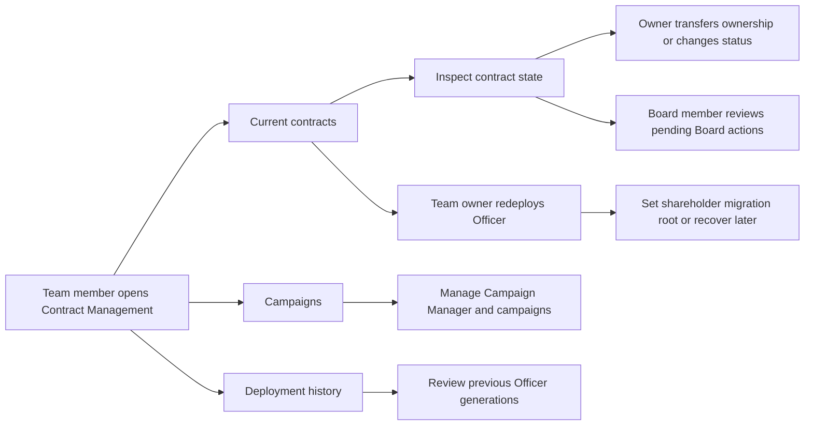

# Contract Management — User Stories

**Scope:** The current-contract, campaign-management, and deployment-history journeys exposed by the portal

**Last reviewed:** Not yet reviewed

These acceptance criteria follow the
[feature documentation review contract](../../platform/feature-specification-guide.md#human-review-contract).

## Product Model

- An **Officer generation** groups the contracts currently used by a team. Its current suite excludes Campaign Manager contracts, which have
  their own management journey.
- A team member can inspect the suite. A direct owner action is available only to the current contract owner; when the Board of Directors
  owns the contract, a Board member manages the action through the Board workflow.
- A **pending Board action** is an action awaiting review or approval. It is distinct from a direct owner action and can be executed only
  under the Board contract's rules.
- A **Campaign Manager** defines advertising rates and the Bank destination for validated advertising spend. It is managed separately from
  the current contract suite.
- A previous Officer generation remains available as deployment history. It is not the active suite used for current operations.
- **Redeploying an Officer** creates a new Officer generation and its workspace contracts. The previous generation remains in deployment
  history, while the team's Safe is not changed by this action.

## Lifecycle

## Status Overview

| User Story      | Title                              | Actor                  | Status         |
| --------------- | ---------------------------------- | ---------------------- | -------------- |
| US-CONTRACT-001 | Review the current contract suite  | Team member            | 🧪 Validation  |
| US-CONTRACT-002 | Manage current contract operations | Owner / Board member   | 🧪 Validation  |
| US-CONTRACT-003 | Manage advertising campaigns       | Authorized team member | 🚧 In Progress |
| US-CONTRACT-004 | Review deployment history          | Team member            | 🚧 In Progress |
| US-CONTRACT-005 | Redeploy an Officer generation     | Team owner             | 🧪 Validation  |

## US-CONTRACT-001: Review the Current Contract Suite

**As a** team member\
**I want to** inspect the active Officer generation and its contracts\
**So that** I can understand the contracts currently used by the team

### Acceptance Criteria

#### Happy Path

- [x] A team member can view the active Officer address, its version, and its current non-Campaign contracts.
- [x] A team member can filter the current contract suite by active or paused status.
- [x] A team member can inspect a contract's address, owner, deployer, current status, and available on-chain read data.

#### Business Rules

- [x] Campaign Manager contracts are managed through the Campaigns journey rather than the current contract suite.
- [x] A contract's paused or active status remains distinguishable in the current suite.

#### Edge & Error Cases

- [x] A team without an active Officer generation receives an unavailable-state message instead of a contract table.
- [x] A failed Officer-generation history read is reported without hiding the current team contracts.

**Status:** 🧪 Validation

**Dependencies:** Current team and its active Officer generation

## US-CONTRACT-002: Manage Current Contract Operations

**As a** current contract owner or eligible Board member\
**I want to** transfer ownership, change contract status, and review pending Board actions\
**So that** the team can safely maintain its active contract suite

### Acceptance Criteria

#### Happy Path

- [x] An eligible user can transfer ownership of a current contract to a selected recipient.
- [x] An eligible user can pause an active contract or resume a paused contract.
- [x] An eligible Board member can open, review, and approve pending Board actions for a contract.
- [x] A successful direct operation refreshes the displayed contract state.

#### Business Rules

- [x] Direct contract actions are unavailable to users who are neither the current owner nor an eligible Board member for a Board-owned
      contract.
- [x] A Board-owned contract uses a Board action for an ownership transfer instead of a direct ownership write.
- [x] An archived team cannot initiate a contract operation or approve a pending Board action.

#### Edge & Error Cases

- [x] Rejecting a wallet request does not report a successful contract operation.
- [x] A failed direct ownership transfer is shown in the transfer context without changing the displayed owner.

**Status:** 🧪 Validation

**Dependencies:** US-CONTRACT-001, current contract permissions, and a connected wallet

## US-CONTRACT-003: Manage Advertising Campaigns

**As an** authorized team member\
**I want to** manage the Campaign Manager and its advertising campaigns\
**So that** validated advertising spend uses the intended rates and Bank destination

### Acceptance Criteria

#### Happy Path

- [ ] A user can identify the Campaign Manager configured for the team.
- [ ] An authorized user can manage Campaign Manager administrators and settings.
- [ ] An authorized user can create, review, and close advertising campaigns.

#### Business Rules

- [ ] Campaign Manager rates and Bank destination determine how validated advertising spend is handled.

#### Edge & Error Cases

- [ ] A team without a Campaign Manager receives an actionable unavailable-state message.

**Status:** 🚧 In Progress

**Dependencies:** Current team and a configured Campaign Manager

## US-CONTRACT-004: Review Deployment History

**As a** team member\
**I want to** review previous Officer generations\
**So that** I can understand the team's contract deployment history

### Acceptance Criteria

#### Happy Path

- [ ] A team member can view previous Officer generations separately from the active suite.

#### Business Rules

- [ ] Previous generations are not presented as contracts currently used for team operations.

#### Edge & Error Cases

- [ ] An empty deployment history remains distinguishable from a failed history read.

**Status:** 🚧 In Progress

**Dependencies:** Current team and the Officer-generation history read

## US-CONTRACT-005: Redeploy an Officer Generation

**As a** team owner\
**I want to** replace the active Officer generation with a new one\
**So that** the team can continue using a fresh set of workspace contracts

### Acceptance Criteria

#### Happy Path

- [x] The team owner can open the redeploy form from the active Officer generation and choose the new share token name and symbol.
- [x] A successful redeploy registers the new Officer generation, refreshes the displayed contract data, and keeps the team's Safe
      unchanged.
- [x] When a previous Officer has shareholders, the owner can sign the follow-up transaction that sets the migration root for the new
      Investor contract.

#### Business Rules

- [x] The redeploy action is available only to the current team owner and is unavailable for an archived team.
- [x] A previous Officer generation and its workspace contracts remain visible in deployment history; they are not deleted by a
      redeployment.
- [x] A shareholder migration can be skipped after a failure and completed later from the Share Token journey.

#### Edge & Error Cases

- [x] A failed deploy, Officer registration, or follow-up lookup keeps the form open and identifies the step that failed.
- [x] A failed shareholder migration keeps the form open with options to retry the migration or skip it and close the form.

**Status:** 🧪 Validation

**Dependencies:** US-CONTRACT-001, a current team owner, a connected wallet, and an active Officer generation

## Implementation Evidence

- [Contract Management page and Officer-generation derivation](../../../app/src/views/team/%5Bid%5D/ContractManagementView.vue)
- [Current contract section](../../../app/src/components/sections/ContractManagementView/MainContractSection.vue)
- [Current contract actions](../../../app/src/components/sections/ContractManagementView/MainContractActions.vue)
- [Ownership recipient selection](../../../app/src/components/sections/ContractManagementView/forms/TransferOwnershipForm.vue)
- [Ownership transfer behaviour](../../../app/src/composables/contracts/useContractOwnershipTransfer.ts)
- [Contract-status behaviour](../../../app/src/composables/contracts/useContractStatusChange.ts)
- [Pending Board-action behaviour](../../../app/src/components/sections/ContractManagementView/MainContractActions.vue)
- [Campaign Management section](../../../app/src/components/sections/ContractManagementView/AdvertiseContractSection.vue)
- [Advertising campaign workspace](../../../app/src/components/sections/ContractManagementView/AdvertisingCampaignWorkspace.vue)
- [Deployment history section](../../../app/src/components/sections/ContractManagementView/DeploymentHistorySection.vue)
- [Officer redeploy entry point](../../../app/src/components/sections/ContractManagementView/MainContractSection.vue)
- [Officer redeploy form and recovery actions](../../../app/src/components/sections/ContractManagementView/RedeployOfficerModal.vue)
- [Officer redeploy workflow](../../../app/src/composables/contracts/useOfficerRedeploy.ts)
- [Current contract action tests](../../../app/src/components/sections/ContractManagementView/__tests__/MainContractActions.spec.ts)
- [Officer redeploy form tests](../../../app/src/components/sections/ContractManagementView/__tests__/RedeployOfficerModal.spec.ts)
- [Officer redeploy workflow tests](../../../app/src/composables/contracts/__tests__/useOfficerRedeploy.spec.ts)
- [Officer redeploy migration recovery tests](../../../app/src/composables/contracts/__tests__/useOfficerRedeploy.retry.spec.ts)

## Related Documentation

- [Contract feature documentation](../../contracts/features/README.md)
- [Shared member-selection implementation](../../implementation/member-selection/README.md)
- [Product feature inventory](../README.md)
