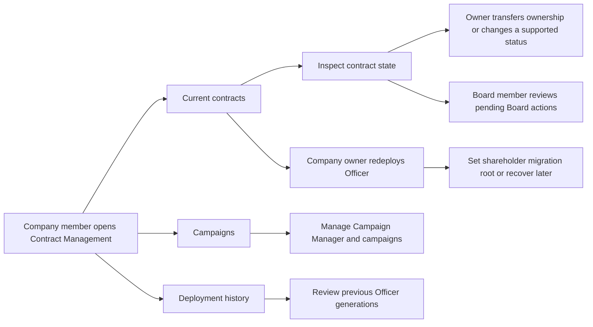

# Contract Management — User Stories

**Scope:** The current-contract, campaign-management, and deployment-history journeys exposed by the portal

**Last reviewed:** Not yet reviewed

These acceptance criteria follow the
[feature documentation review contract](../../platform/feature-specification-guide.md#human-review-contract).

## Product Model

- An **Officer generation** groups the contracts currently used by a company. Its current suite excludes Campaign Manager contracts, which
  have their own management journey.
- A company member can inspect the suite. A direct owner action is available only to the current contract owner; when the Board of Directors
  owns the contract, a Board member manages the action through the Board workflow.
- A **pending Board action** is an action awaiting review or approval. It is distinct from a direct owner action and can be executed only
  under the Board contract's rules.
- A contract's **pause capability** is an explicit policy for its Officer generation. The policy records whether pause is supported, the
  protected operation scope, and the selectors used to read and change the state; ABI presence alone is not sufficient evidence.
- The current suite reports pause state as **Active**, **Paused**, **Not supported**, or **Unavailable**. Active and Paused require a
  successful supported-state read. An unknown generation, a missing capability, or a failed read is Unavailable and exposes no status
  action.
- A **Campaign Manager** defines advertising rates and the Bank destination for validated advertising spend. It is managed separately from
  the current contract suite.
- A previous Officer generation remains available as deployment history. It is not the active suite used for current operations.
- **Redeploying an Officer** creates a new Officer generation and its workspace contracts. The previous generation remains in deployment
  history, while the company's Safe is not changed by this action.

## Lifecycle

```mermaid
flowchart LR
    Member[Company member opens Contract Management] --> Current[Current contracts]
    Member --> Campaigns[Campaigns]
    Member --> History[Deployment history]

    Current --> Inspect[Inspect contract state]
    Inspect --> Direct[Owner transfers ownership or changes a supported status]
    Inspect --> Board[Board member reviews pending Board actions]
    Current --> Redeploy[Company owner redeploys Officer]
    Redeploy --> Migration[Set shareholder migration root or recover later]

    Campaigns --> CampaignManager[Manage Campaign Manager and campaigns]
    History --> Previous[Review previous Officer generations]
```

## Status Overview

| User Story      | Title                              | Actor                     | Status         |
| --------------- | ---------------------------------- | ------------------------- | -------------- |
| US-CONTRACT-001 | Review the current contract suite  | Company member            | 🧪 Validation  |
| US-CONTRACT-002 | Manage current contract operations | Owner / Board member      | 🧪 Validation  |
| US-CONTRACT-003 | Manage advertising campaigns       | Authorized company member | 🚧 In Progress |
| US-CONTRACT-004 | Review deployment history          | Company member            | 🧪 Validation  |
| US-CONTRACT-005 | Redeploy an Officer generation     | Company owner             | 🧪 Validation  |

## Test Coverage Overview

Coverage targets compare each criterion with its required representative evidence. Static references are not a current passing run; the
generated coverage report and CI retain file-level and execution evidence. Known assertion gaps remain insufficient even when a static
reference has the expected layer label.

| User Story      | Main Journey | Coverage Target | Gaps                       |
| --------------- | ------------ | --------------- | -------------------------- |
| US-CONTRACT-001 | ⬜ Planned   | ❌ 0/10 met     | `AC-US-CONTRACT-001-01–10` |
| US-CONTRACT-002 | ⬜ Planned   | ❌ 0/12 met     | `AC-US-CONTRACT-002-01–12` |
| US-CONTRACT-003 | ⬜ Planned   | ❌ 0/6 met      | `AC-US-CONTRACT-003-01–06` |
| US-CONTRACT-004 | ⬜ Planned   | ❌ 0/9 met      | `AC-US-CONTRACT-004-01–09` |
| US-CONTRACT-005 | ⬜ Planned   | ❌ 0/11 met     | `AC-US-CONTRACT-005-01–11` |

## Proof Strategy Reference

| Strategy               | Responsibilities              | Required Evidence        | Proof Rationale                                                               |
| ---------------------- | ----------------------------- | ------------------------ | ----------------------------------------------------------------------------- |
| `PS-FRONTEND`          | Frontend                      | Frontend                 | The client owns deterministic filtering, validation, and presentation.        |
| `PS-BROWSER`           | Frontend                      | Mocked browser           | A controlled browser branch must establish interaction or failure behaviour.  |
| `PS-API`               | Frontend + Backend            | Integrated E2E           | Generation selection and persisted visible state must agree after refresh.    |
| `PS-BROWSER-BACKEND`   | Frontend + Backend            | Mocked browser + Backend | Client availability and API authorization can fail independently.             |
| `PS-FULL-STACK`        | Frontend + Backend + Contract | Integrated E2E           | Deployment, registration, and browser and chain state must agree.             |
| `PS-CONTRACT`          | Contract                      | Contract                 | Authority invariants must hold independently of the portal.                   |
| `PS-CHAIN-READ`        | Frontend + Contract           | Integrated E2E           | Displayed data must match live reads from the selected generation.            |
| `PS-CHAIN-WRITE`       | Frontend + Contract           | Integrated E2E           | A wallet operation must change chain state and the refreshed portal.          |
| `PS-BOARD`             | Frontend + Contract           | Integrated E2E           | Proposal, approval, and execution must be distinguished from an owner write.  |
| `PS-CAMPAIGN`          | Frontend + Contract           | Integrated E2E           | Campaign actions must produce the intended persisted campaign state.          |
| `PS-RECOVERY`          | Frontend + Contract           | Integrated E2E           | Recovery must reduce historic balances and credit the current Bank.           |
| `PS-FRONTEND-CONTRACT` | Frontend + Contract           | Frontend + Contract      | Portal guard and on-chain owner restriction can fail independently.           |
| `PS-MIGRATION-LATER`   | Frontend + Backend + Contract | Integrated E2E           | A skipped migration must remain recoverable in the later Share Token journey. |

## US-CONTRACT-001: Review the Current Contract Suite

**As a** company member\
**I want to** inspect the active Officer generation and its contracts\
**So that** I can understand the contracts currently used by the company

### Acceptance Criteria

#### Happy Path

- [x] `AC-US-CONTRACT-001-01` A company member can view the active Officer address, its version, and its current non-Campaign contracts.
- [x] `AC-US-CONTRACT-001-02` A company member can filter the current contract suite by verified active or paused status; unsupported and
      unavailable states remain visible in the unfiltered suite instead of being classified as active.
- [x] `AC-US-CONTRACT-001-03` A company member can inspect a contract's address, owner, deployer, current status, and available on-chain
      read data.

#### Business Rules

- [x] `AC-US-CONTRACT-001-04` Campaign Manager contracts are managed through the Campaigns journey rather than the current contract suite.
- [x] `AC-US-CONTRACT-001-05` A contract's pause state remains distinguishable as active, paused, not supported, or unavailable according to
      its Officer-generation capability and the latest read evidence.

#### Edge & Error Cases

- [x] `AC-US-CONTRACT-001-06` A company without an active Officer generation receives an unavailable-state message instead of a contract
      table.
- [x] `AC-US-CONTRACT-001-07` A failed Officer-generation history read is reported without hiding the current company contracts.
- [x] `AC-US-CONTRACT-001-08` Contract read data distinguishes loading, no eligible reads, partial failure, and total failure, and a failed
      read can be retried.
- [x] `AC-US-CONTRACT-001-09` For contracts that hold value, the current suite distinguishes loading, unavailable, zero, and populated
      balances and exposes the supported-asset breakdown.
- [x] `AC-US-CONTRACT-001-10` An unknown Officer generation, a missing pause capability, or a failed supported-state read is reported as
      unavailable instead of active.

### Test Coverage

| Acceptance Criterion    | Proof Strategy  | Current Evidence | Status        |
| ----------------------- | --------------- | ---------------- | ------------- |
| `AC-US-CONTRACT-001-01` | `PS-API`        | None linked      | ❌ Missing    |
| `AC-US-CONTRACT-001-02` | `PS-FRONTEND`   | Frontend         | 🔎 Unverified |
| `AC-US-CONTRACT-001-03` | `PS-CHAIN-READ` | None linked      | ❌ Missing    |
| `AC-US-CONTRACT-001-04` | `PS-FRONTEND`   | None linked      | ❌ Missing    |
| `AC-US-CONTRACT-001-05` | `PS-FRONTEND`   | Frontend         | 🔎 Unverified |
| `AC-US-CONTRACT-001-06` | `PS-BROWSER`    | None linked      | ❌ Missing    |
| `AC-US-CONTRACT-001-07` | `PS-BROWSER`    | None linked      | ❌ Missing    |
| `AC-US-CONTRACT-001-08` | `PS-FRONTEND`   | Frontend         | 🔎 Unverified |
| `AC-US-CONTRACT-001-09` | `PS-FRONTEND`   | Frontend         | 🔎 Unverified |
| `AC-US-CONTRACT-001-10` | `PS-FRONTEND`   | Frontend         | 🔎 Unverified |

**Dependencies:** Current company and its active Officer generation

## US-CONTRACT-002: Manage Current Contract Operations

**As a** current contract owner or eligible Board member\
**I want to** transfer ownership, change contract status, and review pending Board actions\
**So that** the company can safely maintain its active contract suite

### Acceptance Criteria

#### Happy Path

- [x] `AC-US-CONTRACT-002-01` An eligible user can transfer ownership of a current contract to a selected recipient.
- [x] `AC-US-CONTRACT-002-02` An eligible user can pause an active contract or resume a paused contract when the Officer-generation
      capability explicitly supports the operation and its current state was verified.
- [x] `AC-US-CONTRACT-002-03` An eligible Board member can open, review, and approve pending Board actions for a contract.
- [x] `AC-US-CONTRACT-002-04` A successful direct operation refreshes the displayed contract state.

#### Business Rules

- [x] `AC-US-CONTRACT-002-05` Direct contract actions are unavailable to users who are neither the current owner nor an eligible Board
      member for a Board-owned contract.
- [x] `AC-US-CONTRACT-002-06` A Board-owned contract uses a Board action for an ownership transfer instead of a direct ownership write.
- [x] `AC-US-CONTRACT-002-07` A Board-submitted ownership transfer identifies its approval requirement before submission.
- [x] `AC-US-CONTRACT-002-08` An archived company cannot initiate a contract operation or approve a pending Board action.

#### Edge & Error Cases

- [x] `AC-US-CONTRACT-002-09` Rejecting a wallet request does not report a successful contract operation.
- [x] `AC-US-CONTRACT-002-10` A failed direct ownership transfer is shown in the transfer context without changing the displayed owner.
- [x] `AC-US-CONTRACT-002-11` Transferring the current Investor contract grants ownership, administrator authority, and minter authority to
      the successor atomically; the previous owner loses those two roles while unrelated technical minters remain unchanged. _(contract)_
- [x] `AC-US-CONTRACT-002-12` Contracts whose pause capability is unsupported or unavailable do not expose pause or resume actions.

### Test Coverage

| Acceptance Criterion    | Proof Strategy   | Current Evidence | Status          |
| ----------------------- | ---------------- | ---------------- | --------------- |
| `AC-US-CONTRACT-002-01` | `PS-CHAIN-WRITE` | Frontend         | ⚠️ Insufficient |
| `AC-US-CONTRACT-002-02` | `PS-CHAIN-WRITE` | Frontend         | ⚠️ Insufficient |
| `AC-US-CONTRACT-002-03` | `PS-BOARD`       | Frontend         | ⚠️ Insufficient |
| `AC-US-CONTRACT-002-04` | `PS-CHAIN-WRITE` | Frontend         | ⚠️ Insufficient |
| `AC-US-CONTRACT-002-05` | `PS-FRONTEND`    | Frontend         | 🔎 Unverified   |
| `AC-US-CONTRACT-002-06` | `PS-BOARD`       | Frontend         | ⚠️ Insufficient |
| `AC-US-CONTRACT-002-07` | `PS-FRONTEND`    | Frontend         | 🔎 Unverified   |
| `AC-US-CONTRACT-002-08` | `PS-FRONTEND`    | None linked      | ❌ Missing      |
| `AC-US-CONTRACT-002-09` | `PS-FRONTEND`    | None linked      | ❌ Missing      |
| `AC-US-CONTRACT-002-10` | `PS-FRONTEND`    | Frontend         | 🔎 Unverified   |
| `AC-US-CONTRACT-002-11` | `PS-CONTRACT`    | Contract         | 🔎 Unverified   |
| `AC-US-CONTRACT-002-12` | `PS-FRONTEND`    | Frontend         | 🔎 Unverified   |

**Dependencies:** US-CONTRACT-001, current contract permissions, and a connected wallet

## US-CONTRACT-003: Manage Advertising Campaigns

**As an** authorized company member\
**I want to** manage the Campaign Manager and its advertising campaigns\
**So that** validated advertising spend uses the intended rates and Bank destination

### Acceptance Criteria

#### Happy Path

- [x] `AC-US-CONTRACT-003-01` A user can identify the Campaign Manager configured for the company.
- [x] `AC-US-CONTRACT-003-02` An authorized user can manage Campaign Manager administrators and settings.
- [x] `AC-US-CONTRACT-003-03` An authorized user can create, review, and close advertising campaigns.

#### Business Rules

- [ ] `AC-US-CONTRACT-003-04` Campaign Manager rates and Bank destination determine how validated advertising spend is handled.

#### Edge & Error Cases

- [x] `AC-US-CONTRACT-003-05` A company without a Campaign Manager receives an actionable unavailable-state message.
- [x] `AC-US-CONTRACT-003-06` The campaign workspace distinguishes loading, a failed read with recovery, a confirmed empty result, and
      populated campaigns.

### Test Coverage

| Acceptance Criterion    | Proof Strategy   | Current Evidence | Status        |
| ----------------------- | ---------------- | ---------------- | ------------- |
| `AC-US-CONTRACT-003-01` | `PS-FRONTEND`    | Frontend         | 🔎 Unverified |
| `AC-US-CONTRACT-003-02` | `PS-CAMPAIGN`    | None linked      | ❌ Missing    |
| `AC-US-CONTRACT-003-03` | `PS-CAMPAIGN`    | None linked      | ❌ Missing    |
| `AC-US-CONTRACT-003-04` | Decision pending | None linked      | 📝 Pending    |
| `AC-US-CONTRACT-003-05` | `PS-FRONTEND`    | Frontend         | 🔎 Unverified |
| `AC-US-CONTRACT-003-06` | `PS-FRONTEND`    | Frontend         | 🔎 Unverified |

**Dependencies:** Current company and a configured Campaign Manager

## US-CONTRACT-004: Review Deployment History

**As a** company member\
**I want to** review previous Officer generations\
**So that** I can understand the company's contract deployment history

### Acceptance Criteria

#### Happy Path

- [x] `AC-US-CONTRACT-004-01` A company member can view previous Officer generations separately from the active suite.
- [x] `AC-US-CONTRACT-004-04` An eligible legacy-contract owner can review funded source accounts and move recoverable balances through the
      legacy Officer into the current company Bank.

#### Business Rules

- [x] `AC-US-CONTRACT-004-02` Previous generations are not presented as contracts currently used for company operations.
- [x] `AC-US-CONTRACT-004-05` An archived company cannot start legacy balance recovery.
- [x] `AC-US-CONTRACT-004-06` A wallet that does not own the legacy contracts cannot start balance recovery.
- [x] `AC-US-CONTRACT-004-07` Recovery remains unavailable while the generation is unresolved or unreadable, has no legacy Bank, points to
      the current Bank, or has no recoverable balance.
- [x] `AC-US-CONTRACT-004-08` A generation without full-sweep support offers Bank-only recovery and identifies any funded accounts that the
      operation will leave behind.

#### Edge & Error Cases

- [x] `AC-US-CONTRACT-004-03` An empty deployment history remains distinguishable from a failed history read.
- [x] `AC-US-CONTRACT-004-09` A failed recovery step identifies the failure and can be retried without rebuilding the completed sequence.

### Test Coverage

| Acceptance Criterion    | Proof Strategy         | Current Evidence | Status          |
| ----------------------- | ---------------------- | ---------------- | --------------- |
| `AC-US-CONTRACT-004-01` | `PS-API`               | Frontend         | ⚠️ Insufficient |
| `AC-US-CONTRACT-004-04` | `PS-RECOVERY`          | Frontend         | ⚠️ Insufficient |
| `AC-US-CONTRACT-004-02` | `PS-API`               | None linked      | ❌ Missing      |
| `AC-US-CONTRACT-004-05` | `PS-FRONTEND`          | Frontend         | 🔎 Unverified   |
| `AC-US-CONTRACT-004-06` | `PS-FRONTEND-CONTRACT` | Frontend         | ⚠️ Insufficient |
| `AC-US-CONTRACT-004-07` | `PS-FRONTEND`          | None linked      | ❌ Missing      |
| `AC-US-CONTRACT-004-08` | `PS-FRONTEND`          | Frontend         | 🔎 Unverified   |
| `AC-US-CONTRACT-004-03` | `PS-FRONTEND`          | None linked      | ❌ Missing      |
| `AC-US-CONTRACT-004-09` | `PS-FRONTEND`          | Frontend         | 🔎 Unverified   |

**Dependencies:** Current company and the Officer-generation history read

## US-CONTRACT-005: Redeploy an Officer Generation

**As a** company owner\
**I want to** replace the active Officer generation with a new one\
**So that** the company can continue using a fresh set of workspace contracts

### Acceptance Criteria

#### Happy Path

- [x] `AC-US-CONTRACT-005-01` The company owner can open the redeploy form from the active Officer generation and choose the new share token
      name and symbol.
- [x] `AC-US-CONTRACT-005-02` A successful redeploy registers the new Officer generation, refreshes the displayed contract data, and keeps
      the company's Safe unchanged.
- [x] `AC-US-CONTRACT-005-03` When a previous Officer has shareholders, the owner can sign the follow-up transaction that sets the migration
      root for the new Investor contract.

#### Business Rules

- [x] `AC-US-CONTRACT-005-04` The redeploy action is available only to the current company owner and is unavailable for an archived company.
- [x] `AC-US-CONTRACT-005-05` The redeploy form requires a share token name and symbol that each contain non-whitespace text.
- [x] `AC-US-CONTRACT-005-06` A previous Officer generation and its workspace contracts remain visible in deployment history; they are not
      deleted by a redeployment.
- [x] `AC-US-CONTRACT-005-07` A shareholder migration can be skipped after a failure and completed later from the Share Token journey.

#### Edge & Error Cases

- [x] `AC-US-CONTRACT-005-08` A failed deploy, Officer registration, or follow-up lookup keeps the form open and identifies the step that
      failed.
- [x] `AC-US-CONTRACT-005-09` A failed shareholder migration keeps the form open with options to retry the migration or skip it and close
      the form.
- [x] `AC-US-CONTRACT-005-10` A malformed pending Board-action description remains discoverable with fallback action details and does not
      hide other actions.
- [x] `AC-US-CONTRACT-005-11` A newly deployed Investor ends with the company owner holding ownership, administrator authority, and minter
      authority; the Officer retains neither temporary role and configured technical minters remain authorized. _(contract)_

### Test Coverage

| Acceptance Criterion    | Proof Strategy       | Current Evidence | Status        |
| ----------------------- | -------------------- | ---------------- | ------------- |
| `AC-US-CONTRACT-005-01` | `PS-FRONTEND`        | Frontend         | 🔎 Unverified |
| `AC-US-CONTRACT-005-02` | `PS-FULL-STACK`      | None linked      | ❌ Missing    |
| `AC-US-CONTRACT-005-03` | `PS-FULL-STACK`      | Integrated E2E   | 🔎 Unverified |
| `AC-US-CONTRACT-005-04` | `PS-BROWSER-BACKEND` | None linked      | ❌ Missing    |
| `AC-US-CONTRACT-005-05` | `PS-FRONTEND`        | Frontend         | 🔎 Unverified |
| `AC-US-CONTRACT-005-06` | `PS-FULL-STACK`      | None linked      | ❌ Missing    |
| `AC-US-CONTRACT-005-07` | `PS-MIGRATION-LATER` | None linked      | ❌ Missing    |
| `AC-US-CONTRACT-005-08` | `PS-FRONTEND`        | None linked      | ❌ Missing    |
| `AC-US-CONTRACT-005-09` | `PS-FRONTEND`        | None linked      | ❌ Missing    |
| `AC-US-CONTRACT-005-10` | `PS-FRONTEND`        | None linked      | ❌ Missing    |
| `AC-US-CONTRACT-005-11` | `PS-CONTRACT`        | None linked      | ❌ Missing    |

**Dependencies:** US-CONTRACT-001, a current company owner, a connected wallet, and an active Officer generation

## Implementation Evidence

**Implementation evidence reviewed against:** `981b174cd7d46564ceff2b07eef46baf60467130`

- [Board reads](../../../app/src/composables/bod/reads.ts), [Board writes](../../../app/src/composables/bod/writes.ts),
  [shared contract reads](../../../app/src/composables/contracts/useContractReadData.ts), and
  [shared contract writes](../../../app/src/composables/contracts/useContractWritesV3.ts)
- [Proposal creation](../../../app/src/components/sections/ProposalsView/forms/CreateProposalForm.vue)
- [Contract Management page and Officer-generation derivation](../../../app/src/views/team/%5Bid%5D/ContractManagementView.vue)
- [Current contract section](../../../app/src/components/sections/ContractManagementView/MainContractSection.vue)
- [Current contract table and selected action boundary](../../../app/src/components/sections/ContractManagementView/MainContractTable.vue)
- [Version-aware pause capability policy](../../../app/src/utils/contracts/pauseCapabilities.ts) and
  [capability-backed contract reads](../../../app/src/composables/contracts/readTeamContracts.ts)
- [Current contract desktop table](../../../app/src/components/sections/ContractManagementView/MainContractDesktopTable.vue)
- [Current contract action menu](../../../app/src/components/sections/ContractManagementView/MainContractActionMenu.vue)
- [Current contract mobile card](../../../app/src/components/sections/ContractManagementView/MainContractMobileCard.vue)
- [Current contract action surfaces](../../../app/src/components/sections/ContractManagementView/MainContractActions.vue)
- [Current contract table row model](../../../app/src/components/sections/ContractManagementView/MainContractTable.types.ts)
- [Ownership recipient selection](../../../app/src/components/sections/ContractManagementView/forms/TransferOwnershipForm.vue)
- [Ownership transfer behaviour](../../../app/src/composables/contracts/useContractOwnershipTransfer.ts)
- [Contract-status behaviour](../../../app/src/composables/contracts/useContractStatusChange.ts)
- [Pending Board-action behaviour](../../../app/src/components/sections/ContractManagementView/MainContractActions.vue)
- [Pending Board-action data formatting](../../../app/src/utils/contracts/management.ts)
- [Integrated Board dividend approval and quorum execution](../../../app/test/e2e/shareholder/shareholder-issuance-dividends.integrated.spec.ts),
  including persistence of the first zero-based Board action
- [Campaign Management section](../../../app/src/components/sections/ContractManagementView/AdvertiseContractSection.vue)
- [Advertising campaign workspace](../../../app/src/components/sections/ContractManagementView/AdvertisingCampaignWorkspace.vue)
- [Campaign Manager setup form](../../../app/src/components/sections/ContractManagementView/forms/CreateAddCampaign.vue) and
  [Campaign Manager deployment mutation](../../../app/src/composables/useContractFunctions.ts)
- [Deployment history section](../../../app/src/components/sections/ContractManagementView/DeploymentHistorySection.vue)
- [Officer redeploy entry point](../../../app/src/components/sections/ContractManagementView/MainContractSection.vue)
- [Officer redeploy form and recovery actions](../../../app/src/components/sections/ContractManagementView/RedeployOfficerModal.vue)
- [Officer redeploy workflow](../../../app/src/composables/contracts/useOfficerRedeploy.ts)
- [Integrated shareholder migration lifecycle](../../../app/test/e2e/shareholder/shareholder-migration.integrated.spec.ts), which reuses the
  Officer redeployment and migration-root commit journey for `AC-US-CONTRACT-005-03`
- [Officer deployment authority cleanup](../../../contract/contracts/Officer.sol) and
  [Investor ownership authority transfer](../../../contract/contracts/Investor/Investor.sol)
- [Current contract action tests](../../../app/src/components/sections/ContractManagementView/__tests__/MainContractActions.spec.ts)
- [Current contract table tests](../../../app/src/components/sections/ContractManagementView/__tests__/MainContractTable.spec.ts)
- [Current contract action-menu tests](../../../app/src/components/sections/ContractManagementView/__tests__/MainContractActionMenu.spec.ts)
- [Pause capability policy tests](../../../app/src/utils/contracts/__tests__/pauseCapabilities.spec.ts),
  [pause-state read tests](../../../app/src/composables/contracts/__tests__/readTeamContracts.spec.ts), and
  [pause-state presentation tests](../../../app/src/components/sections/ContractManagementView/__tests__/MainContractPauseStatus.spec.ts)
- [Officer redeploy form tests](../../../app/src/components/sections/ContractManagementView/__tests__/RedeployOfficerModal.spec.ts)
- [Officer deployment tests](../../../contract/test/Officer.spec.ts) and [Investor authority tests](../../../contract/test/Investor.spec.ts)

## Known Gaps

- Pause semantics are not yet uniform across the Solidity suite. The current Expense Account pause does not stop signed expense transfers,
  Officer beacon configuration remains available while the Officer is paused, and Proposals inherits pause state without pause controls or
  pause-guarded proposal operations. The capability policy reflects the deployed behaviour; changing these semantics requires a separate,
  versioned contract upgrade and deployment rather than a frontend-only change.
- Campaign Manager click and impression rates are configurable and readable, but the current portal and contract accept cumulative spend as
  an input; they do not derive validated spend from those rates. `AC-US-CONTRACT-003-04` therefore remains incomplete, and its proof
  strategy cannot be settled until the spend authority and validation rule are defined.
- The marked direct-transfer test only checks a mocked mutation call, not successor ownership on-chain (`AC-US-CONTRACT-002-04`). The
  legacy-recovery component test checks a recovery plan, not completed movement into the current Bank (`004-04`). An integrated shareholder
  migration test supports the migration-root transition but not every redeploy/history outcome in `US-CONTRACT-005`.
- Historic balance recovery overlaps the Bank account result in `AC-US-BANK-004-02`. Contract Management owns initiating recovery; Accounts
  owns verifying the receiving Bank balance. Their combined evidence must not be counted twice as separate completed transfers.
- The legacy TeamContractDetailExtend suite duplicates the current manager-settings coverage with obsolete mocks and assertion-free cases,
  while TeamContractEventList exercises a component that no current product surface imports. Both suites remain intentionally unmapped
  pending cleanup or restoration of a reachable journey.

## Related Documentation

- [Contract feature documentation](../../contracts/features/README.md)
- [Campaign data-access implementation](../../implementation/campaign-data-access/README.md)
- [Contract interaction implementation](../../implementation/contract-interactions/README.md)
- [Officer generation lifecycle implementation](../../implementation/officer-generation-lifecycle/README.md)
- [Shared member-selection implementation](../../implementation/member-selection/README.md)
- [Product feature inventory](../README.md)
