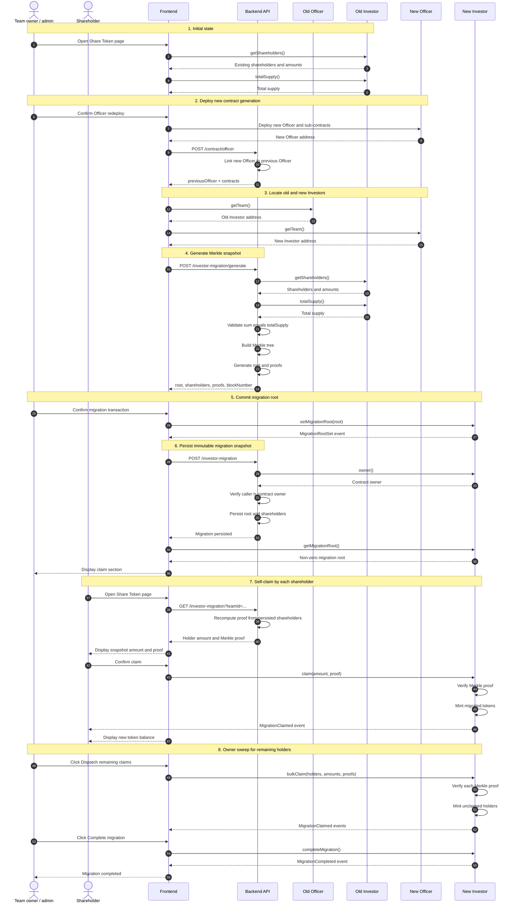

# Shareholder migration flow

Ce document décrit le flow cible d'un propriétaire d'équipe qui possède des
shareholders et migre vers une nouvelle génération de contrats.

## Flow UML complet



## Branches de claim

```mermaid
flowchart TD
    A[Migration root committed] --> B{Shareholder claims individually?}

    B -->|Yes| C[Frontend retrieves amount and proof]
    C --> D[claim(amount, proof)]
    D --> E[New Investor mints tokens]

    B -->|No| F[Owner starts sweep]
    F --> G[Frontend sends holders, amounts and proofs]
    G --> H[bulkClaim(...)]
    H --> I[New Investor mints all unclaimed holders]
    I --> J[Owner calls completeMigration()]
    J --> K[Migration closed and dividends unfrozen]
```

## Notes d'implémentation

Le snapshot persiste les shareholders et la root. Les preuves Merkle sont
recalculées à la lecture à partir de cette liste déterministe, afin de ne pas
dupliquer les données dans la base. Le frontend affiche directement le montant
du snapshot au shareholder et l'envoie avec sa preuve. Le owner peut d'abord
dispatcher les claims via `bulkClaim()` — les claims déjà effectués sont ignorés
— puis appeler séparément `completeMigration()` pour fermer la migration et
dégeler les dividendes.

Fichiers principaux :

- `app/src/composables/contracts/useOfficerRedeploy.ts`
- `app/src/composables/investor/useShareholderMigration.ts`
- `app/src/composables/investor/useSweepMigration.ts`
- `app/src/components/sections/SherTokenView/MerkleClaimForm.vue`
- `backend/src/controllers/investorMigrationController.ts`
- `contract/contracts/Investor/Investor.sol`
