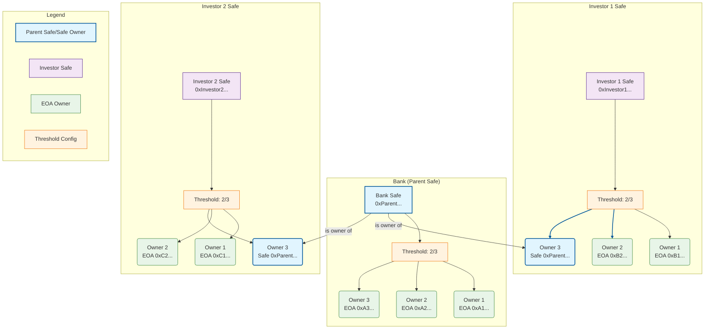

# Polymarket Integration via Safe Wallet

## 📌 Use Case
Execute trades on **Polymarket** using a **Safe Wallet** (multisig contract) for secure, auditable governance.

---

## ⚙️ How Polymarket Works

### Accounts and Signature Types
Polymarket supports three signature types for interacting with its contracts:

1. **EOA (Externally Owned Account)**  
   - Example: MetaMask or other browser wallets  
   - It is represented by **Signature Type 0** in the payload that is sent to the CLOB when placing a bet

2. **Magic Link (Proxy Wallet)**  
   - Login via email or social credentials  
   - Polymarket deploys a **Proxy Wallet** for you  
   - It is represented by **Signature Type 1** in the payload that is sent to the CLOB when placing a bet

3. **Safe Wallet (Multisig Contract)**  
   - Custom Safe implementation deployed via Polymarket’s Safe Factory when a user connects their wallet to the Polymarket app  
   - It is represented by **Signature Type 2** in the payload that is sent to the CLOB when placing a bet

The signature type is part of the payload sent to the CLOB and represents the type of account making the bet

```TypeScript
{
    "salt": 99502677744,
    "maker": "0x...",
    "signer": "0x...",
    "taker": "0x...",
    "tokenId": "1..",
    "makerAmount": "1..",
    "takerAmount": "1...",
    "side": "BUY",
    "expiration": "0",
    "nonce": "0",
    "feeRateBps": "0",
    "signatureType": 2, // Means signature provided is for Safe Wallet
    "signature": "0x..."
}
```

---

## 🔐 Safe Wallet in the Context of Polymarket

- Polymarket deploys a **custom Safe implementation** for each user who connects their wallet to the Polymarket platform.  
- The Safe Wallet address is **deterministically derived** from the user’s MetaMask EOA.  
  - This means the same EOA will always map to the same Safe address, whether created via the web interface or SDK.  
- Each Safe Wallet is a **1‑of‑1 Safe** (single owner, threshold = 1).  
- The Safe acts as the execution layer for trades, while the EOA provides signatures.
- It is possible to mutate or customise the Safe to add more owners and increase the threshold etc.
- It is not possible to enforce multisig approvals when placing bets because of the architecture of the Polymarket CLOB and CFT Exchange contracts.
- It is possible to interact with this Safe{Wallet} using the Safe{Wallet} SDK.

The Safe Wallet is deterministically derived and deployed for you so as to be compatible with the Polymarket platform

```TypeScript
import { deriveSafe } from "@polymarket/builder-relayer-client/dist/builder/derive";
import { getContractConfig } from "@polymarket/builder-relayer-client/dist/config";

// Step 1: Derive Safe address (deterministic)
const config = getContractConfig(137); // Polygon
const safeAddress = deriveSafe(eoaAddress, config.SafeContracts.SafeFactory);

// Step 2: Check if Safe is deployed
const deployed = await relayClient.getDeployed(safeAddress);

// Step 3: Deploy Safe if needed (prompts user signature)
if (!deployed) {
  const response = await relayClient.deploy();
  const result = await response.wait();
  console.log("Safe deployed at:", result.proxyAddress);
}
```

## 🏛 Proposed Multisig Architecture for Polymarket Safe

The diagram below illustrates a **hierarchical Safe architecture** designed to enforce multisig governance on top of Polymarket’s default 1‑of‑1 Safe. In this model:

- A **Bank (Parent Safe)** acts as the controlling entity with a 2‑of‑3 threshold among its owners.  
- Each **Investor Safe** is configured with its own 2‑of‑3 threshold, but one of its owners is the **Parent Safe** itself.
  - The ***Investor Safe*** is the Polymarket Safe which by default is a 1-of-1 Safe
  - It is altered to have 2 other owners, one being an EOA and the other the Parent Safe
  - The EOA that can trade using it is the one from which it was derived
- This setup ensures that no single EOA can unilaterally control trades — approvals require coordination between investor EOAs and the parent Safe.  
- The legend clarifies the roles of parent Safes, investor Safes, EOAs, and threshold configurations.



---

## 📈 Making Orders

- Orders are placed through Polymarket’s **Central Limit Order Book (CLOB)**.  
- The CLOB is exposed via HTTPS at: https://clob.polymarket.com

- To place an order:
  1. Construct an **EIP‑712** data structure with the order details.  
  2. Sign it using the EOA that owns the Safe Wallet (The one from which the Safe is derived).  
  3. Submit it via a `POST` request to the CLOB endpoint.

- The payload includes:
  - **Safe Wallet address**  
  - **EOA address**  
  - **Signature**
  - **Signature Type**

- **Validation rule:** If the Safe Wallet address in the payload does not match the deterministically derived Safe address for the provided EOA, the order will fail validation.

```TypeScript
{
    "salt": 99502677744,
    "maker": "0x...", // If this is different from the address deterministically derived from the "signer" value validation will fail
    "signer": "0x...",
    "taker": "0x...",
    "tokenId": "1..",
    "makerAmount": "1..",
    "takerAmount": "1...",
    "side": "BUY",
    "expiration": "0",
    "nonce": "0",
    "feeRateBps": "0",
    "signatureType": 2,
    "signature": "0x..."
}
```

---

## ✅ Approvals

Before trading, you must approve Polymarket contracts to spend tokens on your behalf. This is a **one‑time setup** step:

| Contract Name            | Address                                    | Purpose |
|---------------------------|--------------------------------------------|---------|
| **CTF Contract**          | `0x4d97dcd97ec945f40cf65f87097ace5ea0476045` | Core Conditional Token Framework |
| **CTF Exchange**          | `0x4bFb41d5B3570DeFd03C39a9A4D8dE6Bd8B8982E` | Standard trading exchange |
| **Neg Risk CTF Exchange** | `0xC5d563A36AE78145C45a50134d48A1215220f80a` | Negative risk trading exchange |
| **Neg Risk Adapter**      | `0xd91E80cF2E7be2e162c6513ceD06f1dD0dA35296` | Adapter for negative risk positions |

- Once approvals are granted, **no further approvals are required** for subsequent trades.  
- This ensures smooth execution of orders without repeated authorization prompts.
- This is the only operation that requires multisig approval on the Polymarket side
  - This means once the approvals are made the EOA owner from which the Safe is deterministically derived can trade without requiring other owners of the Safe to approve.

---

## 🎯 Key Takeaways

- Polymarket integrates Safe Wallets as **deterministic 1‑of‑1 multisigs**.  
- Orders are validated against the Safe Wallet ↔ EOA mapping.  
- Approvals are a one‑time setup across core Polymarket contracts.  
- The Safe derived and deployed by Polymarket for use within their ecosystem needs to be extended to fit the CNC use case.
