# Database Seeding Feature - Functional Specification

**Version:** 2.0.0  
**Date:** December 30, 2025  
**Status:** ✅ Implemented with Admin Provisioning  
**Feature Branch:** feature/improve-seed

---

## 1. Executive Summary

### 1.1 Purpose

The Database Seeding Feature provides automated, environment-aware test data generation for the CNC Portal platform. It enables developers to quickly populate the database with realistic, consistent data for development, testing, and staging environments while preventing accidental data seeding in production.

### 1.2 Scope

This feature encompasses:

- **Environment-Based Seeding**: Different data volumes and characteristics for dev, test, and staging
- **Admin Provisioning**: Assign admin roles to Ethereum addresses with automatic user creation
- **Flexible Control**: Independent boolean flags (CLEAR_DATA, SEED_DATABASE, SEED_ADMINS) for granular control
- **Production Safety**: Built-in restrictions to prevent accidental data loss in production
- **Referential Integrity**: Automatic handling of foreign key relationships and dependencies
- **Realistic Data Generation**: Use of Faker.js and custom helpers for authentic test data
- **Idempotent Operations**: Safe to run multiple times without creating duplicates
- **Date Distribution**: Strategic date ranges to support statistics feature testing
- **Modular Organization**: Separate seed functions for each entity type
- **Validation**: Data validation before insertion to prevent integrity issues

### 1.3 Stakeholders

- **Backend Developers**: Quickly set up development environments with realistic data
- **QA Engineers**: Consistent, predictable test data for automated testing
- **DevOps Engineers**: Populate staging environments with production-like volumes
- **Product Managers**: Demo environments with representative data
- **Database Administrators**: Maintain database health and performance

---

## 2. Business Requirements

### 2.1 Functional Requirements

#### FR-1: Multi-Environment Seeding

**Priority:** Critical  
**Description:** Support different seeding strategies based on environment

**User Story:**

> As a developer, I want different data volumes in dev/test/staging environments so that I can work efficiently without overwhelming the database.

**Acceptance Criteria:**

- [x] Detect environment from `NODE_ENV` variable
- [x] Development environment: Rich, realistic dataset (10 users, 5 teams, ~750 records)
- [x] Test environment: Minimal, predictable dataset (3 users, 2 teams, ~90 records)
- [x] Staging environment: Production-like volumes (50 users, 20 teams, ~4000+ records)
- [x] Production environment: Allow seeding with explicit flags, block CLEAR_DATA
- [x] Support custom environment configuration via env variables

#### FR-2: Referential Integrity Management

**Priority:** Critical  
**Description:** Maintain database referential integrity during seeding

**User Story:**

> As a database administrator, I want seeding to respect foreign key constraints so that the database remains in a valid state.

**Acceptance Criteria:**

- [x] Seed entities in correct dependency order
- [x] Validate foreign key references before insertion
- [x] Handle circular references (e.g., Team ↔ User ownership)
- [x] Roll back entire seed operation if any entity fails
- [x] Log warnings for skipped records due to missing references
- [x] Support optional vs required relationships

#### FR-3: Realistic Data Generation

**Priority:** High  
**Description:** Generate realistic, diverse test data

**User Story:**

> As a QA engineer, I want realistic test data so that I can identify bugs that would occur with real user data.

**Acceptance Criteria:**

- [x] Use valid Ethereum addresses (checksum format)
- [x] Generate realistic names, emails using Faker.js
- [x] Create varied claim amounts and hours (realistic ranges)
- [x] Generate diverse expense amounts and categories
- [x] Include edge cases (empty teams, maximum hours, zero amounts)
- [x] Create data distributions matching expected production patterns

#### FR-4: Idempotent Seeding Operations

**Priority:** High  
**Description:** Allow seeds to be run multiple times safely

**User Story:**

> As a developer, I want to re-run seeds without errors so that I can quickly reset my development database.

**Acceptance Criteria:**

- [x] Use `upsert` operations for critical entities
- [x] Use `skipDuplicates` flag for bulk inserts
- [x] Clear existing data before seeding (optional flag)
- [x] Detect existing data and skip or update appropriately
- [x] Log actions taken (created, updated, skipped)
- [x] Support incremental seeding (add without clearing)

#### FR-5: Date Distribution for Testing

**Priority:** High  
**Description:** Distribute entities across time periods to support stats feature testing

**User Story:**

> As a developer testing the stats feature, I want data distributed across different time periods so that I can verify 7d/30d/90d filtering works correctly.

**Acceptance Criteria:**

- [x] Create claims spanning last 90 days
- [x] Include data in each time bucket (0-7d, 7-30d, 30-90d, >90d)
- [x] Generate weekly claims with varied week start dates
- [x] Create expenses and actions with distributed dates
- [x] Support custom date ranges via configuration
- [ ] Include future dates for testing scheduled features

#### FR-6: Modular Seed Organization

**Priority:** Medium  
**Description:** Organize seed logic into maintainable, reusable modules

**User Story:**

> As a backend developer, I want modular seed functions so that I can easily add new entities or modify existing ones.

**Acceptance Criteria:**

- [x] Separate seed function for each entity type
- [x] Shared helper functions library
- [x] Clear interfaces for seed functions (input/output)
- [ ] Support independent seeding of specific entities
- [x] Enable entity-specific configuration
- [x] Document each seed module with examples

#### FR-7: Seed Data Validation

**Priority:** Medium  
**Description:** Validate seed data before insertion to prevent errors

**User Story:**

> As a QA engineer, I want seed data to be validated so that invalid data doesn't corrupt test databases.

**Acceptance Criteria:**

- [x] Validate Ethereum addresses (checksum, length)
- [x] Validate date formats and ranges
- [x] Check required fields are present
- [x] Verify enum values match allowed options
- [x] Validate JSON fields structure
- [x] Log validation errors with details

#### FR-8: Admin Role Provisioning

**Priority:** High  
**Description:** Assign admin roles to specified Ethereum addresses with automatic user creation

**User Story:**

> As a DevOps engineer, I want to assign admin roles to users in production without manual user creation so that I can provision admins automatically.

**Acceptance Criteria:**

- [x] Accept Ethereum addresses via environment variable (ADMIN_ADDRESSES)
- [x] Accept role assignments via environment variable (ADMIN_ROLES)
- [x] Validate Ethereum address format (0x + 40 hex characters)
- [x] Validate role values (ROLE_ADMIN, ROLE_SUPER_ADMIN)
- [x] Create users automatically if they don't exist
- [x] Assign roles idempotently (skip if already assigned)
- [x] Support multiple admin assignments in single seed run
- [x] Log all admin provisioning actions
- [x] Work independently of database seeding

#### FR-9: Flexible Seeding Control

**Priority:** Critical  
**Description:** Use explicit boolean flags for granular control over seeding operations

**User Story:**

> As a DevOps engineer, I want independent control over clearing data, seeding database, and seeding admins so that I can safely provision production environments.

**Acceptance Criteria:**

- [x] CLEAR_DATA flag for database clearing (boolean)
- [x] SEED_DATABASE flag for entity seeding (boolean)
- [x] SEED_ADMINS flag for admin provisioning (boolean)
- [x] Block CLEAR_DATA in production environment
- [x] Require explicit flags in production (at least one must be true)
- [x] Execute operations in correct order: CLEAR → SEED_DB → SEED_ADMINS
- [x] Support combining multiple operations simultaneously
- [x] Provide clear error messages for invalid configurations

---

## 3. Seeding Architecture

### 3.1 Seeding Order

Entities must be seeded in this specific order to maintain referential integrity:

```typescript
1. Users                    // No dependencies
2. Teams                    // Depends on: Users (owner)
3. MemberTeamsData          // Depends on: Users, Teams
4. TeamContracts            // Depends on: Teams
5. Wages                    // Depends on: Users, Teams
6. WeeklyClaims             // Depends on: Users, Teams, Wages
7. Claims                   // Depends on: Wages, WeeklyClaims
8. Expenses                 // Depends on: Users, Teams
9. BoardOfDirectorActions   // Depends on: Users, Teams
10. Notifications           // Depends on: Users
11. Admin Roles             // Depends on: Users (optional, can run independently)
```

### 3.2 Seeding Execution Flow

```text
1. Environment Detection (NODE_ENV)
2. Parse Flags (CLEAR_DATA, SEED_DATABASE, SEED_ADMINS)
3. Validation (Production safety checks)
4. Clear Data (if CLEAR_DATA=true)
5. Seed Database (if SEED_DATABASE=true)
6. Seed Admins (if SEED_ADMINS=true)
7. Print Summary Statistics
```

### 3.3 Module Structure

```text
backend/prisma/
├── seed.ts # Main orchestration file
├── seeders/
│ ├── users.ts # User seeding logic
│ ├── teams.ts # Team seeding logic
│ ├── wages.ts # Wage seeding logic
│ ├── claims.ts # Claim seeding logic
│ ├── expenses.ts # Expense seeding logic
│ ├── contracts.ts # Contract seeding logic
│ ├── actions.ts # Board action seeding logic
│ ├── notifications.ts # Notification seeding logic
│ ├── admin.ts # Admin role provisioning logic
│ └── helpers.ts # Shared utility functions
├── schema.prisma # Database schema
└── migrations/ # Database migrations
```

## 4. Data Volume Specifications

This table shows the data volumes across all three environments:

| Entity                 | Development | Test | Staging | Notes                             |
| ---------------------- | ----------- | ---- | ------- | --------------------------------- |
| Users                  | 10          | 3    | 50      | Mix of team owners and members    |
| Teams                  | 5           | 2    | 20      | Various sizes (1-5 members)       |
| MemberTeamsData        | 15          | 4    | 100     | User-team relationships           |
| Wages                  | 30          | 6    | 150     | Multiple rates, some with history |
| WeeklyClaims           | 20          | 5    | 100     | Mix of statuses across weeks      |
| Claims                 | 100         | 10   | 500     | Distributed across last 90 days   |
| Expenses               | 15          | 5    | 75      | Various amounts and categories    |
| TeamContracts          | 10          | 4    | 40      | 2-3 contracts per team            |
| BoardOfDirectorActions | 20          | 6    | 100     | Mix of executed and pending       |
| Notifications          | 50          | 10   | 250     | Some read, some unread            |

### 4.1 Environment Characteristics

**Development Environment:**

- **Purpose:** Rich dataset for interactive development
- **Data Style:** Realistic variety with edge cases and unusual scenarios
- **Use Case:** Manual testing and exploration with time distribution

**Test Environment:**

- **Purpose:** Minimal, predictable data for automated tests
- **Data Style:** Fixed, predictable data with no randomness
- **Use Case:** Fast, deterministic testing with clear scenarios

**Staging Environment:**

- **Purpose:** Production-like volumes for performance testing
- **Data Style:** Production-like data with complex relationships
- **Use Case:** Performance testing with realistic load and date coverage

---

## 5. Business Logic

### 5.1 Environment Detection Flow

The environment detection process validates the execution context and ensures production safety by blocking destructive operations and requiring explicit confirmation flags.


**Key Safety Features:**

- **Production Restriction:** `CLEAR_DATA` is blocked in production to prevent accidental data loss
- **Explicit Confirmation:** At least one seeding flag (`SEED_DATABASE` or `SEED_ADMINS`) must be explicitly set
- **Fallback Behavior:** Unknown environments default to development mode
- **Environment Validation:** Only `development`, `test`, `staging`, and `production` are valid

### 5.2 Data Generation Strategies

#### Ethereum Address Generation by Environment

Different strategies are employed for address generation depending on the environment context:

```mermaid
graph LR
    A["Environment"] --> B{"Type?"}
    B -->|Development| C["Hardhat Accounts<br/>+ Faker Generated"]
    B -->|Test| D["Fixed Hardhat<br/>Addresses"]
    B -->|Staging| E["Faker Generated<br/>Realistic Addresses"]
    B -->|Production| F["Custom Addresses<br/>from ADMIN_ADDRESSES"]
    C --> G["✅ Mixed Addresses"]
    D --> H["✅ Predictable Set"]
    E --> I["✅ Realistic Variety"]
    F --> J["✅ Controlled Set"]
```



**Strategy Details:**

- **Development:** Mix of default Hardhat accounts (0xf39Fd6e..., 0x70997970..., etc.) and Faker-generated addresses for variety
- **Test:** Fixed, predictable addresses for consistent, reproducible test runs
- **Staging:** All Faker-generated addresses to simulate production-like diversity
- **Production:** Explicit custom addresses from `ADMIN_ADDRESSES` environment variable

#### Date Distribution Strategy

Seeded dates follow a weighted distribution to create realistic data patterns:

```mermaid
graph TB
    Title["Date Distribution Strategy<br/>(Last 365 Days)"]
    Title --> Buckets["Distribution Buckets"]
    Buckets --> B1["📅 Last 7 Days: 30%<br/>Recent activity"]
    Buckets --> B2["📅 7-30 Days: 40%<br/>Medium-term trends"]
    Buckets --> B3["📅 30-90 Days: 20%<br/>Historical baseline"]
    Buckets --> B4["📅 90-365 Days: 10%<br/>Long-term patterns"]

    B1 --> R1["Higher frequency<br/>for metrics"]
    B2 --> R2["Primary data<br/>concentration"]
    B3 --> R3["Supporting<br/>historical context"]
    B4 --> R4["Edge case<br/>coverage"]
```



**Distribution Rationale:**

- **30% (0-7 days):** Recent data emphasizes current statistics and trending
- **40% (7-30 days):** Primary distribution bucket creates realistic trends
- **20% (30-90 days):** Historical depth for analysis and comparisons
- **10% (90-365 days):** Long-tail data for edge cases and retention testing

#### Wage Chain Creation

Wage records are linked to simulate salary progression and raises:

```mermaid
graph TD
    A["Create Initial Wage<br/>Base Rate: $20/hr"] --> B{"Random:<br/>30% Probability<br/>of Raise"}
    B -->|Yes| C["Create Raise Wage<br/>+15% increase<br/>New Rate: $23/hr"]
    B -->|No| D["Single Wage Record"]
    C --> E["Link Wages<br/>wage1.nextWageId = wage2.id"]
    E --> F["✅ Wage Chain Created"]
    D --> G["✅ Single Wage"]

    H["Database State"] --> I["Users: 10-50<br/>Wages: 20-150<br/>Chains: 30% linked"]
```



**Wage Chain Logic:**

- All wages start with a base rate of $20/hour and 40 hours/week
- 30% probability that a user receives a raise (15% salary increase)
- Raised wages are linked to original wages via `nextWageId` relationship
- Creates realistic multi-wage records for testing salary progression

## 6. CLI Interface

### 6.1 NPM Scripts

```json
{
  "scripts": {
    "seed": "tsx prisma/seed.ts",
    "seed:dev": "NODE_ENV=development tsx prisma/seed.ts",
    "seed:test": "NODE_ENV=test tsx prisma/seed.ts",
    "seed:staging": "NODE_ENV=staging tsx prisma/seed.ts",
    "seed:reset": "npm run db:reset && npm run seed"
  }
}
```

### 6.2 Command Options

```bash
# Basic seeding (defaults to development)
npm run seed

# Environment-specific
NODE_ENV=test npm run seed
NODE_ENV=staging npm run seed

# Production with explicit flags
SEED_DATABASE=true NODE_ENV=production npx prisma db seed
SEED_ADMINS=true ADMIN_ADDRESSES="0xaddr" ADMIN_ROLES="ROLE_ADMIN" NODE_ENV=production npx prisma db seed

# Clear and reseed (non-production only)
CLEAR_DATA=true npm run seed:dev

# Reset and reseed
npm run seed:reset
```

---

---

## 7. Performance Considerations

### 7.1 Bulk Operations

```typescript
// ❌ Slow: Individual creates
for (const user of users) {
  await prisma.user.create({ data: user });
}

// ✅ Fast: Bulk create
await prisma.user.createMany({
  data: users,
  skipDuplicates: true,
});
```

### 7.2 Transaction Boundaries

```typescript
// Create users and teams in one transaction
await prisma.$transaction([
  prisma.user.createMany({ data: users }),
  prisma.team.createMany({ data: teams }),
]);

// But separate complex operations to avoid long-running transactions
await seedComplexWageChains(wages);
```

### 7.3 Indexing

Ensure indexes exist for foreign keys:

```prisma
model Claim {
  wageId Int
  wage   Wage @relation(fields: [wageId], references: [id])

  @@index([wageId]) // Speeds up seeding
}
```

---

## 8. Future Enhancements

### 8.1 Phase 2 Features

**Advanced Configuration:**

- YAML/JSON configuration files for seed data
- Custom scenarios (e.g., "large team", "inactive users")
- Seed templates for common test cases

**CLI Enhancements:**

- Interactive seed wizard
- Selective entity seeding
- Dry-run mode (preview without executing)
- Progress bars and detailed logging

**Data Relationships:**

- Smart relationship inference
- Automatic dependency resolution
- Circular reference handling
- Soft delete support

### 8.2 Phase 3 Features

**Seed Management:**

- Seed versioning and migrations
- Seed snapshots (save/restore states)
- Incremental seeding (add without clearing)
- Seed data diffing

**Advanced Generation:**

- AI-powered realistic data generation
- Import from production (anonymized)
- Graph-based relationship generation
- Custom data generators per entity

**Monitoring:**

- Seed performance metrics
- Data distribution analytics
- Integrity validation reports
- Automated seed health checks

### 8.3 Phase 4 Features

**Cloud Integration:**

- Seed remote databases
- Multi-region seeding
- Scheduled reseeding
- Seed as a service

**Developer Experience:**

- VS Code extension for seed management
- Graphical seed designer
- Seed data marketplace
- Collaborative seed editing

---

## 9. Success Metrics

### 9.1 Performance Metrics

- **Seed Time (Development):** < 5 seconds
- **Seed Time (Test):** < 2 seconds
- **Seed Time (Staging):** < 30 seconds
- **Memory Usage:** < 500MB peak
- **Database Size:** Development < 50MB, Staging < 500MB

### 9.2 Quality Metrics

- **Referential Integrity:** 100% (no orphaned records)
- **Data Validity:** 100% (all records pass validation)
- **Test Pass Rate:** 100% with seeded data
- **Reproducibility:** 100% (same input = same output in test)

### 9.3 Acceptance Criteria

- [x] All functional requirements implemented
- [x] Seed runs successfully in all environments (dev/test/staging/production)
- [x] No foreign key violations occur
- [x] Data distributions match specifications
- [x] Idempotent operations work correctly
- [x] CLI interface is user-friendly
- [x] Comprehensive error handling
- [x] Integration tests pass with seeded data
- [x] Documentation is complete and accurate
- [x] Performance benchmarks are met (test: 0.10s, dev: 0.27s, staging: <2s)

---

## 10. Related Documentation

**Platform Documentation:**

- [Architecture](../../platform/architecture.md) - System architecture
- [Development Standards](../../platform/development-standards.md) - Coding standards
- [Testing Strategy](../../platform/testing-strategy.md) - Testing approach

**Feature Documentation:**

- [Stats Feature](../stats/functional-specification.md) - Statistics feature that uses seed data
- [Seed Implementation](../../../backend/prisma/seed.ts) - Actual seed implementation code (~550 lines)

**External Resources:**

- [Prisma Seeding](https://www.prisma.io/docs/guides/database/seed-database)
- [Faker.js](https://fakerjs.dev/guide/)

---

## 11. Version History

**Version 2.0.0 - December 30, 2025:**

- Added admin role provisioning (FR-8)
- Implemented flexible seeding control with boolean flags (FR-9)
- Added production safety restrictions (CLEAR_DATA blocked, explicit flag requirements)
- Replaced Math.random() with Faker.js for all randomization
- Replaced custom date helpers with dayjs.utc() for temporal operations
- Added admin seeding module with user creation capability
- Implemented validation for Ethereum addresses and role enums
- Enhanced documentation with admin seeding examples

**Version 1.0.0 - December 8, 2025:**

- Initial specification of database seeding feature
- Environment-based seeding strategy defined
- Data volume specifications established
- Helper functions and utilities designed
- CLI interface and scripts defined
- Comprehensive documentation created

```

```
