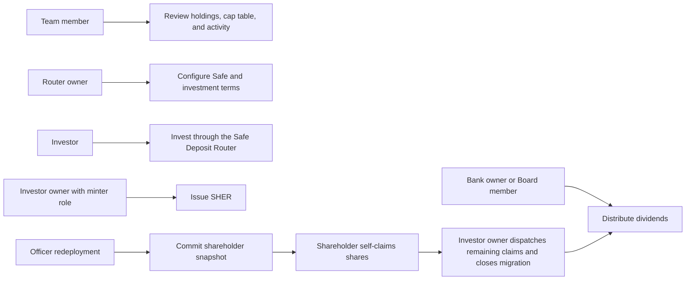

# Shareholder Management — User Stories

**Scope:** Managing the current Investor contract's shareholder register, share issuance, investment configuration, investment, dividends,
and shareholder migration from `/teams/:id/sher-token`

**Last reviewed:** Not yet reviewed

These acceptance criteria follow the
[feature documentation review contract](../../platform/feature-specification-guide.md#human-review-contract).

`US-SHER-*` identifiers are retained because the Sprint 18 validation script and related documentation already reference them. The
capability name is Shareholder Management because the route manages the Investor contract's shareholders and their lifecycle, not only the
SHER token.

## Product Model

- The current **Investor contract** is the team's SHER share token and the on-chain shareholder register. It exposes the current supply,
  holder balances, shareholder set, share issuance, dividend distribution, and migration state.
- A **shareholder** is an address with a non-zero Investor balance. Its ownership percentage is its balance divided by the current total
  supply.
- The Investor owner controls migration completion and bulk issuance. Its `MINTER_ROLE` controls individual issuance. The initial owner
  receives that role, but the portal currently uses ownership checks rather than preflighting the role before offering individual issuance.
- The **Safe Deposit Router** is the investment integration: it accepts supported deposits into the registered Safe and calls the Investor
  contract to issue SHER at its configured multiplier.
- The **Bank** is the dividend integration: the Bank owner executes a payout directly, or an eligible Board member creates the Bank action.
  The Investor contract distributes the funded amount proportionally to shareholders.
- After an Officer redeployment, the new Investor contract can commit a frozen shareholder snapshot. Shareholders self-claim their new
  balance; the Investor owner can dispatch unclaimed balances and close the migration before dividends resume.

## Investor Contract Story Map

| Contract relationship                   | Shareholder-management stories              |
| --------------------------------------- | ------------------------------------------- |
| Direct Investor reads                   | `US-SHER-003`                               |
| Investor issuance                       | `US-SHER-004`                               |
| Safe Deposit Router → Investor issuance | `US-SHER-005`, `US-SHER-001`                |
| Bank → Investor dividend distribution   | `US-SHER-002`                               |
| Investor migration root and claims      | `US-SHER-008`, `US-SHER-006`, `US-SHER-007` |

## Lifecycle

## Status Overview

| User Story  | Title                                    | Actor                           | Status         |
| ----------- | ---------------------------------------- | ------------------------------- | -------------- |
| US-SHER-001 | Invest in the Safe and receive SHER      | Team member                     | 🧪 Validation  |
| US-SHER-002 | Distribute dividends to shareholders     | Bank owner / Board member       | 🧪 Validation  |
| US-SHER-003 | Review shareholder position and activity | Team member                     | 🧪 Validation  |
| US-SHER-004 | Issue SHER to a shareholder              | Investor owner with minter role | 🚧 In Progress |
| US-SHER-005 | Configure shareholder investment         | Safe Deposit Router owner       | 🧪 Validation  |
| US-SHER-006 | Claim a migrated shareholding            | Shareholder                     | 🧪 Validation  |
| US-SHER-007 | Settle and close a shareholder migration | Investor owner                  | 🚧 In Progress |
| US-SHER-008 | Start a shareholder migration            | Team owner                      | 🔗 Reference   |

## US-SHER-003: Review Shareholder Position and Activity

**As a** team member\
**I want to** review the Investor contract's holdings, shareholders, and activity\
**So that** I can understand the current ownership and its changes

### Acceptance Criteria

#### Happy Path

- [x] A team member can review the Investor token symbol, their SHER balance, total supply, and current shareholder count.
- [x] A team member can review every current shareholder's address, SHER balance, and ownership percentage.
- [x] A team member can review Investor and Safe Deposit Router activity, filter it by date and type, and open a transaction's details.

#### Business Rules

- [x] A shareholder's displayed ownership percentage is calculated from its current Investor balance and total supply.
- [x] A shareholder list with no issued SHER remains distinguishable from a list with holders.

#### Edge & Error Cases

- [x] Missing token data is presented as unavailable rather than as a fabricated balance or supply.
- [x] A failed shareholder or activity read is reported without replacing known values with successful-looking data.

**Status:** 🧪 Validation

**Dependencies:** Current Investor contract and team access

## US-SHER-005: Configure Shareholder Investment

**As a** Safe Deposit Router owner\
**I want to** connect the team Safe and configure shareholder investment terms\
**So that** eligible deposits can issue SHER into the intended treasury

### Acceptance Criteria

#### Happy Path

- [x] The router owner can set the team's registered Safe as the router's Safe when it is not already synchronized.
- [x] The router owner can enable or disable deposits after the router points to the team Safe.
- [x] The router owner can set the SHER multiplier used to calculate investment issuance.

#### Business Rules

- [x] Only the Safe Deposit Router owner can change its Safe address, deposit state, or multiplier.
- [x] Deposits cannot be enabled while the router Safe does not match the team's registered Safe.
- [x] A multiplier must be a valid number within the configured range and at least one.
- [x] An archived team cannot start a router configuration write.

#### Edge & Error Cases

- [x] A missing router or team Safe prevents the corresponding configuration write.
- [x] A rejected or failed router write does not report the configuration as updated.

**Status:** 🧪 Validation

**Dependencies:** US-SAFE-001, an active Safe Deposit Router, and a connected router owner

## US-SHER-001: Invest in the Safe and Receive SHER

**As a** team member\
**I want to** invest supported funds through the Safe Deposit Router\
**So that** I receive SHER and the team receives investment capital

### Acceptance Criteria

#### Happy Path

- [x] A team member can open the investment form when the team has a registered Safe and router deposits are enabled.
- [x] The investment form accepts USDC and calculates the corresponding SHER amount from the current router multiplier.
- [x] A successful investment approves USDC only when the allowance is insufficient, then deposits the selected amount through the router.
- [x] The resulting accounting event is recorded as `UC-SDR-01`, increasing Cash — Safe and Investor Equity rather than Service Revenue.

#### Business Rules

- [x] The investment action is unavailable while the router is paused, deposits are disabled, the Safe is missing, or the team is archived.
- [x] The deposit amount must be positive, valid for USDC precision, and no greater than the connected wallet's displayed USDC balance.
- [x] The form blocks the deposit when the router address, selected token, or router multiplier needed to calculate SHER is unavailable.

#### Edge & Error Cases

- [x] Rejecting or failing the approval stops the flow before any deposit is submitted.
- [x] A failed deposit resets the form to the amount step and shows an error without reporting a successful investment.
- [x] Cancelling the form resets its amount and closes the investment modal.

**Status:** 🧪 Validation

**Dependencies:** US-SHER-005, an active Safe Deposit Router, a connected wallet, and a USDC balance

## US-SHER-004: Issue SHER to a Shareholder

**As a** connected issuer with `MINTER_ROLE`\
**I want to** issue SHER to one selected shareholder\
**So that** the Investor contract records the intended ownership allocation

### Acceptance Criteria

#### Happy Path

- [x] An authorized portal user can choose a team member or supported contract recipient and calculate an additive or ending ownership
      stake.
- [x] A successful individual issuance mints the computed incremental SHER amount and refreshes the relevant Investor reads.

#### Business Rules

- [x] The Investor contract requires `MINTER_ROLE` for an individual issuance. _(contract)_
- [x] The recipient address and incremental issuance amount must be valid and greater than zero.
- [x] An archived team cannot start an issuance write.
- [ ] The portal verifies that the connected user has `MINTER_ROLE` and applies that same authorization rule to both individual-issuance
      entry points.

#### Edge & Error Cases

- [x] An invalid recipient or invalid stake does not submit an individual issuance.
- [x] A rejected or failed individual issuance does not report SHER as issued.

**Status:** 🚧 In Progress

**Dependencies:** Current Investor contract, a connected issuer with `MINTER_ROLE`, and a connected wallet

## US-SHER-002: Distribute Dividends to Shareholders

**As a** Bank owner or eligible Board member\
**I want to** distribute a held Bank asset to shareholders\
**So that** shareholders receive their proportional dividend

### Acceptance Criteria

#### Happy Path

- [x] The Bank owner can choose a held native or supported ERC-20 asset and a positive dividend amount within the available Bank balance.
- [x] A direct owner action calls the matching native-token or ERC-20 dividend distribution on Bank.
- [x] An eligible Board member creates the matching Bank action instead of executing the dividend directly.

#### Business Rules

- [x] The action is available only when a SHER token symbol and at least one shareholder are available.
- [x] A user who is neither the Bank owner nor eligible for the Board action cannot open the dividend form.
- [x] The dividend token list excludes SHER.
- [x] The Investor contract rejects dividends while a shareholder migration remains open. _(contract)_
- [x] An archived team cannot start a dividend action.

#### Edge & Error Cases

- [x] A zero, non-numeric, or over-balance amount does not submit a dividend action.
- [x] A Board-action attempt without a Bank address does not create an action.
- [x] A failure while reading the Bank owner is reported without enabling an unauthorized dividend action.

**Status:** 🧪 Validation

**Dependencies:** US-SHER-001, US-BANK-001, a current Bank owner or eligible Board member, and at least one shareholder

## US-SHER-008: Start a Shareholder Migration

**As a** team owner\
**I want to** commit the previous Investor's frozen shareholder snapshot to the new Investor\
**So that** each previous shareholder can claim their allocation after an Officer redeployment

This journey is owned by [US-CONTRACT-005](../contract-management/README.md#us-contract-005-redeploy-an-officer-generation), which covers
the redeployment and migration-root commit. Shareholder Management exposes the migration status and uses the resulting snapshot for
`US-SHER-006` and `US-SHER-007`.

**Status:** 🔗 Reference

**Dependencies:** US-CONTRACT-005 and a previous Investor generation

## US-SHER-006: Claim a Migrated Shareholding

**As a** shareholder\
**I want to** claim my frozen allocation on the new Investor contract\
**So that** my shareholding survives the Officer redeployment

### Acceptance Criteria

#### Happy Path

- [x] A shareholder with a migration proof can review their frozen allocation and submit a self-claim to the new Investor contract.
- [x] A successful claim mints the snapshot amount to the claiming shareholder.

#### Business Rules

- [x] A claim is available only after a migration root and the matching persisted snapshot are available.
- [x] The Investor contract accepts one claim per shareholder and rejects an invalid Merkle proof. _(contract)_
- [x] The migration snapshot, rather than the current old-contract balance, determines the claim amount.

#### Edge & Error Cases

- [x] A connected address not present in the snapshot cannot submit a claim.
- [x] A failed claim remains visible as a failure and does not report migrated shares as received.
- [x] A completed migration no longer accepts an additional self-claim. _(contract)_

**Status:** 🧪 Validation

**Dependencies:** US-SHER-008, a connected shareholder, and a valid migration proof

## US-SHER-007: Settle and Close a Shareholder Migration

**As an** Investor owner\
**I want to** dispatch unclaimed allocations and close the migration\
**So that** the cap table is complete and dividend distribution can resume

### Acceptance Criteria

#### Happy Path

- [x] The Investor owner can dispatch the remaining snapshot allocations in one operation; addresses that already self-claimed are skipped.
- [x] The Investor owner can close the migration after deciding no further claims are expected.
- [x] Closing the migration rejects further claims and removes the Investor contract's dividend freeze. _(contract)_

#### Business Rules

- [x] Dispatch uses the persisted snapshot's holder addresses, amounts, and Merkle proofs.
- [x] The Investor contract restricts dispatch and closure to its owner. _(contract)_
- [ ] The portal verifies that the connected team owner is also the Investor owner before enabling dispatch or closure.

#### Edge & Error Cases

- [x] A migration with no usable proof does not dispatch a partial allocation.
- [x] A failed dispatch or closure is reported without marking the migration complete.

**Status:** 🚧 In Progress

**Dependencies:** US-SHER-008 and an Investor owner

## Known Gaps

- Bulk initial issuance through `distributeMint` is a disabled, coming-soon portal control. The Investor contract implements it, but no
  current portal story claims that a user can complete it.
- The main issuance action is exposed to the Investor owner and the shareholder-list entry point to the team owner, while the contract
  requires `MINTER_ROLE`. Neither control preflights that role, so the portal needs one contract-aligned authorization rule (`US-SHER-004`).
- Migration dispatch and closure are surfaced to the team owner, while the contract restricts them to the Investor owner. The portal does
  not yet verify that both roles resolve to the connected user (`US-SHER-007`).

## Implementation Evidence

- [Shareholder Management route](../../../app/src/views/team/%5Bid%5D/SherTokenView.vue) and
  [Investor overview](../../../app/src/components/sections/SherTokenView/InvestorsHeader.vue)
- [Shareholder list](../../../app/src/components/sections/SherTokenView/ShareholderList.vue) and
  [Investor and router transaction history](../../../app/src/components/sections/SherTokenView/InvestorsTransactions.vue)
- [Individual issuance action](../../../app/src/components/sections/SherTokenView/InvestorActions/MintTokenAction.vue),
  [issuance form](../../../app/src/components/sections/SherTokenView/forms/MintForm.vue), and
  [Investor writes](../../../app/src/composables/investor/writes.ts)
- [Router configuration actions](../../../app/src/components/sections/SherTokenView/InvestorActions/SetSafeAddressAction.vue),
  [deposit control](../../../app/src/components/sections/SherTokenView/InvestorActions/ToggleSherCompensationAction.vue), and
  [multiplier action](../../../app/src/components/sections/SherTokenView/InvestorActions/SetCompensationMultiplierAction.vue)
- [Investment action](../../../app/src/components/sections/SherTokenView/InvestorActions/InvestInSafeAction.vue),
  [investment form](../../../app/src/components/forms/SafeDepositRouterForm.vue), and
  [router investment ledger mapper](../../../app/src/utils/accounting/mappers/safeDepositRouter.ts)
- [Dividend action](../../../app/src/components/sections/SherTokenView/InvestorActions/PayDividendsAction.vue) and
  [dividend form](../../../app/src/components/sections/SherTokenView/forms/PayDividendsForm.vue)
- [Migration banner](../../../app/src/components/sections/SherTokenView/ShareholderMigrationBanner.vue),
  [shareholder claim](../../../app/src/components/sections/SherTokenView/MerkleClaimForm.vue), and
  [migration settlement](../../../app/src/components/sections/SherTokenView/MigrationOwnerSweep.vue)
- [Current Investor contract](../../../contract/contracts/Investor/Investor.sol),
  [migration orchestration](../../../app/src/composables/investor/useShareholderMigration.ts), and
  [claim and settlement writes](../../../app/src/composables/investor/useClaimMigration.ts)
- [Investor overview tests](../../../app/src/components/sections/SherTokenView/__tests__/InvestorsHeader.spec.ts),
  [shareholder-list tests](../../../app/src/components/sections/SherTokenView/__tests__/ShareholderList.spec.ts),
  [issuance-form tests](../../../app/src/components/sections/SherTokenView/forms/__tests__/MintForm.spec.ts), and
  [migration-banner tests](../../../app/src/components/sections/SherTokenView/__tests__/ShareholderMigrationBanner.spec.ts)

## Related Documentation

- [Accounts](../accounts/README.md)
- [Accounting](../accounting/README.md)
- [Contract Management](../contract-management/README.md)
- [Shareholder migration flow](../../contracts/features/shareholder-migration-flow.md)
- [Safe Deposit Router contract behaviour](../../contracts/features/safe-deposit-router/README.md)
- [Product feature inventory](../README.md)

_[← Back to feature inventory](../README.md)_
