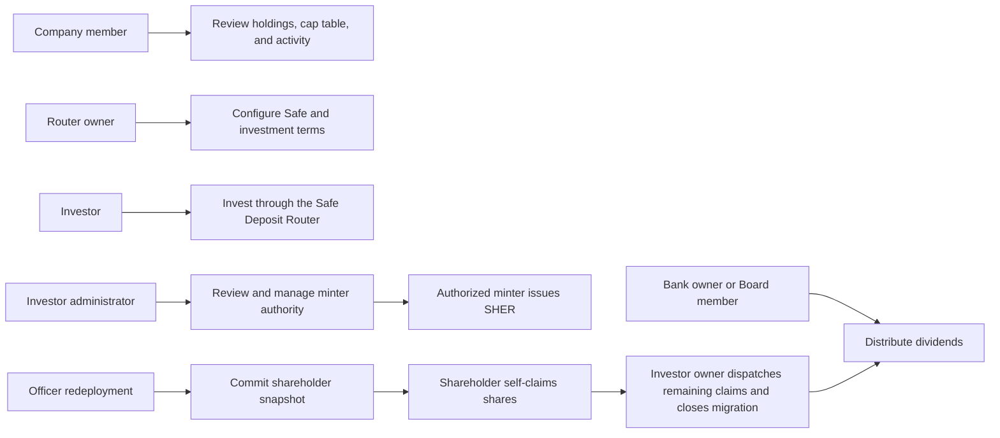

# Shareholder Management — User Stories

**Scope:** Managing the current Investor contract's shareholder register, share issuance, investment configuration, investment, dividends,
and shareholder migration from `/teams/:id/sher-token`

**Last reviewed:** Not yet reviewed

These acceptance criteria follow the
[feature documentation review contract](../../platform/feature-specification-guide.md#human-review-contract).

`US-SHER-*` identifiers are retained because the Sprint 18 validation script and related documentation already reference them. The
capability name is Shareholder Management because the route manages the Investor contract's shareholders and their lifecycle, not only the
SHER token.

## Product Model

- The current **Investor contract** is the company's SHER share token and the on-chain shareholder register. It exposes the current supply,
  holder balances, shareholder set, share issuance, dividend distribution, and migration state.
- A **shareholder** is an address with a non-zero Investor balance. Its ownership percentage is its balance divided by the current total
  supply.
- The Investor owner controls migration completion and bulk issuance. Investor ownership always moves together with `DEFAULT_ADMIN_ROLE` and
  `MINTER_ROLE`; the current owner cannot renounce ownership or remove either authority role from itself.
- Investor administrators can review current role holders and grant or revoke `MINTER_ROLE`. The portal reconstructs candidates from role
  events, verifies their current state with `hasRole`, and labels incomplete RPC evidence instead of presenting it as an empty role set.
  Current and previous Officer generations are identified as company contracts for inspection but are not eligible for a new minter grant.
- The **Safe Deposit Router** is the investment integration: it accepts supported deposits into the registered Safe and calls the Investor
  contract to issue SHER at its configured multiplier.
- The **Bank** is the dividend integration: the Bank owner executes a payout directly, or an eligible Board member creates the Bank action.
  The Investor contract distributes the funded amount proportionally to shareholders.
- After an Officer redeployment, the new Investor contract can commit a frozen shareholder snapshot. Shareholders self-claim their new
  balance; the Investor owner can dispatch unclaimed balances and close the migration before dividends resume.

## Investor Contract Story Map

| Contract relationship                   | Shareholder-management stories              |
| --------------------------------------- | ------------------------------------------- |
| Direct Investor reads                   | `US-SHER-003`                               |
| Investor issuance                       | `US-SHER-004`                               |
| Safe Deposit Router → Investor issuance | `US-SHER-005`, `US-SHER-001`                |
| Bank → Investor dividend distribution   | `US-SHER-002`                               |
| Investor migration root and claims      | `US-SHER-008`, `US-SHER-006`, `US-SHER-007` |
| Investor ownership and role authority   | `US-SHER-009`, `US-SHER-004`                |

## Lifecycle

```mermaid
flowchart LR
    Member[Company member] --> Review[Review holdings, cap table, and activity]
    RouterOwner[Router owner] --> Configure[Configure Safe and investment terms]
    Investor[Investor] --> Invest[Invest through the Safe Deposit Router]
    InvestorAdmin[Investor administrator] --> Permissions[Review and manage minter authority]
    Permissions --> Issue[Authorized minter issues SHER]
    BankOwner[Bank owner or Board member] --> Dividend[Distribute dividends]

    Redeploy[Officer redeployment] --> Snapshot[Commit shareholder snapshot]
    Snapshot --> Claim[Shareholder self-claims shares]
    Claim --> Settle[Investor owner dispatches remaining claims and closes migration]
    Settle --> Dividend
```

## Status Overview

| User Story  | Title                                    | Actor                           | Status         |
| ----------- | ---------------------------------------- | ------------------------------- | -------------- |
| US-SHER-001 | Invest in the Safe and receive SHER      | Company member                  | 🧪 Validation  |
| US-SHER-002 | Distribute dividends to shareholders     | Bank owner / Board member       | 🧪 Validation  |
| US-SHER-003 | Review shareholder position and activity | Company member                  | 🚧 In Progress |
| US-SHER-004 | Issue SHER to a shareholder              | Investor owner with minter role | 🚧 In Progress |
| US-SHER-005 | Configure shareholder investment         | Safe Deposit Router owner       | 🧪 Validation  |
| US-SHER-006 | Claim a migrated shareholding            | Shareholder                     | 🧪 Validation  |
| US-SHER-007 | Settle and close a shareholder migration | Investor owner                  | 🚧 In Progress |
| US-SHER-008 | Start a shareholder migration            | Company owner                   | 🔗 Reference   |
| US-SHER-009 | Manage Investor permissions              | Investor administrator          | 🧪 Validation  |

## Test Coverage Overview

| User Story  | Main Journey  | Coverage Target | Gaps                                                                                                                    |
| ----------- | ------------- | --------------- | ----------------------------------------------------------------------------------------------------------------------- |
| US-SHER-001 | ✅ Integrated | ⚠️ 6/10 met     | `AC-US-SHER-001-05`, `AC-US-SHER-001-06`, `AC-US-SHER-001-07`, `AC-US-SHER-001-10`                                      |
| US-SHER-002 | 📋 Planned    | ⚠️ 3/12 met     | `AC-US-SHER-002-01`–`06`, `AC-US-SHER-002-09`, `AC-US-SHER-002-10`, `AC-US-SHER-002-12`; `02` and `03` lack integration |
| US-SHER-003 | ✅ Integrated | ⚠️ 4/8 met      | `AC-US-SHER-003-05`–`08`                                                                                                |
| US-SHER-004 | 📋 Planned    | ⚠️ 4/8 met      | `AC-US-SHER-004-02`, `AC-US-SHER-004-04`, `AC-US-SHER-004-05`, `AC-US-SHER-004-07`                                      |
| US-SHER-005 | ✅ Integrated | ⚠️ 4/9 met      | `AC-US-SHER-005-04`, `AC-US-SHER-005-06`–`09`                                                                           |
| US-SHER-006 | 📋 Planned    | ⚠️ 1/8 met      | `AC-US-SHER-006-01`–`03`, `AC-US-SHER-006-05`–`08`                                                                      |
| US-SHER-007 | 📋 Planned    | ⚠️ 2/8 met      | `AC-US-SHER-007-01`, `AC-US-SHER-007-02`, `AC-US-SHER-007-04`, `AC-US-SHER-007-06`–`08`                                 |
| US-SHER-008 | 🔗 Reference  | N/A             | Coverage is owned by `US-CONTRACT-005`                                                                                  |
| US-SHER-009 | ✅ Integrated | ✅ 8/8 met      | None                                                                                                                    |

## Proof Strategy Reference

| Strategy                  | Responsibilities              | Required Evidence   | Proof Rationale                                                                 |
| ------------------------- | ----------------------------- | ------------------- | ------------------------------------------------------------------------------- |
| `PS-INTEGRATED-JOURNEY`   | Frontend + Contract           | Integrated E2E      | Portal actions and reads must agree with the durable on-chain result.           |
| `PS-FRONTEND`             | Frontend                      | Frontend            | The portal owns the presentation, validation, guard, or recovery decision.      |
| `PS-CONTRACT`             | Contract                      | Contract            | The smart contract exclusively owns and enforces the rule.                      |
| `PS-FRONTEND-CONTRACT`    | Frontend + Contract           | Frontend + Contract | Portal prevention and contract enforcement can fail independently.              |
| `PS-MIGRATION-INTEGRATED` | Frontend + Backend + Contract | Integrated E2E      | Persisted snapshots, browser orchestration, and on-chain state must stay equal. |

## US-SHER-001: Invest in the Safe and Receive SHER

**As a** company member\
**I want to** invest supported funds through the Safe Deposit Router\
**So that** I receive SHER and the company receives investment capital

### Acceptance Criteria

#### Happy Path

- [x] `AC-US-SHER-001-01` A company member can open the investment form when the company has a registered Safe and router deposits are
      enabled.
- [x] `AC-US-SHER-001-02` The investment form accepts USDC and calculates the corresponding SHER amount from the current router multiplier.
- [x] `AC-US-SHER-001-03` A successful investment approves USDC only when the allowance is insufficient, then deposits the selected amount
      through the router.
- [x] `AC-US-SHER-001-04` A successful investment transfers the deposited USDC to the company Safe and mints the calculated SHER to the
      investor.

#### Business Rules

- [x] `AC-US-SHER-001-05` The investment action is unavailable while the router is paused, deposits are disabled, the Safe is missing, or
      the company is archived.
- [x] `AC-US-SHER-001-06` The deposit amount must be positive, valid for USDC precision, and no greater than the connected wallet's
      displayed USDC balance.
- [x] `AC-US-SHER-001-07` The form blocks the deposit when the router address, selected token, or router multiplier needed to calculate SHER
      is unavailable.

#### Edge & Error Cases

- [x] `AC-US-SHER-001-08` Rejecting or failing the approval stops the flow before any deposit is submitted.
- [x] `AC-US-SHER-001-09` A failed deposit resets the form to the amount step and shows an error without reporting a successful investment.
- [x] `AC-US-SHER-001-10` Cancelling the form resets its amount and closes the investment modal.

### Test Coverage

| Acceptance Criterion | Proof Strategy          | Current Evidence          | Status     |
| -------------------- | ----------------------- | ------------------------- | ---------- |
| `AC-US-SHER-001-01`  | `PS-INTEGRATED-JOURNEY` | Integrated E2E + Frontend | ✅ Met     |
| `AC-US-SHER-001-02`  | `PS-INTEGRATED-JOURNEY` | Integrated E2E            | ✅ Met     |
| `AC-US-SHER-001-03`  | `PS-INTEGRATED-JOURNEY` | Integrated E2E + Frontend | ✅ Met     |
| `AC-US-SHER-001-04`  | `PS-INTEGRATED-JOURNEY` | Integrated E2E            | ✅ Met     |
| `AC-US-SHER-001-05`  | `PS-FRONTEND`           | None linked               | ❌ Missing |
| `AC-US-SHER-001-06`  | `PS-FRONTEND`           | None linked               | ❌ Missing |
| `AC-US-SHER-001-07`  | `PS-FRONTEND`           | None linked               | ❌ Missing |
| `AC-US-SHER-001-08`  | `PS-FRONTEND`           | Frontend                  | ✅ Met     |
| `AC-US-SHER-001-09`  | `PS-FRONTEND`           | Frontend                  | ✅ Met     |
| `AC-US-SHER-001-10`  | `PS-FRONTEND`           | None linked               | ❌ Missing |

**Accounting:** The complete router operation is booked once by
[`UC-SDR-01`](../accounting/journal-entry-catalogue.md#uc-sdr-01--investor-contribution); the matching Safe receipt and Investor mint are
supporting evidence, not separate entries.

**Dependencies:** US-SHER-005, an active Safe Deposit Router, a connected wallet, and a USDC balance

## US-SHER-002: Distribute Dividends to Shareholders

**As a** Bank owner or eligible Board member\
**I want to** distribute a held Bank asset to shareholders\
**So that** shareholders receive their proportional dividend

### Acceptance Criteria

#### Happy Path

- [x] `AC-US-SHER-002-01` The Bank owner can choose a held native or supported ERC-20 asset and a positive dividend amount within the
      available Bank balance.
- [x] `AC-US-SHER-002-02` A direct owner action calls the matching native-token or ERC-20 dividend distribution on Bank.
- [x] `AC-US-SHER-002-03` An eligible Board member creates the matching Bank action instead of executing the dividend directly.

#### Business Rules

- [x] `AC-US-SHER-002-04` The action is available only when a SHER token symbol and at least one shareholder are available.
- [x] `AC-US-SHER-002-05` A user who is neither the Bank owner nor eligible for the Board action cannot open the dividend form.
- [x] `AC-US-SHER-002-06` A Board-submitted dividend identifies its approval requirement before submission.
- [x] `AC-US-SHER-002-07` The dividend token list excludes SHER.
- [x] `AC-US-SHER-002-08` The Investor contract rejects dividends while a shareholder migration remains open. _(contract)_
- [x] `AC-US-SHER-002-09` An archived company cannot start a dividend action.

#### Edge & Error Cases

- [x] `AC-US-SHER-002-10` A zero, non-numeric, or over-balance amount does not submit a dividend action.
- [x] `AC-US-SHER-002-11` A Board-action attempt without a Bank address does not create an action.
- [x] `AC-US-SHER-002-12` A failure while reading the Bank owner is reported without enabling an unauthorized dividend action.

### Test Coverage

| Acceptance Criterion | Proof Strategy          | Current Evidence | Status          |
| -------------------- | ----------------------- | ---------------- | --------------- |
| `AC-US-SHER-002-01`  | `PS-FRONTEND`           | None linked      | ❌ Missing      |
| `AC-US-SHER-002-02`  | `PS-INTEGRATED-JOURNEY` | Frontend         | ⚠️ Insufficient |
| `AC-US-SHER-002-03`  | `PS-INTEGRATED-JOURNEY` | Frontend         | ⚠️ Insufficient |
| `AC-US-SHER-002-04`  | `PS-FRONTEND`           | None linked      | ❌ Missing      |
| `AC-US-SHER-002-05`  | `PS-FRONTEND`           | None linked      | ❌ Missing      |
| `AC-US-SHER-002-06`  | `PS-FRONTEND`           | None linked      | ❌ Missing      |
| `AC-US-SHER-002-07`  | `PS-FRONTEND`           | Frontend         | ✅ Met          |
| `AC-US-SHER-002-08`  | `PS-CONTRACT`           | Contract         | ✅ Met          |
| `AC-US-SHER-002-09`  | `PS-FRONTEND`           | None linked      | ❌ Missing      |
| `AC-US-SHER-002-10`  | `PS-FRONTEND`           | None linked      | ❌ Missing      |
| `AC-US-SHER-002-11`  | `PS-FRONTEND`           | Frontend         | ✅ Met          |
| `AC-US-SHER-002-12`  | `PS-FRONTEND`           | None linked      | ❌ Missing      |

**Accounting:** Per-shareholder payments are grouped into [`UC-INV-01`](../accounting/journal-entry-catalogue.md#uc-inv-01--dividend-paid).
Bank's distribution trigger is not booked again.

**Dependencies:** US-SHER-001, US-BANK-001, a current Bank owner or eligible Board member, and at least one shareholder

## US-SHER-003: Review Shareholder Position and Activity

**As a** company member\
**I want to** review the Investor contract's holdings, shareholders, and activity\
**So that** I can understand the current ownership and its changes

### Acceptance Criteria

#### Happy Path

- [x] `AC-US-SHER-003-01` A company member can review the Investor token symbol, their SHER balance, total supply, and current shareholder
      count.
- [x] `AC-US-SHER-003-02` A company member can review every current shareholder's address, SHER balance, and ownership percentage.
- [x] `AC-US-SHER-003-03` A company member can review Investor and Safe Deposit Router activity, filter it by date and type, and open a
      transaction's details.

#### Business Rules

- [x] `AC-US-SHER-003-04` A shareholder's displayed ownership percentage is calculated from its current Investor balance and total supply.
- [x] `AC-US-SHER-003-05` A shareholder list with no issued SHER remains distinguishable from a list with holders.

#### Edge & Error Cases

- [x] `AC-US-SHER-003-06` Missing Investor balance or total-supply data is presented as unavailable rather than as a fabricated amount.
- [x] `AC-US-SHER-003-07` A failed shareholder or activity read is reported without replacing known values with successful-looking data.
- [ ] `AC-US-SHER-003-08` Missing or invalid Investor token-symbol data is presented as unavailable throughout the overview and activity
      history rather than as a fabricated token identity.

### Test Coverage

| Acceptance Criterion | Proof Strategy          | Current Evidence | Status     |
| -------------------- | ----------------------- | ---------------- | ---------- |
| `AC-US-SHER-003-01`  | `PS-INTEGRATED-JOURNEY` | Integrated E2E   | ✅ Met     |
| `AC-US-SHER-003-02`  | `PS-INTEGRATED-JOURNEY` | Integrated E2E   | ✅ Met     |
| `AC-US-SHER-003-03`  | `PS-INTEGRATED-JOURNEY` | Integrated E2E   | ✅ Met     |
| `AC-US-SHER-003-04`  | `PS-INTEGRATED-JOURNEY` | Integrated E2E   | ✅ Met     |
| `AC-US-SHER-003-05`  | `PS-FRONTEND`           | None linked      | ❌ Missing |
| `AC-US-SHER-003-06`  | `PS-FRONTEND`           | None linked      | ❌ Missing |
| `AC-US-SHER-003-07`  | `PS-FRONTEND`           | None linked      | ❌ Missing |
| `AC-US-SHER-003-08`  | `PS-FRONTEND`           | None linked      | ❌ Missing |

**Dependencies:** Current Investor contract and company access

## US-SHER-004: Issue SHER to a Shareholder

**As a** connected issuer with `MINTER_ROLE`\
**I want to** issue SHER to one selected shareholder\
**So that** the Investor contract records the intended ownership allocation

### Acceptance Criteria

#### Happy Path

- [x] `AC-US-SHER-004-01` An authorized portal user can choose a company member or supported contract recipient and calculate an additive or
      ending ownership stake.
- [x] `AC-US-SHER-004-02` A successful individual issuance mints the computed incremental SHER amount and refreshes the relevant Investor
      reads.

#### Business Rules

- [x] `AC-US-SHER-004-03` The Investor contract requires `MINTER_ROLE` for an individual issuance. _(contract)_
- [x] `AC-US-SHER-004-04` The recipient address and incremental issuance amount must be valid and greater than zero.
- [x] `AC-US-SHER-004-05` An archived company cannot start an issuance write.
- [x] `AC-US-SHER-004-06` The portal verifies that the connected user has `MINTER_ROLE` and applies that same authorization rule to both
      individual-issuance entry points.

#### Edge & Error Cases

- [x] `AC-US-SHER-004-07` An invalid recipient or invalid stake does not submit an individual issuance.
- [x] `AC-US-SHER-004-08` A rejected or failed individual issuance does not report SHER as issued.

### Test Coverage

| Acceptance Criterion | Proof Strategy          | Current Evidence    | Status     |
| -------------------- | ----------------------- | ------------------- | ---------- |
| `AC-US-SHER-004-01`  | `PS-FRONTEND`           | Frontend            | ✅ Met     |
| `AC-US-SHER-004-02`  | `PS-INTEGRATED-JOURNEY` | None linked         | ❌ Missing |
| `AC-US-SHER-004-03`  | `PS-CONTRACT`           | Contract            | ✅ Met     |
| `AC-US-SHER-004-04`  | `PS-FRONTEND-CONTRACT`  | None linked         | ❌ Missing |
| `AC-US-SHER-004-05`  | `PS-FRONTEND`           | None linked         | ❌ Missing |
| `AC-US-SHER-004-06`  | `PS-FRONTEND-CONTRACT`  | Frontend + Contract | ✅ Met     |
| `AC-US-SHER-004-07`  | `PS-FRONTEND`           | None linked         | ❌ Missing |
| `AC-US-SHER-004-08`  | `PS-FRONTEND`           | Frontend            | ✅ Met     |

**Accounting:** A direct mint not backed by Router, Payroll, or Vesting evidence uses
[`DEFAULT-D`](../accounting/journal-entry-catalogue.md#default-d--direct-sher-issuance).

**Dependencies:** Current Investor contract, a connected issuer with `MINTER_ROLE`, and a connected wallet

## US-SHER-005: Configure Shareholder Investment

**As a** Safe Deposit Router owner\
**I want to** connect the company Safe and configure shareholder investment terms\
**So that** eligible deposits can issue SHER into the intended treasury

### Acceptance Criteria

#### Happy Path

- [x] `AC-US-SHER-005-01` The router owner can set the company's registered Safe as the router's Safe when it is not already synchronized.
- [x] `AC-US-SHER-005-02` The router owner can enable or disable deposits after the router points to the company Safe.
- [x] `AC-US-SHER-005-03` The router owner can set the SHER multiplier used to calculate investment issuance.

#### Business Rules

- [x] `AC-US-SHER-005-04` Only the Safe Deposit Router owner can change its Safe address, deposit state, or multiplier.
- [x] `AC-US-SHER-005-05` Deposits cannot be enabled while the router Safe does not match the company's registered Safe.
- [x] `AC-US-SHER-005-06` A multiplier must be a valid number within the configured range and at least one.
- [x] `AC-US-SHER-005-07` An archived company cannot start a router configuration write.

#### Edge & Error Cases

- [x] `AC-US-SHER-005-08` A missing router or company Safe prevents the corresponding configuration write.
- [x] `AC-US-SHER-005-09` A rejected or failed router write does not report the configuration as updated.

### Test Coverage

| Acceptance Criterion | Proof Strategy          | Current Evidence          | Status          |
| -------------------- | ----------------------- | ------------------------- | --------------- |
| `AC-US-SHER-005-01`  | `PS-INTEGRATED-JOURNEY` | Integrated E2E + Frontend | ✅ Met          |
| `AC-US-SHER-005-02`  | `PS-INTEGRATED-JOURNEY` | Integrated E2E + Contract | ✅ Met          |
| `AC-US-SHER-005-03`  | `PS-INTEGRATED-JOURNEY` | Integrated E2E + Contract | ✅ Met          |
| `AC-US-SHER-005-04`  | `PS-FRONTEND-CONTRACT`  | Frontend                  | ⚠️ Insufficient |
| `AC-US-SHER-005-05`  | `PS-INTEGRATED-JOURNEY` | Integrated E2E            | ✅ Met          |
| `AC-US-SHER-005-06`  | `PS-FRONTEND-CONTRACT`  | Contract                  | ⚠️ Insufficient |
| `AC-US-SHER-005-07`  | `PS-FRONTEND`           | None linked               | ❌ Missing      |
| `AC-US-SHER-005-08`  | `PS-FRONTEND`           | None linked               | ❌ Missing      |
| `AC-US-SHER-005-09`  | `PS-FRONTEND`           | None linked               | ❌ Missing      |

**Dependencies:** US-SAFE-001, an active Safe Deposit Router, and a connected router owner

## US-SHER-006: Claim a Migrated Shareholding

**As a** shareholder\
**I want to** claim my frozen allocation on the new Investor contract\
**So that** my shareholding survives the Officer redeployment

### Acceptance Criteria

#### Happy Path

- [x] `AC-US-SHER-006-01` A shareholder with a migration proof can review their frozen allocation and submit a self-claim to the new
      Investor contract.
- [x] `AC-US-SHER-006-02` A successful claim mints the snapshot amount to the claiming shareholder.

#### Business Rules

- [x] `AC-US-SHER-006-03` A claim is available only after a migration root and the matching persisted snapshot are available.
- [x] `AC-US-SHER-006-04` The Investor contract accepts one claim per shareholder and rejects an invalid Merkle proof. _(contract)_
- [x] `AC-US-SHER-006-05` The migration snapshot, rather than the current old-contract balance, determines the claim amount.

#### Edge & Error Cases

- [x] `AC-US-SHER-006-06` A connected address not present in the snapshot cannot submit a claim.
- [x] `AC-US-SHER-006-07` A failed claim remains visible as a failure and does not report migrated shares as received.
- [x] `AC-US-SHER-006-08` A completed migration no longer accepts an additional self-claim. _(contract)_

### Test Coverage

| Acceptance Criterion | Proof Strategy            | Current Evidence | Status          |
| -------------------- | ------------------------- | ---------------- | --------------- |
| `AC-US-SHER-006-01`  | `PS-MIGRATION-INTEGRATED` | None linked      | ❌ Missing      |
| `AC-US-SHER-006-02`  | `PS-MIGRATION-INTEGRATED` | Contract         | ⚠️ Insufficient |
| `AC-US-SHER-006-03`  | `PS-MIGRATION-INTEGRATED` | Contract         | ⚠️ Insufficient |
| `AC-US-SHER-006-04`  | `PS-CONTRACT`             | Contract         | ✅ Met          |
| `AC-US-SHER-006-05`  | `PS-MIGRATION-INTEGRATED` | None linked      | ❌ Missing      |
| `AC-US-SHER-006-06`  | `PS-FRONTEND`             | None linked      | ❌ Missing      |
| `AC-US-SHER-006-07`  | `PS-FRONTEND`             | None linked      | ❌ Missing      |
| `AC-US-SHER-006-08`  | `PS-CONTRACT`             | None linked      | ❌ Missing      |

**Accounting:** A migration claim preserves an existing ownership allocation. It is not a new economic issuance and creates no journal
entry.

**Dependencies:** US-SHER-008, a connected shareholder, and a valid migration proof

## US-SHER-007: Settle and Close a Shareholder Migration

**As an** Investor owner\
**I want to** dispatch unclaimed allocations and close the migration\
**So that** the cap table is complete and dividend distribution can resume

### Acceptance Criteria

#### Happy Path

- [x] `AC-US-SHER-007-01` The Investor owner can dispatch the remaining snapshot allocations in one operation; addresses that already
      self-claimed are skipped.
- [x] `AC-US-SHER-007-02` The Investor owner can close the migration after deciding no further claims are expected.
- [x] `AC-US-SHER-007-03` Closing the migration rejects further claims and removes the Investor contract's dividend freeze. _(contract)_

#### Business Rules

- [x] `AC-US-SHER-007-04` Dispatch uses the persisted snapshot's holder addresses, amounts, and Merkle proofs.
- [x] `AC-US-SHER-007-05` The Investor contract restricts dispatch and closure to its owner. _(contract)_
- [ ] `AC-US-SHER-007-06` The portal verifies that the connected company owner is also the Investor owner before enabling dispatch or
      closure.

#### Edge & Error Cases

- [x] `AC-US-SHER-007-07` A migration with no usable proof does not dispatch a partial allocation.
- [x] `AC-US-SHER-007-08` A failed dispatch or closure is reported without marking the migration complete.

### Test Coverage

| Acceptance Criterion | Proof Strategy            | Current Evidence | Status          |
| -------------------- | ------------------------- | ---------------- | --------------- |
| `AC-US-SHER-007-01`  | `PS-MIGRATION-INTEGRATED` | Contract         | ⚠️ Insufficient |
| `AC-US-SHER-007-02`  | `PS-MIGRATION-INTEGRATED` | Frontend         | ⚠️ Insufficient |
| `AC-US-SHER-007-03`  | `PS-CONTRACT`             | Contract         | ✅ Met          |
| `AC-US-SHER-007-04`  | `PS-MIGRATION-INTEGRATED` | None linked      | ❌ Missing      |
| `AC-US-SHER-007-05`  | `PS-CONTRACT`             | Contract         | ✅ Met          |
| `AC-US-SHER-007-06`  | `PS-FRONTEND-CONTRACT`    | None linked      | ❌ Missing      |
| `AC-US-SHER-007-07`  | `PS-FRONTEND`             | None linked      | ❌ Missing      |
| `AC-US-SHER-007-08`  | `PS-FRONTEND`             | None linked      | ❌ Missing      |

**Accounting:** Dispatch and closure complete an existing ownership migration. They do not create a new economic issuance or journal entry.

**Dependencies:** US-SHER-008 and an Investor owner

## US-SHER-008: Start a Shareholder Migration

**As a** company owner\
**I want to** commit the previous Investor's frozen shareholder snapshot to the new Investor\
**So that** each previous shareholder can claim their allocation after an Officer redeployment

This journey is owned by [US-CONTRACT-005](../contract-management/README.md#us-contract-005-redeploy-an-officer-generation), which covers
the redeployment and migration-root commit. Shareholder Management exposes the migration status and uses the resulting snapshot for
`US-SHER-006` and `US-SHER-007`.

**Dependencies:** US-CONTRACT-005 and a previous Investor generation

## US-SHER-009: Manage Investor Permissions

**As an** Investor administrator\
**I want to** review and manage Investor token-minter authority\
**So that** human and automated issuance uses explicit, current on-chain permissions

### Acceptance Criteria

#### Happy Path

- [x] `AC-US-SHER-009-01` A company member can review the verified Investor owner, administrators, and minters with known member, current or
      previous Officer, team-contract, and external identities distinguished where available.
- [x] `AC-US-SHER-009-03` A connected Investor administrator can grant `MINTER_ROLE` to a valid team member or contract address, and the
      refreshed permission list reflects the confirmed on-chain state.
- [x] `AC-US-SHER-009-04` A connected Investor administrator can revoke `MINTER_ROLE` from a delegated minter, and the refreshed permission
      list reflects the confirmed on-chain state.

#### Business Rules

- [x] `AC-US-SHER-009-05` Only a connected account with `DEFAULT_ADMIN_ROLE` can initiate minter-role changes, and an archived company
      cannot initiate those writes.
- [x] `AC-US-SHER-009-06` The current Investor owner retains `DEFAULT_ADMIN_ROLE` and `MINTER_ROLE`; ownership transfer grants both roles to
      the successor and removes them from the previous owner without removing unrelated technical minters. _(contract)_
- [x] `AC-US-SHER-009-07` Revoking a known Cash Remuneration, Safe Deposit Router, or Vesting minter requires explicit acknowledgement of
      the affected automated issuance flow.

#### Edge & Error Cases

- [x] `AC-US-SHER-009-02` A failed or partial historical role scan is labelled unavailable or incomplete, directly verifies known company
      accounts including Officer generations, and does not masquerade as an authoritative empty permission list.
- [x] `AC-US-SHER-009-08` A rejected or failed role transaction remains visible as a failure and does not report a successful permission
      change.

### Test Coverage

| Acceptance Criterion | Proof Strategy          | Current Evidence                     | Status |
| -------------------- | ----------------------- | ------------------------------------ | ------ |
| `AC-US-SHER-009-01`  | `PS-INTEGRATED-JOURNEY` | Integrated E2E + Frontend            | ✅ Met |
| `AC-US-SHER-009-02`  | `PS-FRONTEND`           | Frontend                             | ✅ Met |
| `AC-US-SHER-009-03`  | `PS-INTEGRATED-JOURNEY` | Integrated E2E + Frontend            | ✅ Met |
| `AC-US-SHER-009-04`  | `PS-INTEGRATED-JOURNEY` | Integrated E2E + Contract            | ✅ Met |
| `AC-US-SHER-009-05`  | `PS-FRONTEND-CONTRACT`  | Integrated E2E + Frontend + Contract | ✅ Met |
| `AC-US-SHER-009-06`  | `PS-CONTRACT`           | Contract                             | ✅ Met |
| `AC-US-SHER-009-07`  | `PS-FRONTEND`           | Frontend                             | ✅ Met |
| `AC-US-SHER-009-08`  | `PS-FRONTEND`           | Frontend                             | ✅ Met |

**Dependencies:** Current Investor contract, a connected Investor administrator, and a connected wallet

## Known Gaps

- Bulk initial issuance through `distributeMint` is a disabled, coming-soon portal control. The Investor contract implements it, but no
  current portal story claims that a user can complete it.
- Migration dispatch and closure are surfaced to the company owner, while the contract restricts them to the Investor owner. The portal does
  not yet verify that both roles resolve to the connected user (`US-SHER-007`).
- Investor activity falls back to the literal `SHER` symbol when the symbol read is missing or invalid, so the activity history can present
  a fabricated token identity (`US-SHER-003`).

## Implementation Evidence

**Implementation evidence reviewed against:** `a8cbb0e32a7bab616ecf4b0fda0578eafa015ce0`

- [Shareholder Management route](../../../app/src/views/team/%5Bid%5D/SherTokenView.vue) and
  [Investor overview](../../../app/src/components/sections/SherTokenView/InvestorsHeader.vue)
- [Investor action panel](../../../app/src/components/sections/SherTokenView/InvestorsActions.vue)
- [Shareholder list](../../../app/src/components/sections/SherTokenView/ShareholderList.vue) and
  [Investor and router transaction history](../../../app/src/components/sections/SherTokenView/InvestorsTransactions.vue)
- [Individual issuance action](../../../app/src/components/sections/SherTokenView/InvestorActions/MintTokenAction.vue),
  [issuance form](../../../app/src/components/sections/SherTokenView/forms/MintForm.vue), and
  [Investor writes](../../../app/src/composables/investor/writes.ts)
- [Investor permission surface](../../../app/src/components/sections/SherTokenView/InvestorPermissionsSection.vue),
  [permission reads](../../../app/src/composables/investor/permissions.ts), and
  [Officer history query](../../../app/src/queries/contract.queries.ts),
  [role evidence query](../../../app/src/queries/investorPermissions.queries.ts), with
  [permission presentation helpers](../../../app/src/utils/investors/permissions.ts)
- [Router configuration actions](../../../app/src/components/sections/SherTokenView/InvestorActions/SetSafeAddressAction.vue),
  [deposit control](../../../app/src/components/sections/SherTokenView/InvestorActions/ToggleSherCompensationAction.vue), and
  [multiplier action](../../../app/src/components/sections/SherTokenView/InvestorActions/SetCompensationMultiplierAction.vue)
- [Investment action](../../../app/src/components/sections/SherTokenView/InvestorActions/InvestInSafeAction.vue),
  [investment form](../../../app/src/components/sections/SherTokenView/forms/SafeDepositRouterForm.vue), and
  [router investment ledger mapper](../../../app/src/utils/accounting/mappers/safeDepositRouter.ts)
- [Integrated shareholder investment lifecycle](../../../app/test/e2e/shareholder/shareholder-investment.integrated.spec.ts) and
  [on-chain shareholder assertions](../../../app/test/e2e/shareholder/shareholder-chain.ts)
- [Dividend action](../../../app/src/components/sections/SherTokenView/InvestorActions/PayDividendsAction.vue) and
  [dividend form](../../../app/src/components/sections/SherTokenView/forms/PayDividendsForm.vue)
- [Migration banner](../../../app/src/components/sections/SherTokenView/ShareholderMigrationBanner.vue),
  [shareholder claim](../../../app/src/components/sections/SherTokenView/MerkleClaimForm.vue), and
  [migration settlement](../../../app/src/components/sections/SherTokenView/MigrationOwnerSweep.vue)
- [Current Investor contract](../../../contract/contracts/Investor/Investor.sol),
  [migration orchestration](../../../app/src/composables/investor/useShareholderMigration.ts), and
  [claim and settlement writes](../../../app/src/composables/investor/useClaimMigration.ts)
- [Investor overview tests](../../../app/src/components/sections/SherTokenView/__tests__/InvestorsHeader.spec.ts),
  [issuance-form tests](../../../app/src/components/sections/SherTokenView/forms/__tests__/MintForm.spec.ts),
  [permission component tests](../../../app/src/components/sections/SherTokenView/__tests__/InvestorPermissionsSection.spec.ts),
  [permission identity tests](../../../app/src/utils/investors/__tests__/permissions.spec.ts), and
  [integrated permission lifecycle](../../../app/test/e2e/investor-permissions.integrated.spec.ts)

## Related Documentation

- [Accounts](../accounts/README.md)
- [Date Picker implementation](../../implementation/date-picker/README.md)
- [Transaction History implementation](../../implementation/transaction-history/README.md)
- [Accounting](../accounting/README.md)
- [Contract Management](../contract-management/README.md)
- [Shareholder migration flow](../../contracts/features/shareholder-migration-flow.md)
- [Safe Deposit Router contract behaviour](../../contracts/features/safe-deposit-router/README.md)
- [Current Investor contract behaviour](../../contracts/features/investor/README.md)
- [Product feature inventory](../README.md)

_[← Back to feature inventory](../README.md)_
