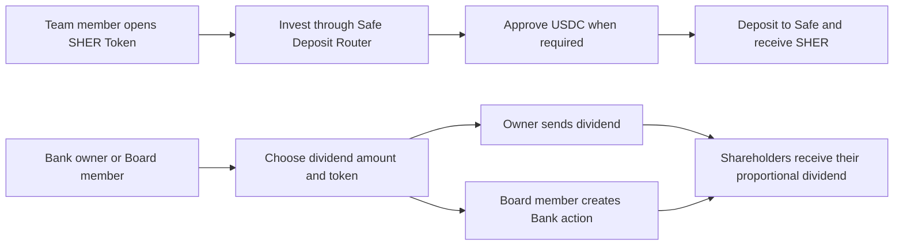

# SHER Token — User Stories

**Scope:** Investing through the Safe Deposit Router and distributing dividends from the SHER Token journey

**Last reviewed:** Not yet reviewed

These acceptance criteria follow the
[feature documentation review contract](../../platform/feature-specification-guide.md#human-review-contract).

## Product Model

- A registered **Safe** receives supported investment deposits through the Safe Deposit Router. The current portal form supports USDC and
  uses the router's current multiplier to calculate the SHER amount.
- A successful router investment is recorded as `UC-SDR-01`: Debit Cash — Safe and credit Investor Equity. It is a capital contribution, not
  Service Revenue.
- **Dividends** move held native assets or supported ERC-20 assets from Bank to shareholders according to their SHER holdings. The Bank
  owner executes the transfer directly; an eligible Board member creates the corresponding Board action.
- SHER itself is not a dividend payment token in this journey.

## Lifecycle

## Status Overview

| User Story  | Title                                | Actor                     | Status        | Priority | Effort |
| ----------- | ------------------------------------ | ------------------------- | ------------- | :------: | ------ |
| US-SHER-001 | Invest in the Safe and receive SHER  | Team member               | 🧪 Validation |    P1    | M      |
| US-SHER-002 | Distribute dividends to shareholders | Bank owner / Board member | 🧪 Validation |    P1    | M      |

## US-SHER-001: Invest in the Safe and Receive SHER

**As a** team member\
**I want to** invest supported funds through the Safe Deposit Router\
**So that** I receive SHER and the team receives investment capital

### Acceptance Criteria

#### Happy Path

- [x] A team member can open the investment form when the team has a registered Safe and router deposits are enabled.
- [x] The investment form accepts USDC and calculates the corresponding SHER amount from the current router multiplier.
- [x] A successful investment approves USDC only when the allowance is insufficient, then deposits the selected amount through the router.
- [x] The resulting accounting event is recorded as `UC-SDR-01`, increasing Cash — Safe and Investor Equity rather than Service Revenue.

#### Business Rules

- [x] The investment action is unavailable while the router is paused, deposits are disabled, the Safe is missing, or the team is archived.
- [x] The deposit amount must be positive, valid for USDC precision, and no greater than the connected wallet's displayed USDC balance.
- [x] The form blocks the deposit when the router address, selected token, or router multiplier needed to calculate SHER is unavailable.

#### Edge & Error Cases

- [x] Rejecting or failing the approval stops the flow before any deposit is submitted.
- [x] A failed deposit resets the form to the amount step and shows an error without reporting a successful investment.
- [x] Cancelling the form resets its amount and closes the investment modal.

**Priority:** P1 (Critical) · **Effort:** M · **Status:** 🧪 Validation

**Dependencies:** US-SAFE-001, an active Safe Deposit Router, a connected wallet, and a USDC balance

## US-SHER-002: Distribute Dividends to Shareholders

**As a** Bank owner or eligible Board member\
**I want to** distribute a held Bank asset to shareholders\
**So that** shareholders receive their proportional dividend

### Acceptance Criteria

#### Happy Path

- [x] The Bank owner can choose a held native or supported ERC-20 asset and a positive dividend amount within the available Bank balance.
- [x] A direct owner action calls the matching native-token or ERC-20 dividend distribution on Bank.
- [x] An eligible Board member creates the matching Bank action instead of executing the dividend directly.

#### Business Rules

- [x] The action is available only when a SHER token symbol and at least one shareholder are available.
- [x] A user who is neither the Bank owner nor eligible for the Board action cannot open the dividend form.
- [x] The dividend token list excludes SHER.
- [x] An archived team cannot start a dividend action.

#### Edge & Error Cases

- [x] A zero, non-numeric, or over-balance amount does not submit a dividend action.
- [x] A Board-action attempt without a Bank address does not create an action.
- [x] A failure while reading the Bank owner is reported without enabling an unauthorized dividend action.

**Priority:** P1 (Critical) · **Effort:** M · **Status:** 🧪 Validation

**Dependencies:** US-SHER-001, US-BANK-001, a current Bank owner or eligible Board member, and at least one shareholder

## Implementation Evidence

- [SHER Token route](../../../app/src/router/index.ts) and
  [investor actions](../../../app/src/components/sections/SherTokenView/InvestorsActions.vue)
- [Investment action](../../../app/src/components/sections/SherTokenView/InvestorActions/InvestInSafeAction.vue),
  [investment form](../../../app/src/components/forms/SafeDepositRouterForm.vue), and
  [router investment ledger mapper](../../../app/src/utils/accounting/mappers/safeDepositRouter.ts)
- [Dividend action](../../../app/src/components/sections/SherTokenView/InvestorActions/PayDividendsAction.vue) and
  [dividend form](../../../app/src/components/sections/SherTokenView/forms/PayDividendsForm.vue)
- [Investment action tests](../../../app/src/components/sections/SherTokenView/InvestorActions/__tests__/InvestInSafeAction.spec.ts),
  [investment form tests](../../../app/src/components/forms/__tests__/SafeDepositRouterForm.spec.ts), and
  [dividend action tests](../../../app/src/components/sections/SherTokenView/InvestorActions/__tests__/PayDividendsAction.spec.ts)

## Related Documentation

- [Accounts](../accounts/README.md)
- [Accounting](../accounting/README.md)
- [Safe Deposit Router contract behaviour](../../contracts/features/safe-deposit-router/README.md)
- [Product feature inventory](../README.md)

_[← Back to feature inventory](../README.md)_
