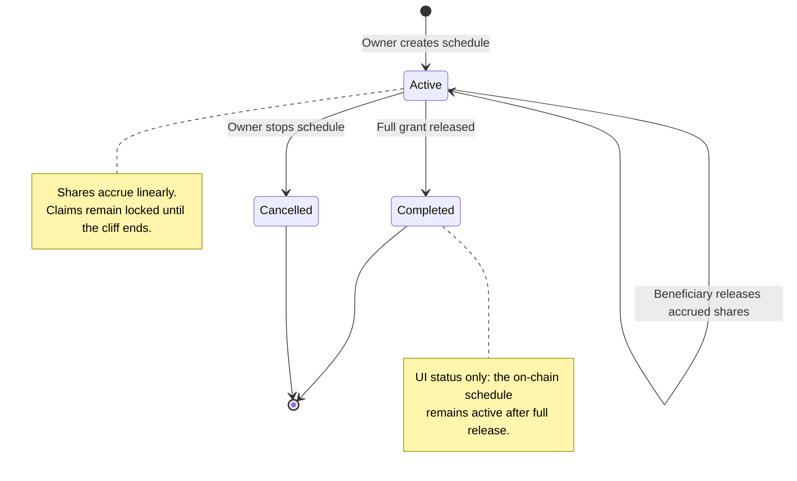

# Vesting — User Stories

**Format:** User Story | Acceptance Criteria (tester checklist) | Priority (P1–P5) | Effort
(XS/S/M/L/XL)  
**Last updated:** 2026-08-21

These stories describe the complete vesting journey exposed by the portal. Acceptance criteria are
written as tester checklists: the story status describes implementation progress, while the boxes
remain unticked until a tester validates a specific release.

## Product Model

- A vesting schedule is an on-chain **promise of future team shares**, not a token transfer.
- Creating a schedule neither mints nor locks shares. The Investor contract mints only the amount
  that has become releasable when the beneficiary claims, or when the owner stops the schedule.
- Accrual is linear from the start to the fully vested boundary. A cliff blocks claims; it does not
  delay the beginning of accrual.
- One beneficiary may have several concurrent schedules. Every action targets one schedule by its
  index.
- Portal boundaries are selected in local time with minute precision, shown in UTC for verification,
  and submitted on-chain with zero seconds.

## Lifecycle

## Status Overview

| User Story     | Title                                    | Actor          | Status        | Priority | Effort |
| -------------- | ---------------------------------------- | -------------- | ------------- | :------: | ------ |
| US-VESTING-001 | Create a minute-precise vesting schedule | Team owner     | 🧪 Validation |    P1    | M      |
| US-VESTING-002 | View schedules and aggregate totals      | Member / Owner | ✅ Done       |    P1    | M      |
| US-VESTING-003 | Release accrued shares                   | Beneficiary    | ✅ Done       |    P1    | M      |
| US-VESTING-004 | Stop an active vesting schedule          | Team owner     | ✅ Done       |    P1    | M      |
| US-VESTING-005 | Understand vested and claimable progress | Member / Owner | ⬜ Planned    |    P2    | M      |

## US-VESTING-001: Create a Minute-Precise Vesting Schedule

**As a** team owner **I want to** configure and review a beneficiary's vesting schedule **So that**
the grant is recorded with unambiguous amounts and time boundaries

### Acceptance Criteria

- [ ] Only the current team owner sees the **Create schedule** action
- [ ] The beneficiary selector accepts current team members and keeps one selected beneficiary
- [ ] The owner can replace the selected beneficiary before reviewing the schedule
- [ ] Total shares are required, greater than zero, and accept at most six decimal places
- [ ] The current Investor share symbol is displayed beside the grant amount
- [ ] Start, fully vested, and optional cliff boundaries each use a local date and time with minute
      precision
- [ ] Every selected local boundary displays its UTC equivalent
- [ ] The start defaults to the next whole minute; submitted timestamps always have zero seconds
- [ ] The fully vested boundary must be at least one minute after the start
- [ ] Duration presets provide 1-year, 2-year, and 4-year choices; the owner may set a custom end
- [ ] Cliff presets provide no cliff, 3 months, 6 months, and 1 year; the owner may set a custom
      cliff
- [ ] A cliff must end between the start and fully vested boundaries, inclusive
- [ ] Changing the start keeps selected duration and cliff presets synchronized to the same local
      time
- [ ] A vertical preview shows Starts, Cliff ends, and Fully vested with each date on one line
- [ ] The preview explains whether shares vest immediately or estimates the amount accrued when the
      cliff ends
- [ ] **Review schedule** validates the form and opens a separate confirmation step
- [ ] The review step repeats the beneficiary, grant, exact duration, cliff, and schedule preview
- [ ] The owner can return to editing without losing the configured schedule
- [ ] Confirming requests the wallet transaction; no shares move or mint at creation time
- [ ] A successful transaction closes the modal, refreshes schedules, and shows **Vesting schedule
      created**
- [ ] Cancelling the wallet request keeps the review visible and explains that no schedule was
      created
- [ ] An archived team cannot submit a new schedule
- [ ] Several concurrent schedules may be created for the same beneficiary

**Priority:** P1 (Critical) · **Effort:** M · **Status:** 🧪 Validation  
**Dependencies:** Current team, current Vesting contract, current Investor contract

## US-VESTING-002: View Schedules and Aggregate Totals

**As a** team member or owner **I want to** see the team's vesting commitments and releases **So
that** I can understand the current vesting position

### Acceptance Criteria

- [ ] The team Vesting page loads aggregate statistics and the schedule overview
- [ ] Statistics show total promised and total released shares for the current Investor token
- [ ] Aggregate totals include both active and stopped schedules
- [ ] The overview combines active and stopped schedules without losing each schedule's on-chain
      index
- [ ] One beneficiary with several schedules appears once per schedule
- [ ] Each row shows member address, token, start date, duration, amount per day, total amount,
      released amount, status, and available actions
- [ ] The status filter supports All, Active, Completed, and Cancelled
- [ ] An on-chain inactive schedule appears as **Cancelled** in the filter and **Inactive** in the
      table
- [ ] A schedule appears as **Completed** only after its full grant has been released; a fully
      vested but unclaimed schedule remains **Active**
- [ ] A read failure shows **Failed to load vestings** instead of failing silently
- [ ] Creating, releasing, or stopping a schedule refreshes both statistics and the overview

**Priority:** P1 (Critical) · **Effort:** M · **Status:** ✅ Done  
**Dependencies:** US-VESTING-001

## US-VESTING-003: Release Accrued Shares

**As a** vesting beneficiary **I want to** release shares accrued by one of my schedules **So that**
the earned shares are minted to my wallet

### Acceptance Criteria

- [ ] **Release** is shown only on the connected beneficiary's active schedules
- [ ] The action targets the selected schedule index, so another concurrent schedule is unchanged
- [ ] Release is unavailable before the schedule start
- [ ] Before the cliff ends, the contract reports no releasable shares
- [ ] At and after the cliff, vested shares equal `total × elapsed since start ÷ duration`, capped
      at the total grant
- [ ] Each release mints only `vested − already released` shares
- [ ] Releasing more than once cannot mint the same accrued shares twice
- [ ] At the fully vested boundary, the remaining unreleased grant can be minted
- [ ] A successful release refreshes the page data and shows **Vested shares minted to you**
- [ ] A failed or rejected transaction leaves the schedule unchanged and shows an error
- [ ] Release is blocked while the Vesting contract is paused or the team is archived
- [ ] Release fails safely when the Vesting contract does not have the Investor minter role

**Priority:** P1 (Critical) · **Effort:** M · **Status:** ✅ Done  
**Dependencies:** US-VESTING-001

## US-VESTING-004: Stop an Active Vesting Schedule

**As a** team owner **I want to** stop one active vesting schedule **So that** future unvested
shares are cancelled while the beneficiary keeps what has already accrued

### Acceptance Criteria

- [ ] **Stop** is shown only to the team owner on active schedules
- [ ] The action targets the beneficiary and schedule index, leaving their other schedules unchanged
- [ ] Stopping before the cliff mints nothing
- [ ] Stopping after the cliff mints the currently releasable amount to the beneficiary
- [ ] The unvested remainder is never minted and is not transferred anywhere
- [ ] The stopped schedule remains in history with `active = false`
- [ ] A stopped schedule cannot be stopped or released again
- [ ] A successful stop refreshes the page data and shows **Vesting stopped successfully**
- [ ] A failed or rejected transaction leaves the schedule active and shows an error
- [ ] Stop is blocked for non-owners, archived teams, and while the Vesting contract is paused

**Priority:** P1 (Critical) · **Effort:** M · **Status:** ✅ Done  
**Dependencies:** US-VESTING-001

## US-VESTING-005: Understand Vested and Claimable Progress

**As a** team member or owner **I want to** understand each schedule's accrued, released, and
claimable shares **So that** I know what can happen now and what remains locked

### Acceptance Criteria

- [ ] Each schedule shows total promised, vested now, already released, claimable now, and unvested
- [ ] Progress is calculated for the individual schedule rather than merged by beneficiary
- [ ] The next relevant boundary is shown with minute precision and local/UTC context
- [ ] Before the cliff, the UI explains that shares are accruing but remain locked
- [ ] After the cliff, the Release action shows the amount currently claimable
- [ ] Release is disabled with a specific explanation when the claimable amount is zero
- [ ] A fully vested but not fully released schedule is distinguished from a completed release
- [ ] A cancelled schedule shows the amount minted at cancellation and the amount that was cancelled

**Priority:** P2 (High) · **Effort:** M · **Status:** ⬜ Planned  
**Dependencies:** US-VESTING-002, US-VESTING-003, US-VESTING-004

## Known UX and Documentation Gaps

- The overview shows the start as a date and durations as whole days; it does not preserve the
  minute-level context available during creation and review.
- The Release button knows whether the schedule has started, but not whether the cliff has ended or
  whether any new shares are releasable. The contract safely rejects a zero release, but the UI
  currently provides only generic failure feedback.
- Stop is irreversible and may mint shares immediately, but the current UI has no confirmation step
  explaining the amounts that will be minted and cancelled.
- The contract-specific [vesting document](../contracts/vesting/README.md) describes an older
  pre-funded ERC20 model. The current contract and tests below are the authority for the on-demand
  Investor share-minting model.

## Implementation Evidence

- [Vesting page](../../../app/src/views/team/%5Bid%5D/VestingView.vue)
- [Schedule overview and actions](../../../app/src/components/sections/VestingView/VestingFlow.vue)
- [Schedule creation form](../../../app/src/components/sections/VestingView/forms/CreateVesting.vue)
- [Creation orchestration and validation](../../../app/src/composables/vesting/useCreateVesting.ts)
- [Frontend vesting reads](../../../app/src/composables/vesting/reads.ts)
- [Frontend vesting writes](../../../app/src/composables/vesting/writes.ts)
- [Current Vesting contract](../../../contract/contracts/Vesting.sol)
- [Contract behaviour tests](../../../contract/test/Vesting.spec.ts)
