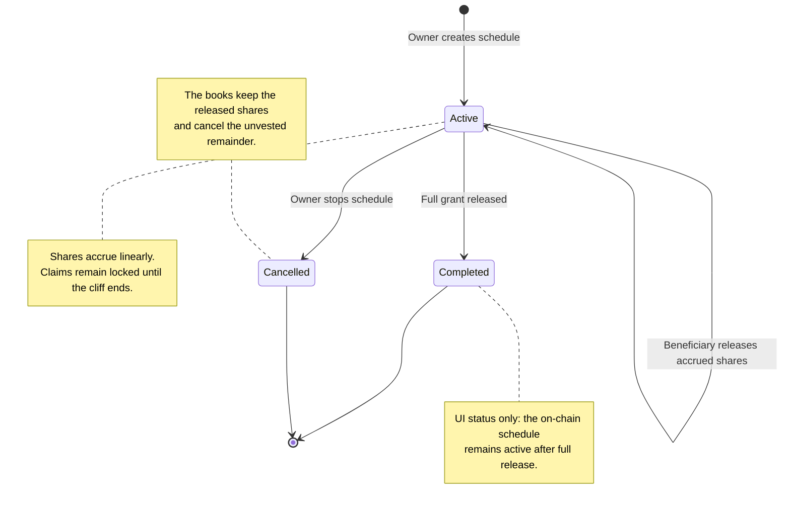

# Vesting — User Stories

**Scope:** The Vesting V2 journey exposed by the portal, from creating a schedule to seeing it in the company books

**Last reviewed:** 2026-08-21

**As a** team owner **I want to** create and manage a vesting schedule for SHERs to a team member **so that** I can incentivize and retain
my team members.

These stories describe the Vesting V2 journey exposed by the portal. Legacy Vesting versions are outside this feature scope. Its acceptance
criteria follow the [feature documentation review contract](../../platform/feature-specification-guide.md#human-review-contract).

## Product Model

- A vesting schedule is an on-chain **promise of future team shares**, not a token transfer.
- Creating a schedule neither mints nor locks shares. The Investor contract mints only the amount that has become releasable when the
  beneficiary claims, or when the owner stops the schedule.
- Accrual is linear from the start to the fully vested boundary. A cliff blocks claims; it does not delay the beginning of accrual.
- One beneficiary may have several concurrent schedules. Every action targets one schedule by its index.
- The portal reads and writes only the current Vesting V2 contract selected for the team.
- Portal boundaries are selected in local time with minute precision, shown in UTC for verification, and submitted on-chain with zero
  seconds.
- A schedule is recorded in the company books as a **restricted-stock grant**: the whole award is committed to equity when the schedule is
  defined, released shares become issued equity, and a stop cancels the unvested remainder. Vesting never affects the company profit.

## Lifecycle

## Status Overview

| User Story     | Title                                    | Actor          | Status       |
| -------------- | ---------------------------------------- | -------------- | ------------ |
| US-VESTING-001 | Create a minute-precise vesting schedule | Team owner     | ✅ Done      |
| US-VESTING-002 | View schedules and aggregate totals      | Member / Owner | ✅ Done      |
| US-VESTING-003 | Release accrued shares                   | Beneficiary    | ✅ Done      |
| US-VESTING-004 | Stop an active vesting schedule          | Team owner     | ✅ Done      |
| US-VESTING-005 | Understand vested and claimable progress | Member / Owner | ✅ Done      |
| US-VESTING-006 | See vesting in the company books         | Member / Owner | 🔗 Reference |

## US-VESTING-001: Create a Minute-Precise Vesting Schedule

**As a** team owner\
**I want to** configure and review a beneficiary's vesting schedule\
**So that** the grant is recorded with unambiguous amounts and time boundaries

### Acceptance Criteria

#### Happy Path

- [x] `AC-US-VESTING-001-01` The team owner can create a vesting schedule for a current team member.
- [x] `AC-US-VESTING-001-02` The owner can use duration and cliff presets or provide custom boundaries.
- [x] `AC-US-VESTING-001-03` The owner can review a schedule before confirmation without losing the entered values.
- [x] `AC-US-VESTING-001-04` A successfully created schedule becomes available in the team's schedules.
- [x] `AC-US-VESTING-001-05` The same beneficiary can receive multiple schedules.

#### Business Rules

- [x] `AC-US-VESTING-001-06` Only the team owner can create a schedule.
- [x] `AC-US-VESTING-001-07` Archived teams cannot create a schedule.
- [x] `AC-US-VESTING-001-08` A schedule grant must be positive and use no more than six decimal places.
- [x] `AC-US-VESTING-001-09` Start, end, and optional cliff boundaries use minute precision and preserve their exact UTC values.
- [x] `AC-US-VESTING-001-10` The end boundary must be after the start boundary.
- [x] `AC-US-VESTING-001-11` An optional cliff must be between the start and end boundaries.
- [x] `AC-US-VESTING-001-12` Creating a schedule records an on-chain commitment without minting shares.

#### Edge & Error Cases

- [x] `AC-US-VESTING-001-13` Cancelling schedule creation does not create an on-chain schedule.
- [x] `AC-US-VESTING-001-14` A failed schedule creation does not create an on-chain schedule and preserves the entered context.

**Accounting:** Creating the grant records its full commitment through
[`UC-VEST-01`](../accounting/journal-entry-catalogue.md#uc-vest-01--vesting-grant) without minting shares.

**Dependencies:** Current team, current Vesting contract, current Investor contract

## US-VESTING-002: View Schedules and Aggregate Totals

**As a** team member or owner\
**I want to** see the team's vesting commitments and releases\
**So that** I can understand the current vesting position

### Acceptance Criteria

#### Happy Path

- [x] `AC-US-VESTING-002-01` Users can access Promised, Vested, Claimable, and Released totals.
- [x] `AC-US-VESTING-002-02` Every grant has one schedule entry, including grants for a repeated beneficiary.
- [x] `AC-US-VESTING-002-03` Users can switch between their own schedules and all team schedules.
- [x] `AC-US-VESTING-002-04` Users can filter schedules by All, Active, Claimable, Completed, or Cancelled.
- [x] `AC-US-VESTING-002-05` Creating, releasing, or stopping a schedule refreshes the schedules and aggregate totals.

#### Business Rules

- [x] `AC-US-VESTING-002-06` A schedule is Completed when its full grant has been released.
- [x] `AC-US-VESTING-002-07` A schedule is Cancelled when the team owner has stopped it.

#### Edge & Error Cases

- [x] `AC-US-VESTING-002-08` An empty schedule scope returns zero aggregate totals and no schedule entries.
- [x] `AC-US-VESTING-002-09` A failed schedule read is reported without being treated as successfully loaded data.

**Dependencies:** US-VESTING-001

## US-VESTING-003: Release Accrued Shares

**As a** vesting beneficiary\
**I want to** release shares accrued by one of my schedules\
**So that** the earned shares are minted to my wallet

### Acceptance Criteria

#### Happy Path

- [x] `AC-US-VESTING-003-01` A beneficiary can release accrued shares from one of their active schedules.
- [x] `AC-US-VESTING-003-02` A successful release updates the schedule's released and claimable amounts.

#### Business Rules

- [x] `AC-US-VESTING-003-03` Only the schedule beneficiary can release its shares.
- [x] `AC-US-VESTING-003-04` A release affects only the selected schedule.
- [x] `AC-US-VESTING-003-05` A release is available only when the selected schedule has a positive claimable amount.
- [x] `AC-US-VESTING-003-06` A release mints the claimable amount without exceeding the grant.
- [x] `AC-US-VESTING-003-07` Repeated releases cannot mint the same shares twice.
- [x] `AC-US-VESTING-003-08` Archived teams and paused Vesting contracts cannot release shares.

#### Edge & Error Cases

- [x] `AC-US-VESTING-003-09` Cancelling a release does not change the schedule or mint shares.
- [x] `AC-US-VESTING-003-10` A failed release does not change the schedule or mint shares.

**Accounting:** A successful release moves promised shares into Investor Equity through
[`UC-VEST-02`](../accounting/journal-entry-catalogue.md#uc-vest-02--vested-sher-released). Its matching Investor mint is not booked again.

**Dependencies:** US-VESTING-001

## US-VESTING-004: Stop an Active Vesting Schedule

**As a** team owner\
**I want to** stop one active vesting schedule\
**So that** future unvested shares are cancelled without losing accrued shares

### Acceptance Criteria

#### Happy Path

- [x] `AC-US-VESTING-004-01` The team owner can stop one active vesting schedule.
- [x] `AC-US-VESTING-004-02` Stopping a schedule releases its claimable shares to the beneficiary and cancels its unvested remainder.
- [x] `AC-US-VESTING-004-03` A stopped schedule remains available with a Cancelled status.

#### Business Rules

- [x] `AC-US-VESTING-004-04` Only the team owner can stop an active schedule.
- [x] `AC-US-VESTING-004-05` Stopping affects only the selected schedule.
- [x] `AC-US-VESTING-004-06` Stopping a schedule before its cliff mints no shares.
- [x] `AC-US-VESTING-004-07` A stopped schedule cannot be used again.
- [x] `AC-US-VESTING-004-08` Archived teams and paused Vesting contracts cannot stop a schedule.

#### Edge & Error Cases

- [x] `AC-US-VESTING-004-09` Cancelling a stop does not change the active schedule.
- [x] `AC-US-VESTING-004-10` A failed stop leaves the schedule active.

**Accounting:** A stop may group an accrued release (`UC-VEST-02`) with cancellation of the unvested remainder through
[`UC-VEST-03`](../accounting/journal-entry-catalogue.md#uc-vest-03--unvested-grant-cancelled) in one journal entry.

**Dependencies:** US-VESTING-001

## US-VESTING-005: Understand Vested and Claimable Progress

**As a** team member or owner\
**I want to** understand each schedule's accrued, released, and claimable shares\
**So that** I know what can happen now and what remains locked

### Acceptance Criteria

#### Happy Path

- [x] `AC-US-VESTING-005-01` Each schedule exposes its promised, vested, released, claimable, and unvested shares.
- [x] `AC-US-VESTING-005-02` Each schedule exposes its next boundary to the minute in local time and UTC.
- [x] `AC-US-VESTING-005-03` Upcoming, Cliff locked, Accruing, Claimable, Fully vested, Completed, and Cancelled remain distinct states.

#### Business Rules

- [x] `AC-US-VESTING-005-04` Releasing a schedule is available only when its claimable amount is positive.
- [x] `AC-US-VESTING-005-05` Fully vested and fully released schedules have distinct statuses.

#### Edge & Error Cases

- [x] `AC-US-VESTING-005-06` Accrued shares remain locked before the cliff boundary.
- [x] `AC-US-VESTING-005-07` A Cancelled schedule exposes both its released amount and its cancelled amount.

**Dependencies:** US-VESTING-002, US-VESTING-003, US-VESTING-004

## US-VESTING-006: See Vesting in the Company Books

This is a reference story. Accounting owns the user journey and acceptance criteria for viewing vesting entries. The
[Accounting rule catalogue](../accounting/journal-entry-catalogue.md#shareholder-and-vesting-rules) defines how creation, release, and stop
evidence becomes `UC-VEST-01`, `UC-VEST-02`, and `UC-VEST-03` in the General Ledger. The focused
[Vesting accounting policy](../accounting/vesting-accounting-restricted-stock.md) explains the restricted-stock treatment.

**Dependencies:** US-VESTING-001, US-VESTING-003, US-VESTING-004, and US-ACCT-002

## UI/UX Notes

- Schedule creation review includes the beneficiary, grant, boundaries, cliff effect, and first claimable amount.
- Release review includes the claimable amount before wallet confirmation.
- Stop confirmation includes the shares to release and cancel before signing.
- Loading, empty, and schedule read-error states remain distinguishable and actionable.

## Human Validation

Validated on 2026-08-21 against the current contract behaviour, automated evidence, and product review, for `US-VESTING-001` through
`US-VESTING-005`. Checked criteria record the verified implementation; this validation records the product review. `US-VESTING-006` is a
reference to the Accounting-owned acceptance contract and has no independent validation status.

## Implementation Evidence

**Implementation evidence reviewed against:** `fa7a1732154709f65a459eb1122ead83fcf05ecf`

- [Vesting components](../../../app/src/components/sections/VestingView/)
- [Vesting page and read orchestration](../../../app/src/views/team/%5Bid%5D/VestingView.vue)
- [Schedule overview and actions](../../../app/src/components/sections/VestingView/VestingFlow.vue)
- [V2 schedule calculations](../../../app/src/utils/vesting/schedule.ts)
- [Release and Stop review](../../../app/src/components/sections/VestingView/VestingActionReviewModal.vue)
- [Schedule creation, validation, and submission](../../../app/src/components/sections/VestingView/forms/)
- [Vesting beneficiary selection](../../../app/src/components/sections/VestingView/forms/VestingGrantDetails.vue)
- [Frontend vesting reads](../../../app/src/composables/vesting/reads.ts)
- [Frontend vesting writes](../../../app/src/composables/vesting/writes.ts)
- [Vesting event feed for accounting (getLogs)](../../../app/src/composables/vesting/useVestingEventsViaLogs.ts)
- [Vesting accounting entries](../../../app/src/utils/accounting/mappers/vesting.ts) and
  [vesting accounting tests](../../../app/src/utils/accounting/__tests__/vesting.spec.ts)
- [Current Vesting contract](../../../contract/contracts/Vesting.sol)
- [Contract behaviour tests](../../../contract/test/Vesting.spec.ts)

### Test-suite ownership

- [Vesting composable tests](../../../app/src/composables/vesting/__tests__/),
  [vesting model tests](../../../app/src/utils/vesting/__tests__/), and
  [vesting view tests](../../../app/src/views/team/%5Bid%5D/__tests__/VestingView.spec.ts)

## Related Documentation

- [Vesting V2 contract behaviour](../../contracts/features/vesting/README.md)
- [Vesting accounting policy](../accounting/vesting-accounting-restricted-stock.md)
- [Accounting — User Stories](../accounting/README.md)
- [Shared member-selection implementation](../../implementation/member-selection/README.md)
- [Contract features index](../../contracts/features/README.md)
