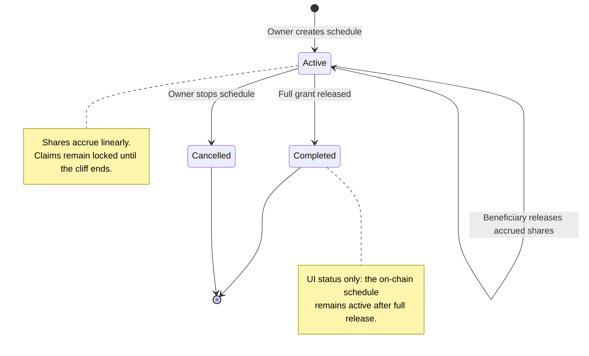

# Vesting — User Stories

**Format:** User Story | Acceptance Criteria (tester checklist) | Priority (P1–P5) | Effort
(XS/S/M/L/XL)

**Last updated:** 2026-08-21

These stories describe the complete vesting journey exposed by the portal.

## Human Review Contract

Acceptance criteria are the centre of human review. Automated tests provide evidence, but do not
replace the reviewer's decision.

- Each criterion describes one observable functional outcome.
- Each criterion must produce a clear pass or fail result.
- A story passes only when a human reviewer validates every criterion for the reviewed release.
- Story status describes current implementation progress; checkboxes remain empty until review.

## Product Model

- A vesting schedule is an on-chain **promise of future team shares**, not a token transfer.
- Creating a schedule neither mints nor locks shares. The Investor contract mints only the amount
  that has become releasable when the beneficiary claims, or when the owner stops the schedule.
- Accrual is linear from the start to the fully vested boundary. A cliff blocks claims; it does not
  delay the beginning of accrual.
- One beneficiary may have several concurrent schedules. Every action targets one schedule by its
  index.
- Portal boundaries are selected in local time with minute precision, shown in UTC for verification,
  and submitted on-chain with zero seconds.

## Lifecycle

## Status Overview

| User Story     | Title                                    | Actor          | Status        | Priority | Effort |
| -------------- | ---------------------------------------- | -------------- | ------------- | :------: | ------ |
| US-VESTING-001 | Create a minute-precise vesting schedule | Team owner     | 🧪 Validation |    P1    | M      |
| US-VESTING-002 | View schedules and aggregate totals      | Member / Owner | ✅ Done       |    P1    | M      |
| US-VESTING-003 | Release accrued shares                   | Beneficiary    | 🟡 Partial    |    P1    | M      |
| US-VESTING-004 | Stop an active vesting schedule          | Team owner     | 🟡 Partial    |    P1    | M      |
| US-VESTING-005 | Understand vested and claimable progress | Member / Owner | ⬜ Planned    |    P2    | M      |

## US-VESTING-001: Create a Minute-Precise Vesting Schedule

**As a** team owner **I want to** configure and review a beneficiary's vesting schedule **So that**
the grant is recorded with unambiguous amounts and time boundaries

### Acceptance Criteria

- [ ] Only the team owner can create a schedule; archived teams cannot create one.
- [ ] The owner can select one current team member and enter a positive grant with up to six
      decimals.
- [ ] Start, end, and optional cliff boundaries are set to the minute and shown in local time and
      UTC.
- [ ] End is after start, and the cliff is between start and end.
- [ ] The owner can use duration and cliff presets or enter custom boundaries.
- [ ] Review shows the beneficiary, grant, boundaries, cliff effect, and first claimable amount.
- [ ] Returning from review preserves the entered schedule.
- [ ] Confirmation creates an on-chain commitment without minting shares.
- [ ] Success refreshes the schedules; cancellation or failure creates nothing and preserves
      context.
- [ ] The same beneficiary can receive multiple schedules.

**Priority:** P1 (Critical) · **Effort:** M · **Status:** 🧪 Validation

**Dependencies:** Current team, current Vesting contract, current Investor contract

## US-VESTING-002: View Schedules and Aggregate Totals

**As a** team member or owner **I want to** see the team's vesting commitments and releases **So
that** I can understand the current vesting position

### Acceptance Criteria

- [ ] The page shows total promised and released shares across active and stopped schedules.
- [ ] Every schedule has its own row, including multiple schedules for one beneficiary.
- [ ] Each row identifies the beneficiary, token, timing, grant, released amount, and status.
- [ ] Users can filter schedules by All, Active, Completed, or Cancelled.
- [ ] Completed means fully released; Cancelled means stopped by the owner.
- [ ] Create, Release, and Stop refresh the totals and schedule list.
- [ ] A loading failure is visible to the user.

**Priority:** P1 (Critical) · **Effort:** M · **Status:** ✅ Done

**Dependencies:** US-VESTING-001

## US-VESTING-003: Release Accrued Shares

**As a** vesting beneficiary **I want to** release shares accrued by one of my schedules **So that**
the earned shares are minted to my wallet

### Acceptance Criteria

- [ ] Only the beneficiary can release shares from their active schedule.
- [ ] Release affects only the selected schedule.
- [ ] Release is unavailable when the claimable amount is zero.
- [ ] Release mints the claimable amount without exceeding the grant.
- [ ] Repeated releases cannot mint the same shares twice.
- [ ] Success updates the released amount; cancellation or failure changes nothing.
- [ ] Archived teams or paused Vesting contracts cannot release shares.

**Priority:** P1 (Critical) · **Effort:** M · **Status:** 🟡 Partial

**Dependencies:** US-VESTING-001

## US-VESTING-004: Stop an Active Vesting Schedule

**As a** team owner **I want to** stop one active vesting schedule **So that** future unvested
shares are cancelled while the beneficiary keeps what has already accrued

### Acceptance Criteria

- [ ] Only the team owner can stop an active schedule.
- [ ] A confirmation shows the shares to release and cancel before signing.
- [ ] Stop affects only the selected schedule.
- [ ] The beneficiary receives the claimable shares; the unvested remainder is cancelled.
- [ ] Stopping before the cliff mints no shares.
- [ ] The stopped schedule remains visible as Cancelled and cannot be used again.
- [ ] Success refreshes the schedule; cancellation or failure leaves it active.
- [ ] Archived teams or paused Vesting contracts cannot stop a schedule.

**Priority:** P1 (Critical) · **Effort:** M · **Status:** 🟡 Partial

**Dependencies:** US-VESTING-001

## US-VESTING-005: Understand Vested and Claimable Progress

**As a** team member or owner **I want to** understand each schedule's accrued, released, and
claimable shares **So that** I know what can happen now and what remains locked

### Acceptance Criteria

- [ ] Each schedule shows promised, vested, released, claimable, and unvested shares.
- [ ] The next boundary is shown to the minute in local time and UTC.
- [ ] Before the cliff, the user sees that accrued shares remain locked.
- [ ] Release shows the claimable amount or explains why it is unavailable.
- [ ] Fully vested and fully released schedules have distinct statuses.
- [ ] Cancelled schedules show released and cancelled amounts.

**Priority:** P2 (High) · **Effort:** M · **Status:** ⬜ Planned

**Dependencies:** US-VESTING-002, US-VESTING-003, US-VESTING-004

## Known UX and Documentation Gaps

- The overview shows the start as a date and durations as whole days; it does not preserve the
  minute-level context available during creation and review.
- The Release button knows whether the schedule has started, but not whether the cliff has ended or
  whether any new shares are releasable. The contract safely rejects a zero release, but the UI
  currently provides only generic failure feedback.
- Stop is irreversible and may mint shares immediately, but the current UI has no confirmation step
  explaining the amounts that will be minted and cancelled.
- The contract-specific [vesting document](../contracts/vesting/README.md) describes an older
  pre-funded ERC20 model. The current contract and tests below are the authority for the on-demand
  Investor share-minting model.

## Implementation Evidence

- [Vesting page](../../../app/src/views/team/%5Bid%5D/VestingView.vue)
- [Schedule overview and actions](../../../app/src/components/sections/VestingView/VestingFlow.vue)
- [Schedule creation form](../../../app/src/components/sections/VestingView/forms/CreateVesting.vue)
- [Creation orchestration and validation](../../../app/src/composables/vesting/useCreateVesting.ts)
- [Frontend vesting reads](../../../app/src/composables/vesting/reads.ts)
- [Frontend vesting writes](../../../app/src/composables/vesting/writes.ts)
- [Current Vesting contract](../../../contract/contracts/Vesting.sol)
- [Contract behaviour tests](../../../contract/test/Vesting.spec.ts)
