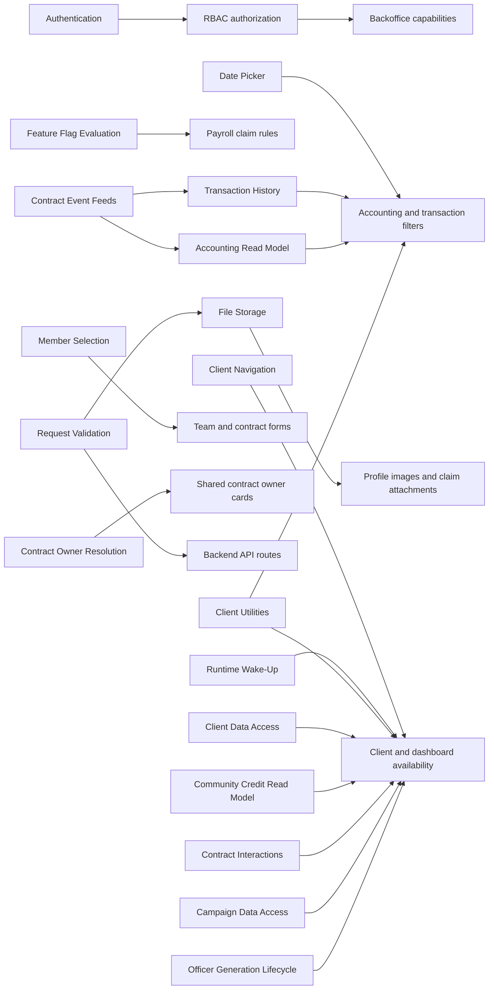

# Architectural Capability Inventory

**Status:** Current documentation index

**Last updated:** 2026-09-09

This index owns CNC Portal's shared architectural capabilities. Product features remain in the
[Product Feature Inventory](../features/README.md), contract behaviour remains under [`docs/contracts/`](../contracts/README.md), and
development tooling remains under [`docs/development-guide/`](../development-guide/README.md).

Capability documents describe verified current runtime behaviour. Their structure and ownership are defined by the
[Implementation Documentation Guide](../platform/implementation-documentation-guide.md). Durable technical choices and their trade-offs
belong in [Architecture Decision Records](../adr/README.md).

## Capability Inventory

| Capability                                                               | System guarantee                                                | Main consumers                   | Last verified |
| ------------------------------------------------------------------------ | --------------------------------------------------------------- | -------------------------------- | ------------- |
| [Authentication](./authentication/README.md)                             | SIWE verification and JWT session issuance                      | Client, dashboard, protected API | 2026-08-21    |
| [Client Navigation](./client-navigation/README.md)                       | Client routes, guards, and sidebar navigation                   | Client feature entry points      | 2026-08-26    |
| [Date Picker](./date-picker/README.md)                                   | Shared as-of-date and period selection                          | Accounting, histories, dashboard | 2026-08-31    |
| [Contract Event Feeds](./contract-event-feeds/README.md)                 | Reconstructs client contract activity from RPC logs             | Accounts, Accounting, histories  | 2026-09-05    |
| [Transaction History](./transaction-history/README.md)                   | Shared transaction filtering and detail display                 | Accounts, Credit, Shareholders   | 2026-08-30    |
| [Feature Flag Evaluation](./feature-flags/README.md)                     | Global and team status resolution                               | Feature Restrictions, Payroll    | 2026-08-21    |
| [RBAC](./rbac/README.md)                                                 | Role-based backend and dashboard authorization                  | Backoffice, administrator APIs   | 2026-08-21    |
| [Runtime Wake-Up](./runtime-wake-up/README.md)                           | Non-blocking process wake and database readiness                | Client, dashboard, deployment    | 2026-08-21    |
| [Member Selection](./member-selection/README.md)                         | Scoped user selection and exclusions                            | Team, Safe, elections, Vesting   | 2026-08-24    |
| [Contract Owner Resolution](./contract-owner-resolution/README.md)       | Resolves and presents a contract owner                          | Accounts, shareholder management | 2026-08-30    |
| [Client Utilities](./client-utilities/README.md)                         | Pure, explicit client data-shaping boundaries                   | All client product surfaces      | 2026-09-01    |
| [Client Data Access](./client-data-access/README.md)                     | Focused client HTTP query and mutation boundaries               | Client product features          | 2026-09-01    |
| [Accounting Read Model](./accounting-read-model/README.md)               | Consolidated postings, canonical journal, and report boundaries | Accounting feature               | 2026-09-04    |
| [Request Validation](./request-validation/README.md)                     | Parses and normalizes backend request sections                  | Backend API routes               | 2026-09-09    |
| [File Storage](./file-storage/README.md)                                 | Validated uploads and time-limited attachment access            | User Profile, Payroll            | 2026-09-09    |
| [Community Credit Read Model](./community-credit-read-model/README.md)   | Consolidated offer, metadata, and position state                | Community Credit                 | 2026-09-23    |
| [Contract Interactions](./contract-interactions/README.md)               | Shared contract read, write, and invalidation boundaries        | Client contract journeys         | 2026-09-23    |
| [Campaign Data Access](./campaign-data-access/README.md)                 | Campaign settings, activity, and mutation boundaries            | Contract Management              | 2026-09-23    |
| [Officer Generation Lifecycle](./officer-generation-lifecycle/README.md) | Versioned Officer deployment and recovery                       | Contract Management              | 2026-09-23    |

## Updating This Index

1. Confirm that the subject is not a direct product outcome, contract behaviour, or development tool.
2. Create `docs/implementation/<capability>/README.md`.
3. Link every consuming product feature and subsystem.
4. Add the capability here after current code and representative tests have been inspected.

## Cross-Capability Test Ownership

These tests protect shared runtime or repository contracts rather than one product feature:

- [API-surface guard tests](../../app/scripts/__tests__/check-api-surface.node.mjs),
  [architecture guard tests](../../app/scripts/__tests__/check-architecture-candidates.node.mjs),
  [application-shell tests](../../app/src/__tests__/App.spec.ts), [application bootstrap tests](../../app/src/__tests__/main.spec.ts), and
  [wallet configuration tests](../../app/src/__tests__/wagmi.spec.ts)
- [Contract artifact registry tests](../../app/src/artifacts/__tests__/registry.spec.ts)
- [Notification API tests](../../backend/src/controllers/__tests__/notificationController.test.ts),
  [notification utility tests](../../backend/src/utils/__tests__/notificationUtil.test.ts),
  [dependency-boundary tests](../../backend/src/utils/__tests__/dependenciesUtil.test.ts),
  [HTTP utility tests](../../backend/src/utils/__tests__/utils.test.ts),
  [chain-client configuration tests](../../backend/src/utils/__tests__/viem.config.test.ts), and
  [telemetry tunnel tests](../../backend/src/routes/__tests__/sentryTunnelRoute.test.ts)
- [Documentation freshness tests](../../scripts/documentation-freshness.test.mjs)
