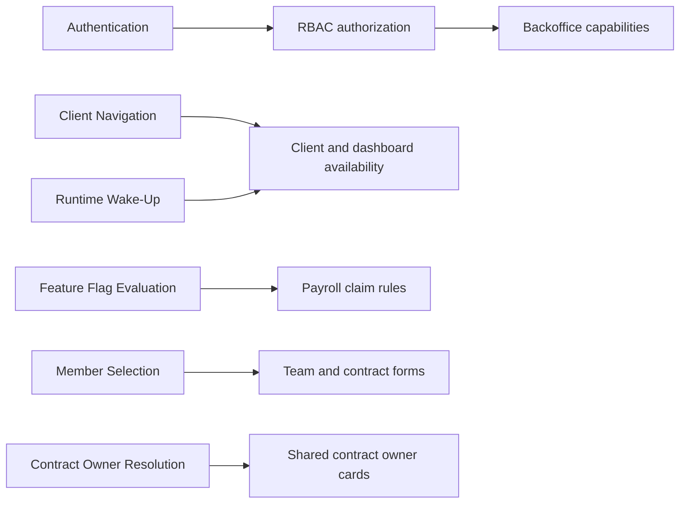

# Architectural Capability Inventory

**Status:** Current documentation index

**Last updated:** 2026-08-30

This index owns CNC Portal's shared architectural capabilities. Product features remain in the
[Product Feature Inventory](../features/README.md), contract behaviour remains under [`docs/contracts/`](../contracts/README.md), and
development tooling remains under [`docs/development-guide/`](../development-guide/README.md).

Capability documents describe verified current runtime behaviour. Their structure and ownership are defined by the
[Implementation Documentation Guide](../platform/implementation-documentation-guide.md). Durable technical choices and their trade-offs
belong in [Architecture Decision Records](../adr/README.md).

## Capability Inventory

| Capability                                                         | System guarantee                                 | Main consumers                   | Last verified |
| ------------------------------------------------------------------ | ------------------------------------------------ | -------------------------------- | ------------- |
| [Authentication](./authentication/README.md)                       | SIWE verification and JWT session issuance       | Client, dashboard, protected API | 2026-08-21    |
| [Client Navigation](./client-navigation/README.md)                 | Client routes, guards, and sidebar navigation    | Client feature entry points      | 2026-08-26    |
| [Feature Flag Evaluation](./feature-flags/README.md)               | Global and team status resolution                | Feature Restrictions, Payroll    | 2026-08-21    |
| [RBAC](./rbac/README.md)                                           | Role-based backend and dashboard authorization   | Backoffice, administrator APIs   | 2026-08-21    |
| [Runtime Wake-Up](./runtime-wake-up/README.md)                     | Non-blocking process wake and database readiness | Client, dashboard, deployment    | 2026-08-21    |
| [Member Selection](./member-selection/README.md)                   | Scoped user selection and exclusions             | Team, Safe, elections, Vesting   | 2026-08-24    |
| [Contract Owner Resolution](./contract-owner-resolution/README.md) | Resolves and presents a contract owner           | Accounts, shareholder management | 2026-08-30    |

## Updating This Index

1. Confirm that the subject is not a direct product outcome, contract behaviour, or development tool.
2. Create `docs/implementation/<capability>/README.md`.
3. Link every consuming product feature and subsystem.
4. Add the capability here after current code and representative tests have been inspected.
