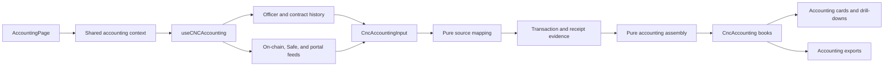
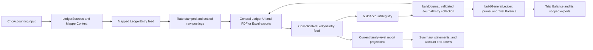
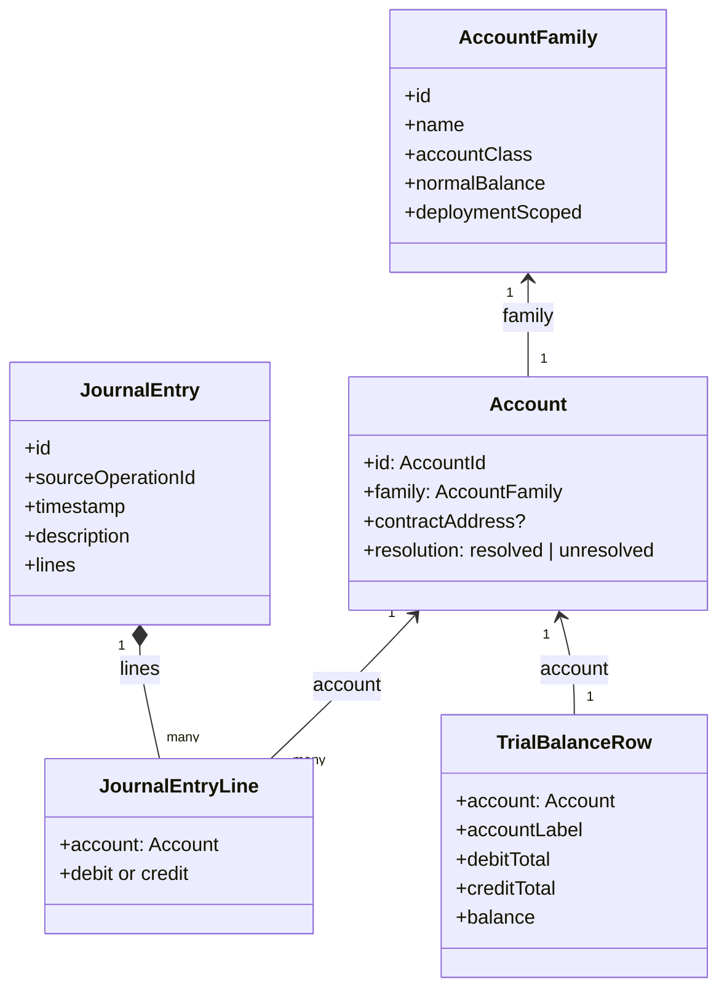
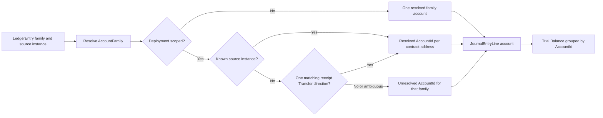
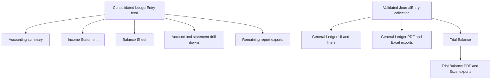

# Accounting Read Model

**Scope:** The client-side read model that turns company contract and portal feeds into consolidated accounting postings, a validated
double-entry journal, and the report projections consumed by Accounting. It does not create or persist manual journal entries.

**Last verified:** 2026-09-04

## Consumers

- The [Accounting feature](../../features/accounting/README.md) uses this read model for its consolidated books, report cards, drill-downs,
  and exports.
- [AccountingPage](../../../app/src/components/sections/AccountingView/AccountingPage.vue) resolves one shared result for the report-card
  tree; standalone cards can resolve the same model through the accounting context.

## Runtime Model

`useCNCAccounting` owns I/O and reactive loading state. The shared context prevents the page's cards from independently fetching and
assembling the same books. The assembly is pure: it receives `CncAccountingInput` and returns `CncAccounting` without Vue or network I/O.

## Main Assembly Flow

The two outgoing branches are intentional current behaviour. `JournalEntry` is the canonical double-entry representation for the General
Ledger and Trial Balance. `LedgerEntry` remains a transitional input for projections that have not yet migrated to journal lines.

## Account Domain Model

An `AccountFamily` is reusable chart metadata. An `Account` is the concrete accounting identity used by journal and Trial Balance lines. For
deployment-scoped families, a source contract address distinguishes each deployment. `accountLabel` is presentation text derived after
identity has been resolved; it is never an account key.

## Canonical Nomenclature

| Term               | Meaning and boundary                                                                                                                                                                                                                                                   |
| ------------------ | ---------------------------------------------------------------------------------------------------------------------------------------------------------------------------------------------------------------------------------------------------------------------- |
| Source operation   | The on-chain transaction or off-chain record from which postings originate. For an indexed transaction, its hash is the `sourceOperationId`; the raw `<txHash>-<logIndex>` identifier remains event evidence. A synthetic operation uses its explicit stable identity. |
| `LedgerEntry`      | A mapped, consolidated posting in the transitional feed. It carries legacy family names and optional source-instance values; it is not the concrete account model.                                                                                                     |
| `AccountName`      | A legacy raw family name in a `LedgerEntry`, not an `Account` identity.                                                                                                                                                                                                |
| `AccountFamily`    | Canonical reusable chart metadata: stable family key, display name, class, normal balance, and deployment scope.                                                                                                                                                       |
| `Account`          | Canonical concrete account object: `AccountId`, `AccountFamily`, optional `contractAddress`, and `resolution`.                                                                                                                                                         |
| `AccountId`        | Stable identity used to group journal lines and Trial Balance rows.                                                                                                                                                                                                    |
| `JournalEntry`     | Validated double-entry record for one source operation, with ordered monetary lines or an explicit memo-only entry. A transaction-backed entry uses its `txHash` for `id` and `sourceOperationId`; its source snapshot is narration-only.                              |
| `JournalEntryLine` | One debit or credit line carrying exactly one concrete `Account` and optional token movement evidence for its display projection.                                                                                                                                      |
| `TrialBalanceRow`  | Projection grouped by `AccountId`; the balance follows the family normal side.                                                                                                                                                                                         |
| `accountLabel`     | Human-readable display text. It may include a deployment number or unresolved marker but must not be used for identity or filtering.                                                                                                                                   |

The raw `LedgerEntry.debit` and `LedgerEntry.credit` fields currently contain `AccountName` values, while `debitInstance` and
`creditInstance` carry source-instance values such as a contract address. These names are ambiguous at the transitional boundary. New code
must use `AccountFamily`, `Account`, `contractAddress`, and `AccountId` according to the model above rather than calling an unscoped string
an account.

## Account Resolution Across Redeployments

Bank, Payroll, Expense, and Credit families are deployment-scoped. Their resolved addresses receive distinct account identities only when a
mapper names a known company deployment of the matching family, or when an ERC-20 `Transfer` in the operation receipt proves that known
deployment sent or received the cash. A missing, external, ambiguous, or native-only address remains unresolved; the registry never assigns
it to an earlier or later deployment based on activity order.

## Invariants and Failure Behaviour

### Invariants

- The consolidated posting feed is chronologically sorted and de-duplicated before account resolution.
- One transaction-backed operation uses its `txHash` as its `JournalEntry.id` and `sourceOperationId`; all source events with that hash are
  assembled into that entry before compatible debit and credit lines are aggregated. A synthetic operation retains its explicit stable
  identity.
- A monetary `JournalEntryLine` has exactly one debit or credit amount and exactly one concrete `Account`.
- Each monetary `JournalEntry` has equal debit and credit totals. Invalid normalized postings are rejected before a journal projection can
  consume them.
- A direct external deposit into Bank or Safe credits `Service Revenue` regardless of the sender address. Deposits and company-pocket
  transfers retain their source-evidence accounts even when a legacy category exists. A dedicated SafeDepositRouter investment that issues
  SHER remains an `Investor Equity` operation.
- Trial Balance grouping uses `AccountId`, not a display label or a contract-generation order.
- A deployment-specific instance is resolved only when it is a known company deployment of the matching family, either named directly by the
  mapper or proven by an unambiguous ERC-20 receipt `Transfer` direction. Missing, external, ambiguous, and native-only evidence remains
  unresolved; activity order and current-generation status are never evidence.

### Failure Behaviour

- A company-query failure is fatal because Accounting cannot establish the contract set that owns the books.
- A failed on-chain scan for one contract generation leaves other generations in the assembled books and records a reconciliation gap.
- A failed transaction-receipt read leaves its deployment-specific leg unresolved and records a reconciliation gap. A readable receipt with
  no matching or more than one matching company deployment is an explicit unresolved result rather than a read failure.
- Safe-service feeds are optional and do not block the page's loading state. Their absence can omit Safe activity without generating a
  reconciliation gap, which remains a known limitation.
- A standalone report card falls back to its route's company identifier when it is rendered outside the shared Accounting page context.

## Current Report Boundaries

This is a current implementation boundary, not an accounting-policy distinction. The General Ledger filters reporting period, concrete
`AccountId`, and currency at the journal-entry level, retaining all lines of every selected entry. Internal-transfer narration reads the
source and destination display labels from the debit and credit `JournalEntryLine` accounts, so later deployments and unresolved accounts
remain explicit rather than being inferred from family-level event text. Every transaction-backed journal group uses its transaction hash as
its identity; a raw `<txHash>-<logIndex>` value remains traceability evidence. A fee is an ordinary `Transaction Fee Expense` line in its
source operation; there is no `Fee` pseudo-category or separate fee entry in this projection. The General Ledger renders the transaction
hash once on the entry's first line and preserves its full value in PDF and spreadsheet exports; synthetic operations have no
transaction-hash value. A transaction-backed hash links to the configured network block explorer in a separate tab. Every visible General
Ledger column, including the account drill-down Balance column, has bounded widths and supports pointer, touch, and keyboard resizing; a
double-click restores its default width. JournalEntry assembly groups source postings and withholds a `FeePaid` source without matching
Bank-outflow evidence, returning it as a reconciliation gap. The global FeeCollector is not part of the company's internal-pocket registry.
A later migration of every remaining projection to journal lines must preserve report date scopes and mapper semantics. In particular,
`mergedBankFee` is re-booked only while calculating legacy raw-posting account balances because that presentation metadata is not carried by
the canonical journal feed.

## Optimisation Review

### Existing Protections

- The page-level context shares one `useCNCAccounting` result instead of fetching and assembling once per card.
- Mapping and assembly are pure functions, which makes their cost and semantics independently testable.
- The account registry and validated journal are built once from the consolidated feed and reused by the Trial Balance projection.

### Measure Before Changing

- Event queries fan out across every known contract generation and have an `EVENT_LIMIT` of 500. Measure result volume, pagination needs,
  and user-visible load time before altering source selection or limits.
- Date-specific views perform their own projection work: Trial Balance rebuilds from a date-filtered journal, while statement presenters
  filter and project the transitional feed. Profile realistic multi-generation books before introducing caching or alternate snapshots.
- Moving the remaining projections from `LedgerEntry` to `JournalEntry` is a semantic migration, not a mechanical performance change. It
  must retain date handling, fee re-booking, drill-down scope, and the accounting meaning established by the source mappers.

## Known Gaps

- The summary, Income Statement, Balance Sheet, account drill-downs, and their remaining exports have not migrated to `JournalEntry` lines.
- The legacy raw posting field names do not make the distinction between an account family, a concrete account, and a source instance
  explicit.
- Legacy manual categories remain only for eligible external disbursements; account-backed `JournalEntryLine` assignment has not yet
  replaced that category surface.
- Optional Safe-service and enrichment failures can leave books incomplete without every omission being surfaced to the reviewer.

## Implementation Evidence

**Implementation evidence reviewed against:** `355aa31a0acb30d889a6067df5d8719a8201e35b`

- [Accounting data layer](../../../app/src/composables/accounting/useCNCAccounting.ts) and
  [shared accounting context](../../../app/src/composables/accounting/useAccountingContext.ts)
- [Transaction evidence reader](../../../app/src/composables/accounting/useTransactionEvidence.ts)
- [Pure assembly](../../../app/src/utils/accounting/assemble.ts) and [consolidation](../../../app/src/utils/accounting/buildLedger.ts)
- [Chart of accounts](../../../app/src/utils/accounting/chartOfAccounts.ts) and
  [concrete account registry](../../../app/src/utils/accounting/accountRegistry.ts), and
  [account-instance evidence resolver](../../../app/src/utils/accounting/accountInstances.ts)
- [Validated JournalEntry model](../../../app/src/utils/accounting/journalEntry.ts),
  [transaction-identity helper](../../../app/src/utils/accounting/ledgerEntry.ts),
  [journal assembly and Trial Balance projection](../../../app/src/utils/accounting/generalLedger.ts), and
  [General Ledger journal presenter](../../../app/src/utils/accounting/journalLedgerPresenter.ts)
- [General Ledger card](../../../app/src/components/sections/AccountingView/GeneralLedger.vue),
  [General Ledger table](../../../app/src/components/sections/AccountingView/LedgerTable.vue),
  [General Ledger column header](../../../app/src/components/sections/AccountingView/LedgerColumnHeader.vue),
  [PDF projection](../../../app/src/lib/accounting/generalLedgerPdfTable.ts),
  [spreadsheet projection](../../../app/src/lib/accounting/generalLedgerSheet.ts), and
  [Trial Balance card](../../../app/src/components/sections/AccountingView/TrialBalanceCard.vue)
- [Assembly tests](../../../app/src/utils/accounting/__tests__/assemble.spec.ts),
  [account-instance evidence tests](../../../app/src/utils/accounting/__tests__/accountInstances.spec.ts),
  [transaction evidence tests](../../../app/src/composables/accounting/__tests__/useTransactionEvidence.spec.ts),
  [account-registry tests](../../../app/src/utils/accounting/__tests__/accountRegistry.spec.ts),
  [General Ledger table tests](../../../app/src/components/sections/AccountingView/__tests__/LedgerRedeployLabel.spec.ts),
  [journal General Ledger tests](../../../app/src/utils/accounting/__tests__/journalLedgerPresenter.spec.ts), and
  [journal and Trial Balance tests](../../../app/src/utils/accounting/__tests__/generalLedger.spec.ts)

## Related Documentation

- [Accounting user journey](../../features/accounting/README.md)
- [Accounting Journal Entry Catalogue](../../features/accounting/journal-entry-catalogue.md)
- [Accounting history across contract migrations](../../features/accounting/contract-migration-history.md)
- [Money Flow Catalogue](../../features/accounting/money-flow-catalogue.md)
- [Implementation Documentation Guide](../../platform/implementation-documentation-guide.md)
