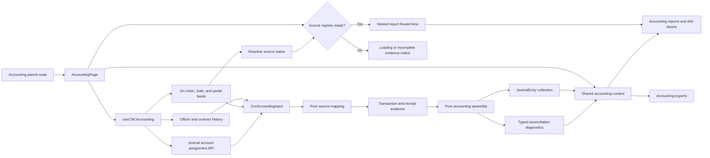
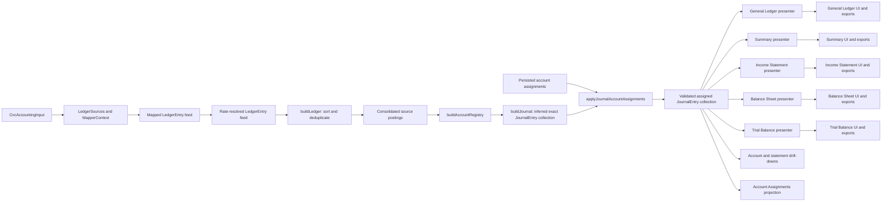
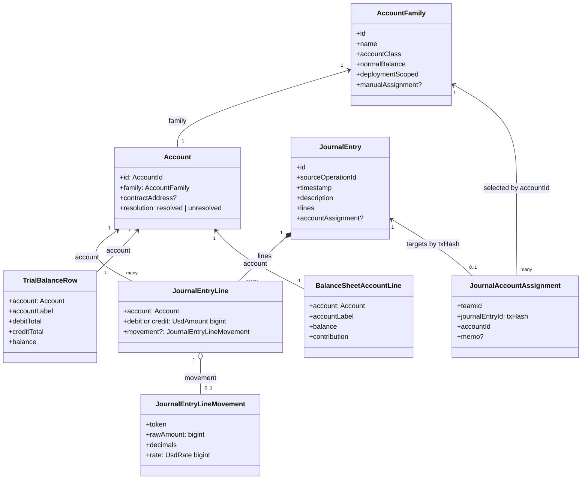
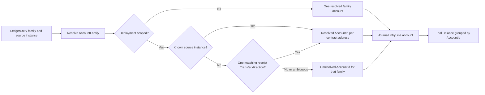
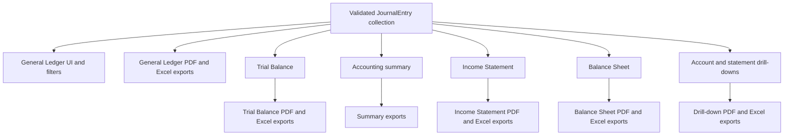

# Accounting Read Model

**Scope:** The client-side read model that turns company contract and portal feeds into consolidated accounting postings and a validated
double-entry journal, including the persisted counter-account assignments it consumes. Accounting report projections consume that journal on
demand. This model does not create or persist manual journal entries.

**Last verified:** 2026-09-09

## Consumers

- The [Accounting feature](../../features/accounting/README.md) uses this read model for its consolidated books, reports, drill-downs, and
  exports.
- [AccountingPage](../../../app/src/components/sections/AccountingView/AccountingPage.vue) is the persistent parent route that resolves one
  shared result for every nested report route. Reports require that accounting context instead of constructing another journal.

## Runtime Model

`useCNCAccounting` calls the on-chain, Safe, and portal queries directly and owns their reactive state. It exposes only the journal, a
grouped status, and a refresh operation. `useAccountingStatus` projects each applicable source into `loading`, `ready`, `partial`, or
`failed`; a source that does not apply is `not-applicable`. A fatal company failure takes precedence, then loading, then partial evidence.
Only `ready` mounts the nested reports, so a balanced subset cannot be mistaken for final books. Typed diagnostics identify source errors,
contract-scan gaps, unavailable block timestamps, orphan fees, receipt failures, and unavailable rates. The parent Accounting route remains
mounted while its report child changes, so the shared context prevents those reports from independently fetching and assembling the same
books. The team workspace gives that route owner a stable key within one team and a new key when the team identifier changes. Its two pure
runtime stages are `buildRawCncEntries(CncAccountingInput)` and
`assembleWithAccountEvidence(rawEntries, deploymentAccounts, evidence, accountAssignments)`, which returns the journal and reconciliation
diagnostics without Vue or network I/O.

The incoming-transfer and executed-transaction Safe queries remain disabled until the reactive company Safe address resolves. Once enabled,
the address is checksum-normalized before it enters the query key or Transaction Service request. Each query then follows the service's
`next` links to exhaustion before publishing its array to Accounting. The configured `limit` controls the request page size rather than the
total history returned. A later-page failure rejects the whole query instead of publishing a silently partial Safe history.

Contract logs do not carry timestamps. `eventsViaLogs` resolves every distinct mined block through the shared TanStack Query client, keyed
by network and block number with infinite staleness and garbage-collection time because a mined block is immutable. Concurrent event feeds
and later refetches therefore share one block read. A failed block read or a decoded log without a block number does not receive a synthetic
timestamp: the event is withheld and emitted as a typed source diagnostic, which keeps the Accounting route out of `ready`.

### Runtime Export Boundary

The production assembly API exposes only the two stages the reactive read model calls: raw mapping and evidence-aware book assembly. Fixture
constructors, empty-book conveniences, raw-posting assembly shortcuts, and implementation details of account, price, fee, and presentation
shaping stay private to their modules. Tests exercise the public stages through a test-only fixture helper; they do not add runtime APIs
solely for test construction. The General Ledger, Trial Balance, Summary, Income Statement, Balance Sheet, and their exports project the
validated `JournalEntry` collection. Account and statement drill-downs project the same collection: they select complete entries by a
concrete `Account` or an account family and compute a running balance only from the selected account's own lines.

The reactive view context exposes the journal, not the transitional source-posting feed, account registry, or precomputed report objects.
The Summary export dialog reads the journal length directly, counting monetary and memo-only operations once. Export snapshots contain only
the journal. The table and exporters share `LedgerRow` from the journal presenter and import their column definitions directly from
`ledgerColumns`. Each report surface calls one focused presenter with the canonical journal and its optional scope. For example, Summary
calls `presentSummary(journal)`, while the Trial Balance card and both export formats call `presentTrial(journal, asOf)`.

### Source Mapping Boundaries

The mapper directory exposes one public mapping function per accounting domain. A mapper may consume several forms of evidence when they
produce the same domain postings; event names and fallback mechanisms do not create additional public mappers.

| Domain              | Public boundary              | Evidence owned by the boundary                                       |
| ------------------- | ---------------------------- | -------------------------------------------------------------------- |
| Bank                | `mapBankEvents`              | Deposits, transfers, and transaction-bound protocol fees             |
| Payroll             | `mapPayroll`                 | Weekly claim accruals and CashRemuneration settlements               |
| Expense             | `mapExpense`                 | Indexed payouts and the portal drawn-balance fallback                |
| Community Credit    | `mapFixedReturnEvents`       | Credit funding, lending, repayment, and refund events                |
| Investor            | `mapInvestorEvents`          | Share mints, dividends, and evidence that prevents backed-mint reuse |
| Vesting             | `mapVestingEvents`           | Grant, release, and stop events                                      |
| Safe                | `mapSafeTransfers`           | Incoming and outgoing Safe transfers                                 |
| Safe Deposit Router | `mapSafeDepositRouterEvents` | Investment deposits that mint SHER                                   |

The mapper barrel publishes only the ledger orchestrator and its grouped input type. Tests that exercise one domain import that domain
module directly. Context construction, credit timelines, expense periods, and the shared internal-transfer posting are support modules
rather than source mappers. Account assignments apply only after journal construction, so source mappers remain responsible for evidence
inference rather than owner decisions. SHER realization settlement runs after rate stamping and therefore lives at the Accounting assembly
level, outside the mapper directory.

## Main Assembly Flow

`JournalEntry` is the canonical double-entry representation for every financial report and drill-down. `LedgerEntry` remains a transitional
mapping input only; assembly attaches the rate of record before a monetary posting reaches journal validation. The Balance Sheet starts from
the Trial Balance rows, preserving each concrete account in the assets, liabilities, and equity sections. Income and expense rows remain
visible in a separate calculation and contribute to one `Earnings to date` equity line; only explicit statement totals aggregate accounts.

## Account Domain Model

An `AccountFamily` is reusable chart metadata, including whether it can be selected for an external-outflow assignment. An `Account` is the
concrete accounting identity used by journal, Trial Balance, and Balance Sheet account lines. For deployment-scoped families, a source
contract address distinguishes each deployment. `accountLabel` is presentation text derived after identity has been resolved; it is never an
account key. A persisted `JournalAccountAssignment` selects an allowed account-family ID for one transaction-backed `JournalEntry`; it does
not store or replace journal amounts.

## Canonical Nomenclature

| Term                       | Meaning and boundary                                                                                                                                                                                                                                                   |
| -------------------------- | ---------------------------------------------------------------------------------------------------------------------------------------------------------------------------------------------------------------------------------------------------------------------- |
| Source operation           | The on-chain transaction or off-chain record from which postings originate. For an indexed transaction, its hash is the `sourceOperationId`; the raw `<txHash>-<logIndex>` identifier remains event evidence. A synthetic operation uses its explicit stable identity. |
| `LedgerEntry`              | A mapped, consolidated posting in the transitional feed. It carries legacy family names and optional source-instance values; it is not the concrete account model.                                                                                                     |
| `AccountName`              | A legacy raw family name in a `LedgerEntry`, not an `Account` identity.                                                                                                                                                                                                |
| `AccountFamily`            | Canonical reusable chart metadata: stable family key, display name, class, normal balance, and deployment scope.                                                                                                                                                       |
| `Account`                  | Canonical concrete account object: `AccountId`, `AccountFamily`, optional `contractAddress`, and `resolution`.                                                                                                                                                         |
| `AccountId`                | Stable identity used to group journal lines and Trial Balance rows.                                                                                                                                                                                                    |
| `JournalEntry`             | Validated double-entry record for one source operation, with ordered monetary lines or an explicit memo-only entry. A transaction-backed entry uses its `txHash` for `id` and `sourceOperationId`; its source snapshot is narration-only.                              |
| `JournalEntryLine`         | One debit or credit line carrying exactly one concrete `Account` and optional token movement evidence for its display projection.                                                                                                                                      |
| `JournalEntryLineMovement` | Exact token evidence carried by a monetary line: token, `bigint` base units, token decimals, and the required fixed-scale rate of record used for valuation.                                                                                                           |
| `JournalAccountAssignment` | One owner-selected counter-account family for a transaction-backed `JournalEntry`, uniquely identified by company and lowercase transaction hash. It contains no debit, credit, quantity, rate, or fee.                                                                |
| `UsdAmount`                | USD value stored as a `bigint` with a shared 24-decimal scale throughout journal validation and report calculations.                                                                                                                                                   |
| `UsdRate`                  | USD price of one whole token stored as a `bigint` with the source rate's six-decimal scale.                                                                                                                                                                            |
| `TrialBalanceRow`          | Projection grouped by `AccountId`; the balance follows the family normal side.                                                                                                                                                                                         |
| `BalanceSheetAccountLine`  | A Trial Balance account row classified for the Balance Sheet, with its normal-side balance and signed section contribution.                                                                                                                                            |
| Earnings to date           | Current income-account contributions minus expense-account contributions through the selected date; it does not rename or replace a posted `Retained Earnings` account.                                                                                                |
| `accountLabel`             | Human-readable display text. It may include a deployment number or unresolved marker but must not be used for identity or filtering.                                                                                                                                   |

The raw `LedgerEntry.debit` and `LedgerEntry.credit` fields currently contain `AccountName` values, while `debitInstance` and
`creditInstance` carry source-instance values such as a contract address. These names are ambiguous at the transitional boundary. New code
must use `AccountFamily`, `Account`, `contractAddress`, and `AccountId` according to the model above rather than calling an unscoped string
an account.

## Account Resolution Across Redeployments

Bank, Payroll, Expense, and Credit families are deployment-scoped. Their resolved addresses receive distinct account identities only when a
mapper names a known company deployment of the matching family, or when an ERC-20 `Transfer` in the operation receipt proves that known
deployment sent or received the cash. A missing, external, ambiguous, or native-only address remains unresolved; the registry never assigns
it to an earlier or later deployment based on activity order.

## Invariants and Failure Behaviour

### Invariants

- The consolidated posting feed is chronologically sorted and de-duplicated before account resolution.
- One transaction-backed operation uses its `txHash` as its `JournalEntry.id` and `sourceOperationId`; all source events with that hash are
  assembled into that entry before compatible debit and credit lines are aggregated. A synthetic operation retains its explicit stable
  identity.
- A monetary `JournalEntryLine` has exactly one debit or credit amount and exactly one concrete `Account`.
- Journal assembly requires a rate of record on every monetary source posting. Missing rates are rejected instead of falling back to the
  transitional `amountUsd` number.
- Each monetary `JournalEntry` has equal debit and credit totals by exact integer equality. Invalid normalized postings are rejected before
  a journal projection can consume them.
- Token movement evidence retains the exact blockchain base-unit `bigint` and token decimals. The current maximum of 18 token decimals plus
  the six-decimal rate of record determines the common 24-decimal `UsdAmount` scale, so token-to-USD conversion requires no division or
  rounding.
- General Ledger, Trial Balance, account running balances, Summary, Income Statement, and Balance Sheet aggregate `UsdAmount` integers. A
  non-zero base-unit movement is never discarded because its presentation value is below a display threshold.
- The assembled Accounting result carries only the canonical journal and reconciliation diagnostics. UI and export consumers never receive
  transitional postings, an account registry, or precomputed report projections beside the journal.
- Every material source has an explicit availability state. Accounting reports mount only when all applicable sources are ready; balanced
  entries assembled from partial evidence remain internal and are not presented as final reports.
- Every on-chain journal posting has a verified block timestamp. A missing or unavailable block timestamp withholds the source event rather
  than mapping it to Unix epoch time.
- A direct external deposit into Bank or Safe with no matching SafeDepositRouter transaction credits `Service Revenue` regardless of the
  sender address. Deposits and company-pocket transfers retain their source-evidence accounts and are never manual assignment targets.
- A persisted account assignment is keyed by company and lowercase transaction hash. It applies only to an editable transaction-backed
  external Bank/Safe outflow and replaces exactly one non-cash, non-fee debit account.
- Account assignment never changes a cash line, a transaction-bound `Transaction Fee Expense` line, a token movement, or a monetary value;
  the resulting journal entry is validated again before report projection.
- The assignable accounts come from canonical account-family metadata and are limited to Operating Expense, Owner Capital, Payroll Expense,
  Interest Expense, and Dividend Expense.
- A SafeDepositRouter operation that issues SHER owns the `Cash — Safe` and `Investor Equity` lines. Its Safe token transfer has the same
  transaction hash and is duplicate source evidence, so it cannot add `Service Revenue` or a second cash debit.
- Trial Balance grouping uses `AccountId`, not a display label or a contract-generation order.
- Balance Sheet account lines reuse the Trial Balance grouping by `AccountId`. The account's family supplies its account class and normal
  balance; a later deployment or unresolved account never merges into another deployment before the report line and drill-down are selected.
- Earnings to date is calculated from the same Trial Balance income and expense rows. The supporting rows remain concrete and drillable;
  their signed contributions are the only temporary-account aggregate added to total equity.
- A deployment-specific instance is resolved only when it is a known company deployment of the matching family, either named directly by the
  mapper or proven by an unambiguous ERC-20 receipt `Transfer` direction. Missing, external, ambiguous, and native-only evidence remains
  unresolved; activity order and current-generation status are never evidence.

### Failure Behaviour

- A company-query failure is fatal because Accounting cannot establish the contract set that owns the books.
- A failed on-chain scan for one contract generation leaves other generations internally assembled, marks that source partial, and withholds
  every report until the gap is resolved.
- A failed transaction-receipt read leaves its deployment-specific leg unresolved, marks receipt evidence partial, and withholds reports. A
  readable receipt with no matching or more than one matching company deployment is an explicit unresolved result rather than a read
  failure.
- Applicable Safe-service and portal enrichment queries participate in completeness. A pending query keeps Accounting loading; a failed
  query marks the books partial and identifies its source rather than silently publishing the available subset.
- A failed immutable block read withholds every decoded event from that block and marks the owning event source partial. A log without a
  block number is handled the same way; neither case creates a timestamp-zero posting.
- A report mounted outside the Accounting route context fails explicitly. This is a programming error rather than permission to construct a
  second journal implicitly.
- Changing the route team identifier remounts the Accounting owner, so the previous team's journal cannot survive into the new team scope.
- Transaction evidence reads only receipts needed to resolve deployment accounts. There is no additional signer lookup for a discarded
  source-posting presentation; receipt failures remain explicit reconciliation gaps.

## Current Report Boundaries

This is a current implementation boundary, not an accounting-policy distinction. The General Ledger filters reporting period, concrete
`AccountId`, and currency at the journal-entry level, retaining all lines of every selected entry. The Summary and Income Statement
aggregate the same journal lines by account family. The Balance Sheet reuses the Trial Balance's concrete rows, classifies permanent
accounts into assets, liabilities, and equity, and retains the same account identity and label for every drill-down. Its separate earnings
calculation shows each income and expense account's signed contribution before adding `Earnings to date` to total equity. Each UI card and
export section supplies `JournalEntry[]` to one responsibility-specific presenter; derived reports are local values, not reactive state kept
in parallel with the journal. Internal-transfer narration reads the source and destination display labels from the debit and credit
`JournalEntryLine` accounts, so later deployments and unresolved accounts remain explicit rather than being inferred from family-level event
text. Every transaction-backed journal group uses its transaction hash as its identity; a raw `<txHash>-<logIndex>` value remains
traceability evidence. A fee is an ordinary `Transaction Fee Expense` line in its source operation; there is no `Fee` pseudo-category or
separate fee entry in this projection. Ledger action and transaction labels are derived from the entry's assigned or inferred accounts and
source use-case evidence; no persisted presentation category participates. The General Ledger renders the transaction hash once on the
entry's first line and preserves its full value in PDF and spreadsheet exports; synthetic operations have no transaction-hash value. A
transaction-backed hash links to the configured network block explorer in a separate tab. Every visible General Ledger column, including the
account drill-down Balance column, has bounded widths and supports pointer, touch, and keyboard resizing; a double-click restores its
default width. JournalEntry assembly groups source postings and withholds a `FeePaid` source without matching Bank-outflow evidence,
returning it as a reconciliation gap. Bank fees are collected from each supported generation: V0/V0.1 local events infer an ERC-20 currency
only from the next movement in the same transaction and Bank, while V1/V2 query their version-specific FeeCollectors by payer. Those
protocol FeeCollectors are not part of the company's internal-pocket registry. Account and statement drill-downs select complete
JournalEntry records by a concrete Account or account family, then flatten their validated lines for display and exports. Their running
balances update only on lines posted to the selected account; an aggregate statement line has no single running balance. A fee remains an
ordinary line of the source operation in every drill-down.

All report identities, totals, and drill-down running balances above use the exact fixed-scale journal integers. Presenters and exporters
convert those values to numbers and apply human-readable rounding only after the selected snapshot and its aggregates have been calculated;
running balances never parse the already-formatted debit or credit strings.

## Account Assignment Boundary

Account Assignments selects complete journal entries containing an eligible external Bank/Safe withdrawal and reuses the General Ledger line
presentation. Account labels are resolved against the full journal, so filtering to eligible withdrawals does not renumber historical Bank
deployments. Amounts, currencies, fees, and concrete accounts come exclusively from validated journal lines.

Source mapping first infers a complete balanced entry. Before journal projection, the grouped source records mark whether the entry contains
exactly one supported external withdrawal. An entry with that one withdrawal and no other non-fee source movement is editable; a Bank fee
may remain another line of the same entry. Multiple withdrawals and other compound operations remain complete but read-only. Deposits,
company-pocket movements, standalone fees, and system-owned payouts do not receive assignment state.

After `buildJournal`, `applyJournalAccountAssignments` matches persisted records by the lowercase transaction hash used as
`JournalEntry.id`. A valid record replaces only the entry's single non-cash, non-fee debit account with the selected canonical account. It
does not reconstruct the entry or map through a category. The utility ignores unmatched, ineligible, compound, and unsupported records and
revalidates every changed entry with `createJournalEntry`.

The team-scoped API stores one record per `(teamId, journalEntryId)`. Team members may read assignments; only the company owner may create,
replace, or remove one, and archived companies reject mutations. The API accepts the canonical transaction-hash format, a memo of at most
500 characters, and only the five account-family IDs exposed by the chart of accounts for external outflows.

The database migration preserves every former category decision by renaming the old table to an audit-only table that Prisma and production
runtime no longer map. For each company and transaction hash, the latest former expense, owner-capital, payroll-expense, interest-expense,
or dividend-expense decision becomes an active account assignment. Former revenue and internal-transfer records remain audit evidence only
because deposits and company-pocket transfers are not manual assignment targets.

## Optimisation Review

### Existing Protections

- The persistent Accounting route context shares one `useCNCAccounting` result across every report route for the same team. Report filters
  and projections remain local; the root exposes only `journal`, grouped `status`, and `refetch`. The backend queries are direct members of
  that root rather than a second feed wrapper.
- `types.ts` owns the cross-module Account, JournalEntry, exact-monetary, and financial-statement contracts through type-only imports.
  Responsibility-specific runtime utilities and their local mapper, export, composable, and presentation types remain colocated.
- Mapping and assembly are pure functions, which makes their cost and semantics independently testable.
- Source mapping has one public function per accounting domain. Bank owns its fees, Payroll owns accrual and settlement, and Expense owns
  indexed and fallback evidence instead of exposing event-specific public mappers.
- The account registry is built once inside assembly; each `JournalEntryLine` then carries its complete concrete `Account` downstream.
- The export count does not build table rows. No view-level source regrouping, fee folding or separate pocket-numbering index runs beside
  the journal presenter. Mapper inputs do not accept an ignored global FeeCollector address.

### Measure Before Changing

- Contract event queries fan out across every known contract generation. Safe history uses pages of 500 records and follows every available
  page. Measure source volume and user-visible load time before altering scan selection, page size, or request scheduling.
- Date-specific views perform their own projection work from a date-filtered journal. Account and statement drill-downs select whole
  JournalEntry records from that same boundary. Profile realistic multi-generation books before introducing caching or alternate snapshots.

## Known Gaps

- The legacy raw posting field names do not make the distinction between an account family, a concrete account, and a source instance
  explicit.
- The transitional `LedgerEntry.amountUsd` remains a six-decimal `number` for source narration and mapper compatibility. Journal assembly
  always computes the report-authoritative amount from exact token base units and the required rate of record; reports never consume the
  transitional number.

## Implementation Evidence

**Implementation evidence reviewed against:** `a61919c6d9bf77c4a179be46a85f7f8db585bb6f`

- [Accounting data layer](../../../app/src/composables/accounting/useCNCAccounting.ts),
  [source-status projection](../../../app/src/composables/accounting/useAccountingStatus.ts),
  [shared accounting context](../../../app/src/composables/accounting/useAccountingContext.ts),
  [reactive paginated Safe history queries](../../../app/src/queries/safe.queries.ts),
  [Safe query behaviour tests](../../../app/src/queries/__tests__/safe.queries.spec.ts), and
  [Safe address reactivity test](../../../app/src/queries/__tests__/safe.queries.integration.spec.ts)
- [Persistent Accounting route](../../../app/src/router/index.ts),
  [team route-owner lifetime](../../../app/src/views/team/%5Bid%5D/ShowIndex.vue), and
  [Accounting report route views](../../../app/src/views/team/%5Bid%5D/Accounting/)
- [Transaction evidence reader](../../../app/src/composables/accounting/useTransactionEvidence.ts)
- [Contract event scanner](../../../app/src/composables/eventsViaLogs.ts),
  [version-aware Bank event feed](../../../app/src/composables/bank/useBankEventsViaLogs.ts),
  [legacy Bank fee currency normalization](../../../app/src/composables/bank/bankFees.ts),
  [immutable block timestamp query](../../../app/src/queries/blockTimestamp.queries.ts),
  [shared query client](../../../app/src/queries/queryClient.ts), and
  [block timestamp cache tests](../../../app/src/queries/__tests__/blockTimestamp.queries.spec.ts)
- [Accounting source contracts](../../../app/src/utils/accounting/types.ts),
  [pure completeness projection](../../../app/src/utils/accounting/accountingCompleteness.ts), and
  [source-status integration tests](../../../app/src/composables/accounting/__tests__/useCNCAccounting.spec.ts)
- [Pure assembly](../../../app/src/utils/accounting/assemble.ts),
  [source-mapper orchestrator](../../../app/src/utils/accounting/mappers/index.ts),
  [Bank mapper](../../../app/src/utils/accounting/mappers/bank.ts), [Payroll mapper](../../../app/src/utils/accounting/mappers/payroll.ts),
  [Expense mapper](../../../app/src/utils/accounting/mappers/expenseAccount.ts),
  [SHER realization settlement](../../../app/src/utils/accounting/sherIssuance.ts),
  [Safe transfer adapter](../../../app/src/utils/accounting/safeTransfers.ts),
  [SafeDepositRouter mapper](../../../app/src/utils/accounting/mappers/safeDepositRouter.ts), and
  [consolidation](../../../app/src/utils/accounting/buildLedger.ts)
- [Shared Accounting domain contracts](../../../app/src/utils/accounting/types.ts),
  [canonical Account registry](../../../app/src/utils/accounting/accountRegistry.ts), and
  [concrete-account journal balances](../../../app/src/utils/accounting/journalBalances.ts)
- [Journal account-assignment projection](../../../app/src/utils/accounting/journalAccountAssignment.ts),
  [assignment presenter](../../../app/src/utils/accounting/journalAccountAssignmentPresenter.ts),
  [assignment query](../../../app/src/queries/journalAccountAssignment.queries.ts), and
  [Account Assignments route](../../../app/src/views/team/%5Bid%5D/Accounting/AccountAssignmentsView.vue)
- [Account-assignment controller](../../../backend/src/controllers/journalAccountAssignmentController.ts),
  [route](../../../backend/src/routes/journalAccountAssignmentRoute.ts),
  [validation](../../../backend/src/validation/schemas/journalAccountAssignment.ts),
  [persistence model](../../../backend/prisma/schema.prisma), and
  [audit-preserving migration](../../../backend/prisma/migrations/20260908000000_migrate_journal_account_assignments/)
- [Journal-only export snapshot](../../../app/src/utils/accounting/exportSpec.ts),
  [export orchestration](../../../app/src/composables/accounting/useAccountingExport.ts), and
  [PDF report projection](../../../app/src/lib/accounting/pdf.ts),
  [spreadsheet report projection](../../../app/src/lib/accounting/spreadsheet.ts), and
  [shared ledger columns](../../../app/src/utils/accounting/ledgerColumns.ts)
- [Balance Sheet projection](../../../app/src/utils/accounting/balanceSheet.ts),
  [statement presenter](../../../app/src/utils/accounting/presenter.ts), and
  [Balance Sheet route view](../../../app/src/views/team/%5Bid%5D/Accounting/BalanceSheetView.vue),
  [Balance Sheet table](../../../app/src/components/sections/AccountingView/BalanceSheetTable.vue), and
  [Balance Sheet tests](../../../app/src/utils/accounting/__tests__/balanceSheet.spec.ts)
- [Chart of accounts](../../../app/src/utils/accounting/chartOfAccounts.ts) and
  [concrete account registry](../../../app/src/utils/accounting/accountRegistry.ts), and
  [account-instance evidence resolver](../../../app/src/utils/accounting/accountInstances.ts)
- [Validated JournalEntry model](../../../app/src/utils/accounting/journalEntry.ts),
  [fixed-scale monetary domain](../../../app/src/utils/accounting/monetaryAmount.ts),
  [transaction-identity helper](../../../app/src/utils/accounting/ledgerEntry.ts),
  [journal assembly and Trial Balance projection](../../../app/src/utils/accounting/generalLedger.ts), and
  [journal balance projection](../../../app/src/utils/accounting/journalBalances.ts),
  [journal summary projection](../../../app/src/utils/accounting/accountingSummary.ts),
  [Summary presenter](../../../app/src/utils/accounting/summaryCards.ts),
  [General Ledger journal presenter](../../../app/src/utils/accounting/journalLedgerPresenter.ts)
- [General Ledger route view](../../../app/src/views/team/%5Bid%5D/Accounting/GeneralLedgerView.vue),
  [General Ledger table](../../../app/src/components/sections/AccountingView/LedgerTable.vue),
  [drill-down modal](../../../app/src/components/sections/AccountingView/LedgerDrilldownModal.vue),
  [drill-down composable](../../../app/src/composables/accounting/useLedgerDrilldown.ts), and
  [account drill-down utilities](../../../app/src/utils/accounting/accountLedger.ts),
  [General Ledger column header](../../../app/src/components/sections/AccountingView/LedgerColumnHeader.vue),
  [PDF projection](../../../app/src/lib/accounting/generalLedgerPdfTable.ts),
  [spreadsheet projection](../../../app/src/lib/accounting/generalLedgerSheet.ts), and
  [Trial Balance route view](../../../app/src/views/team/%5Bid%5D/Accounting/TrialBalanceView.vue)
- [Assembly tests](../../../app/src/utils/accounting/__tests__/assemble.spec.ts),
  [account-assignment assembly tests](../../../app/src/utils/accounting/__tests__/assemble.accountAssignment.spec.ts),
  [account-assignment presentation tests](../../../app/src/utils/accounting/__tests__/journalAccountAssignmentPresenter.spec.ts),
  [account-assignment owner and member tests](../../../app/src/views/team/%5Bid%5D/Accounting/__tests__/AccountAssignmentsView.spec.ts),
  [account-assignment API tests](../../../backend/src/controllers/__tests__/journalAccountAssignmentController.test.ts),
  [Accounting context tests](../../../app/src/composables/accounting/__tests__/useAccountingContext.spec.ts),
  [Accounting route-owner tests](../../../app/src/views/team/%5Bid%5D/__tests__/ShowIndex.spec.ts),
  [account-instance evidence tests](../../../app/src/utils/accounting/__tests__/accountInstances.spec.ts),
  [transaction evidence tests](../../../app/src/composables/accounting/__tests__/useTransactionEvidence.spec.ts),
  [account-registry tests](../../../app/src/utils/accounting/__tests__/accountRegistry.spec.ts),
  [General Ledger table tests](../../../app/src/components/sections/AccountingView/__tests__/LedgerRedeployLabel.spec.ts),
  [journal General Ledger tests](../../../app/src/utils/accounting/__tests__/journalLedgerPresenter.spec.ts), and
  [journal and Trial Balance tests](../../../app/src/utils/accounting/__tests__/generalLedger.spec.ts), and
  [journal statement-projection tests](../../../app/src/utils/accounting/__tests__/journalAssembly.spec.ts), and
  [exact-precision regression tests](../../../app/src/utils/accounting/__tests__/exactPrecision.spec.ts)
- [Summary journal-count tests](../../../app/src/views/team/%5Bid%5D/Accounting/__tests__/SummaryView.spec.ts) and
  [cross-report journal projections](../../../app/src/utils/accounting/__tests__/transactionFirst.spec.ts)

## Related Documentation

- [Accounting user journey](../../features/accounting/README.md)
- [Accounting Journal Entry Catalogue](../../features/accounting/journal-entry-catalogue.md)
- [Accounting history across contract migrations](../../features/accounting/contract-migration-history.md)
- [Money Flow Catalogue](../../features/accounting/money-flow-catalogue.md)
- [Implementation Documentation Guide](../../platform/implementation-documentation-guide.md)
