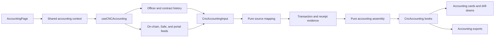
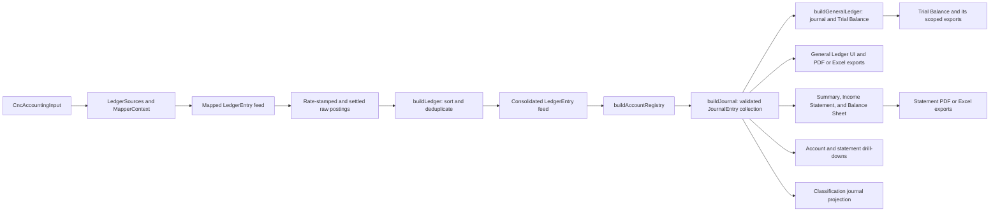
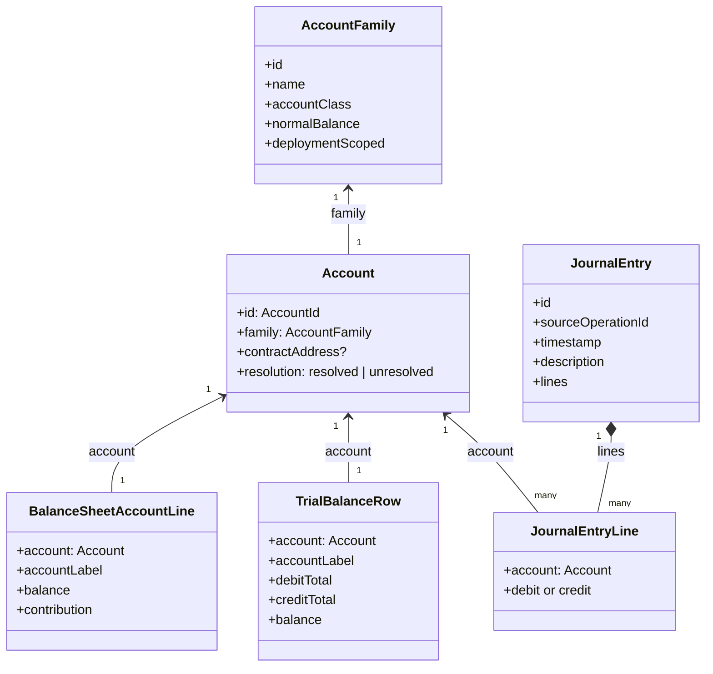
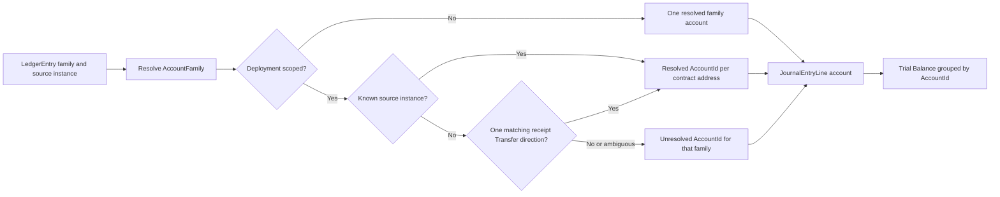
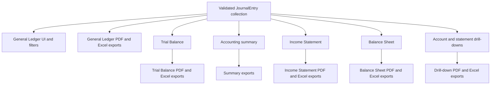

# Accounting Read Model

**Scope:** The client-side read model that turns company contract and portal feeds into consolidated accounting postings, a validated
double-entry journal, and the report projections consumed by Accounting. It does not create or persist manual journal entries.

**Last verified:** 2026-09-05

## Consumers

- The [Accounting feature](../../features/accounting/README.md) uses this read model for its consolidated books, report cards, drill-downs,
  and exports.
- [AccountingPage](../../../app/src/components/sections/AccountingView/AccountingPage.vue) resolves one shared result for the report-card
  tree; standalone cards can resolve the same model through the accounting context.

## Runtime Model

`useCNCAccounting` owns I/O and reactive loading state. The shared context prevents the page's cards from independently fetching and
assembling the same books. Its two pure runtime stages are `buildRawCncEntries(CncAccountingInput)` and
`assembleWithAccountEvidence(rawEntries, deploymentAccounts, evidence)`, which returns `CncAccounting` without Vue or network I/O.

### Runtime Export Boundary

The production assembly API exposes only the two stages the reactive read model calls: raw mapping and evidence-aware book assembly. Fixture
constructors, empty-book conveniences, raw-posting assembly shortcuts, and implementation details of account, price, fee, and presentation
shaping stay private to their modules. Tests exercise the public stages through a test-only fixture helper; they do not add runtime APIs
solely for test construction. The General Ledger, Trial Balance, Summary, Income Statement, Balance Sheet, and their exports project the
validated `JournalEntry` collection. Account and statement drill-downs project the same collection: they select complete entries by a
concrete `Account` or an account family and compute a running balance only from the selected account's own lines.

The reactive view context exposes the journal and its report projections, not the transitional source-posting feed. The Summary export
dialog reads the journal length directly, counting monetary and memo-only operations once. Export snapshots contain only journal records and
report projections; they do not carry raw postings or presentation-specific fee aggregates. The table and exporters share `LedgerRow` from
the journal presenter and import their column definitions directly from `ledgerColumns`.

## Main Assembly Flow

`JournalEntry` is the canonical double-entry representation for every financial report and drill-down. `LedgerEntry` remains a transitional
mapping input only; it is not a report projection boundary. The Balance Sheet starts from the Trial Balance rows, preserving each concrete
account in the assets, liabilities, and equity sections. Income and expense rows remain visible in a separate calculation and contribute to
one `Earnings to date` equity line; only explicit statement totals aggregate accounts.

## Account Domain Model

An `AccountFamily` is reusable chart metadata. An `Account` is the concrete accounting identity used by journal, Trial Balance, and Balance
Sheet account lines. For deployment-scoped families, a source contract address distinguishes each deployment. `accountLabel` is presentation
text derived after identity has been resolved; it is never an account key.

## Canonical Nomenclature

| Term                      | Meaning and boundary                                                                                                                                                                                                                                                   |
| ------------------------- | ---------------------------------------------------------------------------------------------------------------------------------------------------------------------------------------------------------------------------------------------------------------------- |
| Source operation          | The on-chain transaction or off-chain record from which postings originate. For an indexed transaction, its hash is the `sourceOperationId`; the raw `<txHash>-<logIndex>` identifier remains event evidence. A synthetic operation uses its explicit stable identity. |
| `LedgerEntry`             | A mapped, consolidated posting in the transitional feed. It carries legacy family names and optional source-instance values; it is not the concrete account model.                                                                                                     |
| `AccountName`             | A legacy raw family name in a `LedgerEntry`, not an `Account` identity.                                                                                                                                                                                                |
| `AccountFamily`           | Canonical reusable chart metadata: stable family key, display name, class, normal balance, and deployment scope.                                                                                                                                                       |
| `Account`                 | Canonical concrete account object: `AccountId`, `AccountFamily`, optional `contractAddress`, and `resolution`.                                                                                                                                                         |
| `AccountId`               | Stable identity used to group journal lines and Trial Balance rows.                                                                                                                                                                                                    |
| `JournalEntry`            | Validated double-entry record for one source operation, with ordered monetary lines or an explicit memo-only entry. A transaction-backed entry uses its `txHash` for `id` and `sourceOperationId`; its source snapshot is narration-only.                              |
| `JournalEntryLine`        | One debit or credit line carrying exactly one concrete `Account` and optional token movement evidence for its display projection.                                                                                                                                      |
| `TrialBalanceRow`         | Projection grouped by `AccountId`; the balance follows the family normal side.                                                                                                                                                                                         |
| `BalanceSheetAccountLine` | A Trial Balance account row classified for the Balance Sheet, with its normal-side balance and signed section contribution.                                                                                                                                            |
| Earnings to date          | Current income-account contributions minus expense-account contributions through the selected date; it does not rename or replace a posted `Retained Earnings` account.                                                                                                |
| `accountLabel`            | Human-readable display text. It may include a deployment number or unresolved marker but must not be used for identity or filtering.                                                                                                                                   |

The raw `LedgerEntry.debit` and `LedgerEntry.credit` fields currently contain `AccountName` values, while `debitInstance` and
`creditInstance` carry source-instance values such as a contract address. These names are ambiguous at the transitional boundary. New code
must use `AccountFamily`, `Account`, `contractAddress`, and `AccountId` according to the model above rather than calling an unscoped string
an account.

## Account Resolution Across Redeployments

Bank, Payroll, Expense, and Credit families are deployment-scoped. Their resolved addresses receive distinct account identities only when a
mapper names a known company deployment of the matching family, or when an ERC-20 `Transfer` in the operation receipt proves that known
deployment sent or received the cash. A missing, external, ambiguous, or native-only address remains unresolved; the registry never assigns
it to an earlier or later deployment based on activity order.

## Invariants and Failure Behaviour

### Invariants

- The consolidated posting feed is chronologically sorted and de-duplicated before account resolution.
- One transaction-backed operation uses its `txHash` as its `JournalEntry.id` and `sourceOperationId`; all source events with that hash are
  assembled into that entry before compatible debit and credit lines are aggregated. A synthetic operation retains its explicit stable
  identity.
- A monetary `JournalEntryLine` has exactly one debit or credit amount and exactly one concrete `Account`.
- Each monetary `JournalEntry` has equal debit and credit totals. Invalid normalized postings are rejected before a journal projection can
  consume them.
- A direct external deposit into Bank or Safe with no matching SafeDepositRouter transaction credits `Service Revenue` regardless of the
  sender address. Deposits and company-pocket transfers retain their source-evidence accounts even when a legacy category exists.
- A SafeDepositRouter operation that issues SHER owns the `Cash — Safe` and `Investor Equity` lines. Its Safe token transfer has the same
  transaction hash and is duplicate source evidence, so it cannot add `Service Revenue` or a second cash debit.
- Trial Balance grouping uses `AccountId`, not a display label or a contract-generation order.
- Balance Sheet account lines reuse the Trial Balance grouping by `AccountId`. The account's family supplies its account class and normal
  balance; a later deployment or unresolved account never merges into another deployment before the report line and drill-down are selected.
- Earnings to date is calculated from the same Trial Balance income and expense rows. The supporting rows remain concrete and drillable;
  their signed contributions are the only temporary-account aggregate added to total equity.
- A deployment-specific instance is resolved only when it is a known company deployment of the matching family, either named directly by the
  mapper or proven by an unambiguous ERC-20 receipt `Transfer` direction. Missing, external, ambiguous, and native-only evidence remains
  unresolved; activity order and current-generation status are never evidence.

### Failure Behaviour

- A company-query failure is fatal because Accounting cannot establish the contract set that owns the books.
- A failed on-chain scan for one contract generation leaves other generations in the assembled books and records a reconciliation gap.
- A failed transaction-receipt read leaves its deployment-specific leg unresolved and records a reconciliation gap. A readable receipt with
  no matching or more than one matching company deployment is an explicit unresolved result rather than a read failure.
- Safe-service feeds are optional and do not block the page's loading state. Their absence can omit Safe activity without generating a
  reconciliation gap, which remains a known limitation.
- A standalone report card falls back to its route's company identifier when it is rendered outside the shared Accounting page context.
- Transaction evidence reads only receipts needed to resolve deployment accounts. There is no additional signer lookup for a discarded
  source-posting presentation; receipt failures remain explicit reconciliation gaps.

## Current Report Boundaries

This is a current implementation boundary, not an accounting-policy distinction. The General Ledger filters reporting period, concrete
`AccountId`, and currency at the journal-entry level, retaining all lines of every selected entry. The Summary and Income Statement
aggregate the same journal lines by account family. The Balance Sheet reuses the Trial Balance's concrete rows, classifies permanent
accounts into assets, liabilities, and equity, and retains the same account identity and label for every drill-down. Its separate earnings
calculation shows each income and expense account's signed contribution before adding `Earnings to date` to total equity. Internal-transfer
narration reads the source and destination display labels from the debit and credit `JournalEntryLine` accounts, so later deployments and
unresolved accounts remain explicit rather than being inferred from family-level event text. Every transaction-backed journal group uses its
transaction hash as its identity; a raw `<txHash>-<logIndex>` value remains traceability evidence. A fee is an ordinary
`Transaction Fee Expense` line in its source operation; there is no `Fee` pseudo-category or separate fee entry in this projection. The
General Ledger renders the transaction hash once on the entry's first line and preserves its full value in PDF and spreadsheet exports;
synthetic operations have no transaction-hash value. A transaction-backed hash links to the configured network block explorer in a separate
tab. Every visible General Ledger column, including the account drill-down Balance column, has bounded widths and supports pointer, touch,
and keyboard resizing; a double-click restores its default width. JournalEntry assembly groups source postings and withholds a `FeePaid`
source without matching Bank-outflow evidence, returning it as a reconciliation gap. The global FeeCollector is not part of the company's
internal-pocket registry. Account and statement drill-downs select complete JournalEntry records by a concrete Account or account family,
then flatten their validated lines for display and exports. Their running balances update only on lines posted to the selected account; an
aggregate statement line has no single running balance. A fee remains an ordinary line of the source operation in every drill-down.

## Classification Boundary

Classification selects complete journal entries containing an eligible external Bank/Safe withdrawal and reuses the General Ledger line
presenter. Account labels are resolved against the full journal, so filtering to eligible withdrawals does not renumber historical Bank
deployments. Amounts, currencies and concrete accounts come exclusively from journal lines.

During assembly, `legacyClassification` captures the exact source-record identifiers and applied owner decisions separately from monetary
lines. These identifiers remain the mutation keys for the existing classification API; replacing one with the journal transaction hash would
address a different persisted record. A source decision never supplies the displayed accounts or amounts.

Only an operation with one supported external withdrawal, optionally accompanied by Bank fee postings, is editable. Multiple withdrawals, or
a withdrawal combined with another kind of source movement, remain one read-only journal group with their decisions visible. Deposits,
company-pocket movements, standalone fees and system-owned payouts are not legacy edit targets. Mutations continue to use the existing
query-cache invalidation and owner API; replacing persisted categories with account-backed assignment remains incomplete.

## Optimisation Review

### Existing Protections

- The page-level context shares one `useCNCAccounting` result instead of fetching and assembling once per card.
- Mapping and assembly are pure functions, which makes their cost and semantics independently testable.
- The account registry and validated journal are built once from the consolidated feed and reused by the Trial Balance projection.
- The export count does not build table rows. No view-level source regrouping, fee folding or separate pocket-numbering index runs beside
  the journal presenter. Mapper inputs do not accept an ignored global FeeCollector address.

### Measure Before Changing

- Event queries fan out across every known contract generation and have an `EVENT_LIMIT` of 500. Measure result volume, pagination needs,
  and user-visible load time before altering source selection or limits.
- Date-specific views perform their own projection work from a date-filtered journal. Account and statement drill-downs select whole
  JournalEntry records from that same boundary. Profile realistic multi-generation books before introducing caching or alternate snapshots.

## Known Gaps

- The legacy raw posting field names do not make the distinction between an account family, a concrete account, and a source instance
  explicit.
- Legacy manual categories remain only for eligible external disbursements; account-backed `JournalEntryLine` assignment has not yet
  replaced that category surface. The legacy API cannot edit a compound journal entry as a whole, so Classification keeps those entries
  read-only rather than selecting one source decision on the owner's behalf.
- Optional Safe-service and enrichment failures can leave books incomplete without every omission being surfaced to the reviewer.

## Implementation Evidence

**Implementation evidence reviewed against:** `47b4491f581ff46f0e1982d7f7576ded7594cefb`

- [Accounting data layer](../../../app/src/composables/accounting/useCNCAccounting.ts) and
  [shared accounting context](../../../app/src/composables/accounting/useAccountingContext.ts)
- [Transaction evidence reader](../../../app/src/composables/accounting/useTransactionEvidence.ts)
- [Pure assembly](../../../app/src/utils/accounting/assemble.ts),
  [Safe transfer adapter](../../../app/src/utils/accounting/safeTransfers.ts),
  [SafeDepositRouter mapper](../../../app/src/utils/accounting/mappers/safeDepositRouter.ts), and
  [consolidation](../../../app/src/utils/accounting/buildLedger.ts)
- [Canonical Account registry](../../../app/src/utils/accounting/accountRegistry.ts) and
  [concrete-account journal balances](../../../app/src/utils/accounting/journalBalances.ts)
- [Journal Classification projection](../../../app/src/utils/accounting/journalClassification.ts) and
  [legacy source-target capture](../../../app/src/utils/accounting/classificationTarget.ts)
- [Journal-only export snapshot](../../../app/src/utils/accounting/exportSpec.ts),
  [export orchestration](../../../app/src/composables/accounting/useAccountingExport.ts), and
  [shared ledger columns](../../../app/src/utils/accounting/ledgerColumns.ts)
- [Balance Sheet projection](../../../app/src/utils/accounting/balanceSheet.ts),
  [statement presenter](../../../app/src/utils/accounting/presenter.ts), and
  [Balance Sheet card](../../../app/src/components/sections/AccountingView/BalanceSheetCard.vue),
  [Balance Sheet table](../../../app/src/components/sections/AccountingView/BalanceSheetTable.vue), and
  [Balance Sheet tests](../../../app/src/utils/accounting/__tests__/balanceSheet.spec.ts)
- [Chart of accounts](../../../app/src/utils/accounting/chartOfAccounts.ts) and
  [concrete account registry](../../../app/src/utils/accounting/accountRegistry.ts), and
  [account-instance evidence resolver](../../../app/src/utils/accounting/accountInstances.ts)
- [Validated JournalEntry model](../../../app/src/utils/accounting/journalEntry.ts),
  [transaction-identity helper](../../../app/src/utils/accounting/ledgerEntry.ts),
  [journal assembly and Trial Balance projection](../../../app/src/utils/accounting/generalLedger.ts), and
  [journal balance projection](../../../app/src/utils/accounting/journalBalances.ts),
  [journal summary projection](../../../app/src/utils/accounting/accountingSummary.ts),
  [General Ledger journal presenter](../../../app/src/utils/accounting/journalLedgerPresenter.ts)
- [General Ledger card](../../../app/src/components/sections/AccountingView/GeneralLedger.vue),
  [General Ledger table](../../../app/src/components/sections/AccountingView/LedgerTable.vue),
  [drill-down modal](../../../app/src/components/sections/AccountingView/LedgerDrilldownModal.vue),
  [drill-down composable](../../../app/src/composables/accounting/useLedgerDrilldown.ts), and
  [account drill-down utilities](../../../app/src/utils/accounting/accountLedger.ts),
  [General Ledger column header](../../../app/src/components/sections/AccountingView/LedgerColumnHeader.vue),
  [PDF projection](../../../app/src/lib/accounting/generalLedgerPdfTable.ts),
  [spreadsheet projection](../../../app/src/lib/accounting/generalLedgerSheet.ts), and
  [Trial Balance card](../../../app/src/components/sections/AccountingView/TrialBalanceCard.vue)
- [Assembly tests](../../../app/src/utils/accounting/__tests__/assemble.spec.ts),
  [account-instance evidence tests](../../../app/src/utils/accounting/__tests__/accountInstances.spec.ts),
  [transaction evidence tests](../../../app/src/composables/accounting/__tests__/useTransactionEvidence.spec.ts),
  [account-registry tests](../../../app/src/utils/accounting/__tests__/accountRegistry.spec.ts),
  [General Ledger table tests](../../../app/src/components/sections/AccountingView/__tests__/LedgerRedeployLabel.spec.ts),
  [journal General Ledger tests](../../../app/src/utils/accounting/__tests__/journalLedgerPresenter.spec.ts), and
  [journal and Trial Balance tests](../../../app/src/utils/accounting/__tests__/generalLedger.spec.ts), and
  [journal statement-projection tests](../../../app/src/utils/accounting/__tests__/journalAssembly.spec.ts)
- [Summary journal-count tests](../../../app/src/components/sections/AccountingView/__tests__/AccountingSummary.spec.ts) and
  [cross-report journal projections](../../../app/src/utils/accounting/__tests__/transactionFirst.spec.ts)

## Related Documentation

- [Accounting user journey](../../features/accounting/README.md)
- [Accounting Journal Entry Catalogue](../../features/accounting/journal-entry-catalogue.md)
- [Accounting history across contract migrations](../../features/accounting/contract-migration-history.md)
- [Money Flow Catalogue](../../features/accounting/money-flow-catalogue.md)
- [Implementation Documentation Guide](../../platform/implementation-documentation-guide.md)
