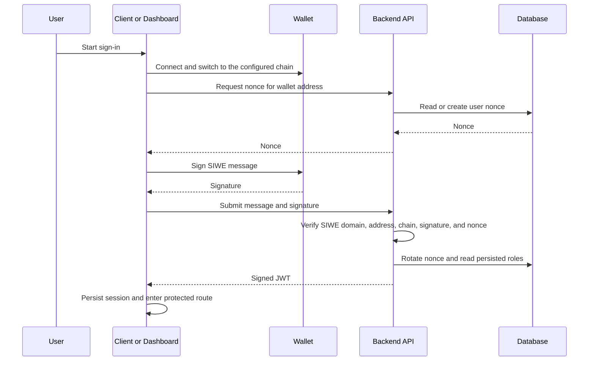

# Authentication Implementation

**Scope:** Shared SIWE authentication, JWT session issuance, and protected-route entry

**Last verified:** 2026-08-21

**Consumers:** [Authentication user journey](../../features/authentication/README.md), the Vue client, the administrator
dashboard, and every authenticated backend route

Authentication has a product facet and an architectural facet. The feature document owns what a user experiences; this
document owns the shared SIWE and session boundaries.

## Runtime Model

## Responsibility Boundaries

- The client and dashboard own wallet connection, chain switching, SIWE message construction, signature prompts,
  user-facing errors, and local session storage.
- The backend owns nonce persistence, SIWE verification, nonce rotation, JWT issuance, and JWT validation.
- RBAC owns authorization after authentication; a valid session does not imply administrator access.
- Wallet signatures authenticate ownership but do not execute a transaction or consume gas.

## Invariants

- A successful login uses a backend-issued nonce and rotates it after verification.
- Private keys never leave the wallet.
- Protected backend routes validate the bearer token before authorization middleware runs.
- The dashboard admits only persisted administrators after authentication.
- Clearing or invalidating the local token returns the user to the login journey.

## Failure Behaviour

- Wallet connection, chain switching, signature rejection, nonce retrieval, authentication, and profile retrieval
  produce distinct client errors where the surface supports them.
- Invalid SIWE payloads or signatures are rejected by the backend.
- Missing, invalid, or incomplete JWT payloads are rejected before protected handlers run.
- Dashboard role rejection leads to the access-denied page rather than a protected module.

## Implementation Evidence

- [Client SIWE orchestration](../../../app/src/composables/useSiwe.ts)
- [Client login page](../../../app/src/views/LoginView.vue)
- [Client SIWE tests](../../../app/src/composables/__tests__/useSiwe.spec.ts)
- [Dashboard SIWE orchestration](../../../dashboard/app/composables/useSiwe.ts)
- [Dashboard login page](../../../dashboard/app/pages/login.vue)
- [Dashboard authentication guard](../../../dashboard/app/middleware/auth.global.ts)
- [Backend authentication controller](../../../backend/src/controllers/authController.ts)
- [Backend authentication routes](../../../backend/src/routes/authRoutes.ts)
- [Backend authentication tests](../../../backend/src/controllers/__tests__/authController.test.ts)

## Related Documentation

- [Authentication User Stories](../../features/authentication/README.md)
- [RBAC implementation](../rbac/README.md)
- [Security Standards](../../platform/security.md)
- [Implementation Documentation Guide](../../platform/implementation-documentation-guide.md)
