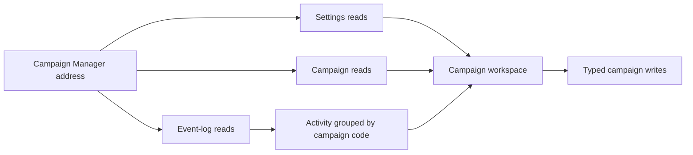

# Campaign Data Access

**Status:** Current

**Last verified:** 2026-09-23

**Scope:** Read Campaign Manager settings, campaigns, and activity; execute campaign writes; and normalize event logs for the Contract
Management campaigns journey.

The user journey remains in [Contract Management](../../features/contract-management/README.md). On-chain authorization and settlement rules
remain in [AdCampaignManager](../../contracts/features/ad-campaign-manager/README.md).

## Consumers

- [Contract Management](../../features/contract-management/README.md) consumes Campaign Manager settings, campaigns, and activity.
- The campaign workspace and configuration forms consume the focused read and write boundaries.

## Runtime Model

## Invariants and Failure Behaviour

- Queries remain disabled until a valid Campaign Manager address is available.
- Campaign detail reads preserve exact integer values and expose empty and failed reads separately.
- Event logs remain grouped by campaign code and retain their chain order within each campaign.
- Click and impression rates are configuration values only; the current runtime does not derive validated spend from them.

## Known Gaps

- The portal does not independently validate the off-chain click or impression totals used to calculate cumulative campaign spend.

## Implementation Evidence

**Implementation evidence reviewed against:** `272d6bd8d455cf09e681192f3b9c6c284b63b4fa`

- [Campaign read tests](../../../app/src/composables/campaign/__tests__/reads.spec.ts),
  [campaign write tests](../../../app/src/composables/campaign/__tests__/writes.spec.ts), and
  [campaign event tests](../../../app/src/lib/campaign/__tests__/events.spec.ts)
- [AdCampaignManager contract tests](../../../contract/test/AdCampaignManager.spec.ts)

## Related Documentation

- [Contract Management](../../features/contract-management/README.md)
- [Contract Event Feeds](../contract-event-feeds/README.md)
