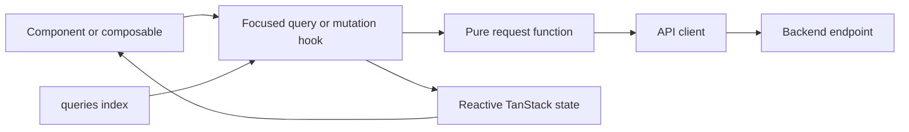

# Client Data Access

**Scope:** Shared client HTTP query and mutation boundaries under `app/src/queries/`, including their central export surface

**Last verified:** 2026-09-01

## Consumers

- Every client feature may consume a focused query or mutation hook.
- [Profile](../../features/user-profile/README.md) uses the single-file upload mutation to prepare a profile image for its user-profile
  update journey.
- Product-specific query owners, such as [Payroll](../../features/payroll/README.md), retain their feature rules and API payload mapping.

## Runtime Model

## Invariants and Failure Behaviour

- A mutation keeps its HTTP request in a pure async function and exposes one focused TanStack mutation hook for callers.
- A caller owns user-visible success callbacks and renders mutation failures reactively in its own context.
- `uploadSingleFile` returns the first uploaded file URL and throws when the backend response does not contain one.
- The `@/queries` barrel re-exports focused query modules; it does not combine their endpoint behaviour or server state.

## Implementation Evidence

**Implementation evidence reviewed against:** `787921e5cf9dd1cf46fd0f69f651dba7d8785374`

- [Query barrel](../../../app/src/queries/index.ts), [query factory](../../../app/src/queries/queryFactory.ts), and
  [single-file upload query](../../../app/src/queries/file.queries.ts)
- [Profile image consumer](../../../app/src/components/forms/ProfileImageUpload.vue) and
  [pure upload/query tests](../../../app/src/queries/__tests__/file.queries.spec.ts)

## Related Documentation

- [Query hook conventions](../../../app/src/queries/README.md)
- [Profile](../../features/user-profile/README.md)
- [Vue Component Standards](../../../.github/copilot-instructions/vue-component-standards.md)
- [Documentation Freshness Policy](../../platform/documentation-freshness-policy.md)
