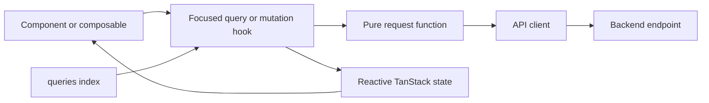

# Client Data Access

**Scope:** Shared client HTTP query and mutation boundaries under `app/src/queries/`, including their central export surface

**Last verified:** 2026-10-01

## Consumers

- Every client feature may consume a focused query or mutation hook.
- [Profile](../../features/user-profile/README.md) uses the single-file upload mutation to prepare a profile image for its user-profile
  update journey.
- Product-specific query owners, such as [Payroll](../../features/payroll/README.md), retain their feature rules and API payload mapping.

## Runtime Model

```mermaid
flowchart LR
  component[Component or composable] --> hook[Focused query or mutation hook]
  hook --> request[Pure request function]
  request --> api[API client]
  api --> backend[Backend endpoint]
  hook --> state[Reactive TanStack state]
  state --> component
  barrel[queries index] --> hook
```

## Invariants and Failure Behaviour

- A mutation keeps its HTTP request in a pure async function and exposes one focused TanStack mutation hook for callers.
- A caller owns user-visible success callbacks and renders mutation failures reactively in its own context.
- `uploadSingleFile` returns the first uploaded file URL and throws when the backend response does not contain one.
- The `@/queries` barrel re-exports focused query modules; it does not combine their endpoint behaviour or server state.

### Contract-based asset markets

[Asset market discovery](../../../app/src/queries/assetMarket.queries.ts) verifies the provider platform and contract address before
returning an asset's coin identity, current USD price, or optional display logo. Valid HTTPS image URLs come from that same verified
contract response and remain available even when its price is missing. Safe metadata logos survive matching-contract RPC metadata
enrichment. Coin identity is cached independently from periodically refreshed prices. Historical rates continue to use immutable coin/date
snapshots. Safe transfer history is paginated and deduplicated using the service transfer identity; later-page failures reject the whole
history. The read-only Safe portfolio is independent of CNC payment allowlists.

Incoming deposits retain the service's raw transfer objects. An ERC-20 deposit without `tokenInfo` displays `Token amount unavailable`; the
raw object retains the token contract, transaction hash, and value. Missing metadata does not establish token reputation or identify the
transaction signer. The complete asset-transfer query can recover metadata independently, so holdings and deposits may have different
available metadata.

### Browser request coordination

[External read coordination](../../../app/src/lib/externalReads.ts) serializes Safe GETs and CoinGecko reads in separate browser-session
queues. Safe starts are spaced by at least 250 ms; CoinGecko starts by at least 2.1 seconds. A provider's HTTP 429 pauses its entire queue
for the supplied `Retry-After` duration (seconds or HTTP date), with a 30-second minimum, or one minute when that header is unavailable.
Calls during the pause fail without contacting the provider. CoinGecko requests have a 15-second timeout, and cancelled queued reads do not
send a request. Writes are outside these queues and are never automatically replayed by this coordination.

Safe information and complete transfer histories are fresh for five minutes. The transaction queue polls every minute while a pending
transaction exists and every five minutes otherwise; a single transaction detail does not poll. Prices use a five-minute cache, and
successful token metadata and coin identities use a 24-hour cache. Unused regular query data is retained for 30 minutes; successful
historical price snapshots remain immutable in the session cache. Periodic intervals include up to ten percent jitter shared by observers of
the same cadence, do not poll in background tabs, and do not refetch on window focus. Rate limits and terminal HTTP client errors do not
trigger automatic retries. Safe reads and supported-price observers allow one delayed retry for transient failures; imperative market,
historical and token-metadata reads recover on a subsequent refresh instead of retrying each failed request.

Historical target sets retry missing snapshots every five minutes without requesting already successful dates again. Full Safe pagination is
retained on each history refresh; this change does not implement incremental synchronization. A later-page failure leaves the previous
successful query result in cache and rejects the incomplete replacement.

The queues and caches belong to one browser session. They do not coordinate separate users, tabs, devices, or backend instances, and do not
guarantee that provider quotas can absorb concurrent users.

## Implementation Evidence

**Implementation evidence reviewed against:** `e0afafbea5c6669900a3fd30d7e9cd15f9477214`

- [Query barrel](../../../app/src/queries/index.ts), [query factory](../../../app/src/queries/queryFactory.ts), and
  [single-file upload query](../../../app/src/queries/file.queries.ts)
- [Profile image consumer](../../../app/src/components/forms/ProfileImageUpload.vue) and
  [pure upload/query tests](../../../app/src/queries/__tests__/file.queries.spec.ts)
- [HTTP client tests](../../../app/src/lib/__tests__/axios.spec.ts)

## Related Documentation

- [Query hook conventions](../../../app/src/queries/README.md)
- [Profile](../../features/user-profile/README.md)
- [Vue Component Standards](../../../.github/copilot-instructions/vue-component-standards.md)
- [Documentation Freshness Policy](../../platform/documentation-freshness-policy.md)
