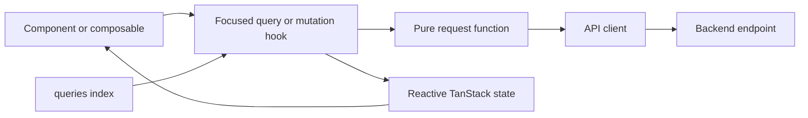

# Client Data Access

**Scope:** Shared client HTTP query and mutation boundaries under `app/src/queries/`, including their central export surface

**Last verified:** 2026-10-01

## Consumers

- Every client feature may consume a focused query or mutation hook.
- [Profile](../../features/user-profile/README.md) uses the single-file upload mutation to prepare a profile image for its user-profile
  update journey.
- Product-specific query owners, such as [Payroll](../../features/payroll/README.md), retain their feature rules and API payload mapping.

## Runtime Model

```mermaid
flowchart LR
  component[Component or composable] --> hook[Focused query or mutation hook]
  hook --> request[Pure request function]
  request --> api[API client]
  api --> backend[Backend endpoint]
  hook --> state[Reactive TanStack state]
  state --> component
  barrel[queries index] --> hook
```

## Invariants and Failure Behaviour

- A mutation keeps its HTTP request in a pure async function and exposes one focused TanStack mutation hook for callers.
- A caller owns user-visible success callbacks and renders mutation failures reactively in its own context.
- `uploadSingleFile` returns the first uploaded file URL and throws when the backend response does not contain one.
- The `@/queries` barrel re-exports focused query modules; it does not combine their endpoint behaviour or server state.

### Contract-based asset markets

[Asset market discovery](../../../app/src/queries/assetMarket.queries.ts) verifies the provider platform and contract address before
returning an asset's coin identity, current USD price, or optional display logo. Contract market lookup supports Polygon (137) only;
Hardhat, Amoy, Sepolia, and other networks fail explicitly before sending a provider request. Test contracts never inherit Polygon prices by
address or symbol. Valid HTTPS image URLs come from that same verified contract response and remain available even when its price is
missing. Safe metadata logos survive matching-contract RPC metadata enrichment. Coin identity is cached independently from periodically
refreshed prices. Historical rates continue to use immutable coin/date snapshots. Safe transfer history is paginated and deduplicated using
the service transfer identity; later-page failures reject the whole history. The read-only Safe portfolio is independent of CNC payment
allowlists.

Incoming deposits retain the service's raw transfer objects. An ERC-20 deposit without `tokenInfo` displays `Token amount unavailable`; the
raw object retains the token contract, transaction hash, and value. Missing metadata does not establish token reputation or identify the
transaction signer. The complete asset-transfer query can recover metadata independently, so holdings and deposits may have different
available metadata.

### Browser request coordination

[External read coordination](../../../app/src/lib/externalReads.ts) serializes Safe GETs and CoinGecko reads in separate browser-session
queues. Safe starts are spaced by at least 250 ms; CoinGecko starts by at least 2.1 seconds. A provider's HTTP 429 pauses its entire queue
for the supplied `Retry-After` duration (seconds or HTTP date), with a 30-second minimum, or one minute when that header is unavailable.
Calls during the pause fail without contacting the provider. Safe and CoinGecko GETs use the existing external Axios client, including its
15-second timeout and query cancellation signal. Cancelled queued reads do not send a request. Writes are outside these queues and are never
automatically replayed by this coordination.

Safe information and complete transfer histories are fresh for five minutes. The transaction queue polls every minute while a pending
transaction exists and every five minutes otherwise; a single transaction detail does not poll. Prices use a five-minute cache, and
successful token metadata and coin identities use a 24-hour cache. Unused regular query data is retained for 30 minutes; successful
historical price snapshots remain immutable in the session cache. Each query declares its own freshness, retention, polling and retry
options. Periodic observers use their declared cadence, do not poll in background tabs, and do not refetch on window focus. Rate limits and
terminal HTTP client errors do not trigger automatic retries. Safe reads and supported-price observers allow one delayed retry for transient
failures; imperative market, historical and token-metadata reads recover on a subsequent refresh instead of retrying each failed request.

Unchanged historical target sets retry missing snapshots once a day, with daily cache retention and no window-focus refresh, without
requesting already successful dates again. A newly required date is fetched when its target set changes; an explicit Accounting refresh can
retry unavailable dates immediately. Full Safe pagination is retained on each history refresh; this change does not implement incremental
synchronization. A later-page failure leaves the previous successful query result in cache and rejects the incomplete replacement.

External reads remain necessary on this runtime: Safe history and CoinGecko market data are HTTP provider resources, while ERC-20 balances
are RPC contract reads. A balance read cannot replace transfer pagination or market prices. The current backend exposes no replacement
provider-read routes; currency prices, contract markets, and historical snapshots therefore share the browser coordination utility. It
prevents each consumer from implementing its own pacing and 429 handling.

[Discovered Safe balance queries](../../../app/src/queries/safePortfolio.queries.ts) expose standard TanStack state and delegate their async
reads to `fetchSafePortfolioAssets`. The portfolio composable combines that query with supported balances and complete history. Confirmed
operations use [one Safe invalidation helper](../../../app/src/queries/safe.mutations.ts) for the entire Safe service prefix and the
affected wallet's on-chain balance prefix. Proposals refresh only pending transactions until execution.

The queues and caches belong to one browser session. They do not coordinate separate users, tabs, devices, or backend instances, and do not
guarantee that provider quotas can absorb concurrent users.

## Implementation Evidence

**Implementation evidence reviewed against:** `ac9229f7b43dbbcca9ee1c39a8a013642e2ff464`

- [Query barrel](../../../app/src/queries/index.ts), [query factory](../../../app/src/queries/queryFactory.ts), and
  [single-file upload query](../../../app/src/queries/file.queries.ts)
- [Profile image consumer](../../../app/src/components/forms/ProfileImageUpload.vue) and
  [pure upload/query tests](../../../app/src/queries/__tests__/file.queries.spec.ts)
- [HTTP client tests](../../../app/src/lib/__tests__/axios.spec.ts),
  [coordinated Axios transport tests](../../../app/src/lib/__tests__/externalReads.spec.ts), and
  [per-query Safe refresh and recovery tests](../../../app/src/queries/__tests__/safe.queries.refresh.spec.ts)

## Related Documentation

- [Query hook conventions](../../../app/src/queries/README.md)
- [Profile](../../features/user-profile/README.md)
- [Vue Component Standards](../../../.github/copilot-instructions/vue-component-standards.md)
- [Documentation Freshness Policy](../../platform/documentation-freshness-policy.md)
