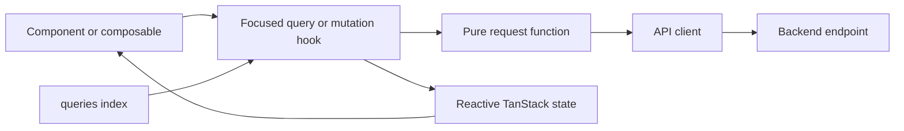

# Client Data Access

**Scope:** Shared client HTTP query and mutation boundaries under `app/src/queries/`, including their central export surface

**Last verified:** 2026-10-01

## Consumers

- Every client feature may consume a focused query or mutation hook.
- [Profile](../../features/user-profile/README.md) uses the single-file upload mutation to prepare a profile image for its user-profile
  update journey.
- Product-specific query owners, such as [Payroll](../../features/payroll/README.md), retain their feature rules and API payload mapping.

## Runtime Model

```mermaid
flowchart LR
  component[Component or composable] --> hook[Focused query or mutation hook]
  hook --> request[Pure request function]
  request --> api[API client]
  api --> backend[Backend endpoint]
  hook --> state[Reactive TanStack state]
  state --> component
  barrel[queries index] --> hook
```

## Invariants and Failure Behaviour

- A mutation keeps its HTTP request in a pure async function and exposes one focused TanStack mutation hook for callers.
- A caller owns user-visible success callbacks and renders mutation failures reactively in its own context.
- `uploadSingleFile` returns the first uploaded file URL and throws when the backend response does not contain one.
- The `@/queries` barrel re-exports focused query modules; it does not combine their endpoint behaviour or server state.

### Contract-based asset markets

[CoinGecko queries](../../../app/src/queries/coingecko.queries.ts) provide ordinary `useQuery` and `useQueries` observers for
supported-token prices, Polygon contract metadata and historical snapshots. Each query calls the external Axios client directly, forwards
cancellation, validates contract identity or historical precision through [pure utilities](../../../app/src/utils/tokens/coingecko.ts), and
caches the unchanged valid provider response. The [Accounting data layer](../../../app/src/composables/accounting/useCNCAccounting.ts)
consumes those queries directly and uses the pure utilities to resolve a token's transaction-date rate. The currency store consumes the
price query. Current prices use `queryPresets.moderate` for one-minute freshness; contract identity and historical snapshots use
`queryPresets.once`, without local `staleTime` overrides. The authenticated CNC query factory is not used for external provider requests.

Asset market discovery verifies the provider platform and contract address before returning an asset's coin identity, current USD price, or
optional display logo. Contract market lookup supports Polygon (137) only; Hardhat, Amoy, Sepolia, and other networks remain unavailable
without sending a provider request. Test contracts never inherit Polygon prices by address or symbol. Valid HTTPS image URLs come from that
same verified contract response and remain available even when its price is missing. Safe metadata logos survive matching-contract RPC
metadata enrichment. Raw contract metadata is retained for 24 hours after its last observer; historical snapshots remain immutable by
coin/date. Safe transfer history is paginated and deduplicated using the service transfer identity; later-page failures reject the whole
history. The read-only Safe portfolio is independent of CNC payment allowlists.

Incoming deposits retain the service's raw transfer objects. An ERC-20 deposit without `tokenInfo` displays `Token amount unavailable`; the
raw object retains the token contract, transaction hash, and value. Missing metadata does not establish token reputation or identify the
transaction signer. The complete asset-transfer query can recover metadata independently, so holdings and deposits may have different
available metadata.

### Confirmed Safe spam

The complete asset-transfer and incoming-transfer queries apply the same
[confirmed-spam policy](../../../app/src/utils/safe/confirmedSpam.ts) through TanStack `select`. The registry currently excludes only two
audited counterfeit USDC contracts on Polygon: `0x9251cf87c36a02b741ff2127817be4d79eadc05b` and
`0x0ce89273aadcb0f297a32d957cbd459ed06848ea`. Each entry records its reason, confirmation date and public transaction evidence. Matching
uses the chain ID and the ERC-20 event's emitting contract, case-insensitively; symbols, sender resemblance, missing metadata, provider
trust flags and unavailable prices do not create exclusions.

Raw events remain in their existing query cache, including their transaction and transfer identities. The read functions skip metadata
recovery for confirmed spam; observers exclude those events before discovery, holdings, current or historical prices, and Accounting
mapping. The policy also applies to already cached histories. Each event is filtered independently, preserving admitted incoming and
outgoing legs in the same transaction. Real assets and their outflows retain their existing processing and completeness rules.

This is a reviewed registry, with no automatic detection, user classification interface, or persistent quarantine. Raw evidence remains
available for the existing browser-cache lifetime and can be fetched again from the provider. Adding an exclusion requires reviewed evidence
and a source change. The same address on another network is outside the exclusion.

Executable evidence: [policy regressions](../../../app/src/utils/safe/__tests__/confirmedSpam.spec.ts) and
[cached and paginated query-to-accounting tests](../../../app/src/queries/__tests__/safe.queries.integration.spec.ts). These tests use
mocked provider responses and real TanStack observers; live browser validation remains pending.

### Browser request coordination

Safe and CoinGecko HTTP requests live in their query modules and use the existing
[external Axios client](../../../app/src/lib/external.axios.ts), including its 15-second timeout and query cancellation signal. Independent
Transaction Service reads use [Safe request admission](../../../app/src/queries/safe.requests.ts): one HTTP request in flight and starts at
least one second apart. HTTP 429 pauses queued reads and explicit retries for at least one minute or the longer `Retry-After`. Aborted reads
are withheld before HTTP admission. Direct `api.safe.global/tx-service` URLs avoid cross-origin redirects; `VITE_APP_SAFE_API_KEY` is sent
only to that production Transaction Service, never to Gateway or other providers. A production key must come from `developer.safe.global`;
staging keys from `developer.5afe.dev` do not establish a production quota. Service writes retain their explicit mutation path and are not
queued or replayed by this read policy. Gateway keeps its own balance query cadence.

CoinGecko requests use standard TanStack cache identities and independent query error states. Queries for the same identity share one
request; distinct identities can run concurrently. There is no custom admission queue, shared pause or batch recovery state. All CoinGecko
queries disable automatic retries. Current prices still poll every five minutes; contract discovery and historical snapshots are requested
when needed and unavailable results can be retried by explicit Accounting refresh. A 429 remains a failed provider read and does not block
unrelated queries.

Safe information, complete transfer histories, Gateway holdings and current prices inherit the moderate preset's one-minute freshness. Safe
information, histories and current-price observers poll every five minutes; Gateway balances poll every minute. The transaction queue polls
every minute while a pending transaction exists and every five minutes otherwise; a single transaction detail does not poll. Successful
token metadata and verified coin identities use the once preset with 24-hour retention. Unused regular query data is retained for 30
minutes; successful historical price snapshots remain immutable in the session cache. Each query inherits freshness and declares retention,
polling and retry options. Periodic observers use their declared cadence, do not poll in background tabs, and do not refetch on window
focus. Rate limits and terminal HTTP client errors do not trigger automatic retries. Safe reads allow one delayed retry for transient
failures; CoinGecko and token-metadata reads recover on a subsequent refresh instead of retrying each failed request.

Accounting deduplicates contract discovery and coin/date targets, then consumes their independent observers. Missing, malformed or failed
rates remain explicit valuation gaps without a current-price fallback. The existing Accounting refresh retries failed query observers;
dependent historical dates start when verified contract metadata becomes available. Successful snapshots are reused. A disabled valuation
consumer sends no requests, including on refresh. There is no automatic historical polling or provider-wide rate-limit guarantee across
identities, tabs or users.

`staleTime` describes successful-cache freshness, `refetchInterval` schedules observer refreshes, and `retryDelay` applies only when `retry`
permits another failed request. Successful historical snapshots remain immutable; `retry: false` disables per-request retries. Full Safe
pagination is retained on each history refresh; this change does not implement incremental synchronization. A later-page failure leaves the
previous successful query result in cache and rejects the incomplete replacement.

[Safe Client balance queries](../../../app/src/queries/safeClient.queries.ts) fetch native and ERC-20 holdings, exact base-unit quantities,
token metadata, current unit prices and fiat values in one request to the Safe Client Gateway. The raw Gateway response stays in TanStack
Query; [pure holdings presentation](../../../app/src/utils/safe/portfolio.ts) preserves token identity, decimal precision, provider order,
metadata and returned zero balances. It never adds absent configured currencies and supplements provider spam filtering with the reviewed
contract registry. Zero or missing prices for nonzero holdings keep values and totals explicitly incomplete, including the Gateway's
zero-price fallback. The provider's fiat total is used only for a complete, unfiltered response; excluded or duplicate contracts require a
total from admitted items. The response contract is defined in [Safe types](../../../app/src/types/safe.ts).

Address, configured chain and uppercase fiat code identify each balance cache entry. The overview and holdings share one USD request; a
selected non-USD currency has its own Gateway request while the overview retains its USD total. No transfer-history, RPC balance or
CoinGecko current-price reads are required to populate these holdings. The query refreshes every minute in active tabs, retains unused data
for 30 minutes, propagates cancellation and allows one delayed transient-error retry. Both Gateway and Transaction Service GETs use the
external Axios client directly. A failed request retains its cached response while exposing the error; the UI marks the total incomplete.

[Gateway queries](../../../app/src/queries/safeClient.queries.ts) own the balance HTTP request and reject malformed response bodies.
[Safe movement queries](../../../app/src/queries/safe.queries.ts) own complete transfer pagination, deduplication and contract metadata
recovery. Accounting keeps its Transaction Service movement feeds and historical market snapshots; other account surfaces keep their RPC
balances and existing price queries. Gateway discovery does not expand CNC transfer currencies. Confirmed operations use
[one Safe invalidation helper](../../../app/src/queries/safe.mutations.ts) for the entire Safe service prefix and the affected wallet's
balance prefix, which also reaches all Gateway fiat entries. Proposals refresh only pending transactions until execution. Direct hosted
Gateway access is a runtime dependency; mocked query tests do not establish an availability guarantee.

Executable evidence: [Gateway request tests](../../../app/src/queries/__tests__/safeClient.queries.spec.ts),
[shared observer and invalidation tests](../../../app/src/queries/__tests__/safeClient.queries.integration.spec.ts), and
[holdings presentation tests](../../../app/src/utils/safe/__tests__/portfolio.spec.ts).

The caches belong to one browser session. They do not coordinate separate users, tabs, devices, or backend instances, and do not guarantee
that provider quotas can absorb concurrent users.

## Implementation Evidence

**Implementation evidence reviewed against:** `0bc2609d26711fab5422985ba93c4512a3e12ca8`

- [Query barrel](../../../app/src/queries/index.ts), [query factory](../../../app/src/queries/queryFactory.ts), and
  [single-file upload query](../../../app/src/queries/file.queries.ts)
- [Profile image consumer](../../../app/src/components/forms/ProfileImageUpload.vue) and
  [pure upload/query tests](../../../app/src/queries/__tests__/file.queries.spec.ts)
- [HTTP client tests](../../../app/src/lib/__tests__/axios.spec.ts),
  [contract market request tests](../../../app/src/queries/__tests__/assetMarket.queries.spec.ts),
  [historical snapshot tests](../../../app/src/queries/__tests__/historicalTokenRate.queries.spec.ts), and
  [per-query Safe refresh and recovery tests](../../../app/src/queries/__tests__/safe.queries.refresh.spec.ts)
- [Accounting data layer](../../../app/src/composables/accounting/useCNCAccounting.ts) and
  [real observer cache and explicit recovery tests](../../../app/src/queries/__tests__/coingecko.queries.integration.spec.ts)

## Related Documentation

- [Query hook conventions](../../../app/src/queries/README.md)
- [Profile](../../features/user-profile/README.md)
- [Vue Component Standards](../../../.github/copilot-instructions/vue-component-standards.md)
- [Documentation Freshness Policy](../../platform/documentation-freshness-policy.md)
