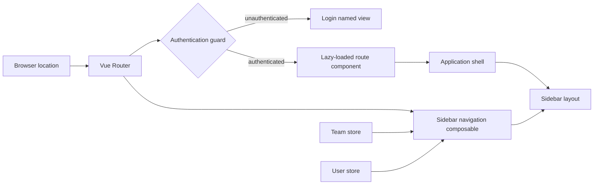

# Client Navigation — Implementation

**Scope:** Shared client routing, authentication redirects, application-shell route rendering, and sidebar navigation for the portal.

**Last verified:** 2026-08-26

This capability owns the shared navigation boundary. Product goals, permissions, and acceptance criteria remain in the linked feature
READMEs.

## Consumers

- [Authentication](../../features/authentication/README.md) relies on the route guard around the login journey.
- [Companies](../../features/companies/README.md), [Accounts](../../features/accounts/README.md),
  [Payroll](../../features/payroll/README.md), and [Accounting](../../features/accounting/README.md) use team-scoped routes and sidebar
  entries.
- [Community Credit](../../features/community-credit/README.md) and [Board Elections](../../features/elections/README.md) use the same
  workspace and Administration navigation.
- The [Product Feature Inventory](../../features/README.md) records the currently reachable client capabilities.

## Runtime Model

## Main Flow

1. Vue Router resolves the browser location. The root location redirects to the Companies route and team routes resolve under a team ID.
2. The guard redirects an unauthenticated visitor to Login and redirects an authenticated visitor away from Login to Companies.
3. The application shell renders the named login view or, for an authenticated session, the team workspace and its default route view.
4. The sidebar derives its entries, disabled state, active section, and active child from the current route plus the current team and user.

## Invariants and Failure Behaviour

- Route records lazy-load their view components; the shared router owns their names, paths, redirects, and authentication redirect policy.
- The locked-session location bypasses the normal authentication redirect so the locked-session view can render.
- Workspace navigation remains disabled until the URL or team store identifies a current team.
- A parent menu section is active and initially open when its route-name group matches the current route. The sidebar keeps at most one
  manually expanded section open at a time.
- Sidebar targets use named routes. A route-name change therefore requires the corresponding navigation target and its regression coverage
  to be updated together.

## Implementation Evidence

**Implementation evidence reviewed against:** `8b231a2e0ccf81bf988ee73a26f8a53512d15f18`

- [Team selection menu](../../../app/src/components/layout/TeamSelectMenu.vue)
- [Router definition and authentication guard](../../../app/src/router/index.ts)
- [Application shell and route-view rendering](../../../app/src/App.vue)
- [Sidebar layout and controlled accordion](../../../app/src/components/ui/SidebarLayout.vue)
- [Sidebar navigation derivation](../../../app/src/composables/useSidebarNavItems.ts)
- [Router behaviour tests](../../../app/src/router/__tests__/index.spec.ts)
- [Sidebar navigation behaviour tests](../../../app/src/composables/__tests__/useSidebarNavItems.spec.ts)
- [Sidebar layout tests](../../../app/src/components/ui/__tests__/SidebarLayout.spec.ts)

## Related Documentation

- [Product Feature Inventory](../../features/README.md)
- [Authentication implementation](../authentication/README.md)
- [Implementation Documentation Guide](../../platform/implementation-documentation-guide.md)
