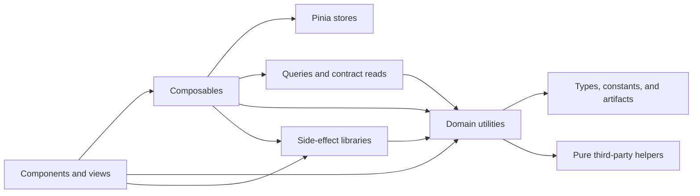

# Client Utilities

**Scope:** Pure, shared data-shaping boundaries for the `app/` frontend and the separation of their stateful, network, browser, SDK, and
file-export effects.

**Last verified:** 2026-09-05

## Consumers

- Every client product surface may consume an explicitly owned utility domain.
- [Accounting](../../features/accounting/README.md), [Community Credit](../../features/community-credit/README.md),
  [Payroll](../../features/payroll/README.md), [Accounts](../../features/accounts/README.md),
  [Companies](../../features/companies/README.md), [Shareholder Management](../../features/shareholder-management/README.md), and
  [Vesting](../../features/vesting/README.md) own the primary product-specific consumers.
- Client composables, queries, and `lib/` modules consume pure transforms while retaining state and side-effect ownership.

## Runtime Model

## Main Flow

1. A consumer imports a responsibility-specific module such as `@/utils/transactions/history` or `@/utils/format`.
2. The consumer supplies plain input data. Store-backed presentation supplies that data through a composable rather than reading Pinia
   inside the utility.
3. The utility returns a deterministic value without network, contract, browser, logging, or file-system effects.
4. A composable, query, or `lib/` module performs any required effect and owns its failure handling.
5. `lint:utilities` scans production imports and the utility graph before the normal ESLint pass.

## Invariants and Failure Behaviour

- Every production TypeScript utility belongs to a documented domain directory; the root contains guidance only.
- Production code does not import a global `@/utils` barrel. Domain barrels may remain when they represent one stable responsibility, as
  `@/utils/format` does.
- Utilities do not import Pinia stores, composables, queries, API or HTTP clients, `lib/`, Wagmi orchestration, or browser I/O.
- Utility runtime imports are acyclic. Type-only relationships are erased by TypeScript and do not participate in the runtime graph.
- Contract reads, store-backed transaction presentation, Safe browser access, logging, spreadsheet/PDF generation, and Safe SDK transaction
  effects remain outside `utils`.
- Boundary validation fails with the exact files and imports that violate the contract; it does not silently maintain an exception baseline.
- Utility specs remain colocated with their domain owner and validate unchanged formatting, accounting, and transaction semantics.

## Known Gaps

- The boundary check enforces structural dependencies and cycles; it cannot identify two semantically duplicate pure helpers with different
  names. Code review and the domain map remain responsible for that discovery.

## Implementation Evidence

**Implementation evidence reviewed against:** `c7f058d0227a463709ac7a54ea95f3164cf385b2`

- [Utility ownership map and domain implementations](../../../app/src/utils/)
- [Pure accounting account-instance evidence resolver](../../../app/src/utils/accounting/accountInstances.ts)
- [Utility boundary validator](../../../app/scripts/check-utility-boundaries.mjs) and
  [validator tests](../../../app/scripts/__tests__/check-utility-boundaries.node.mjs)
- [Store-backed transaction presentation](../../../app/src/composables/transactions/useTransactionPresentation.ts) and
  [pure presentation model](../../../app/src/utils/transactions/presentation.ts)
- [Contract-read owner](../../../app/src/composables/contracts/readTeamContracts.ts)
- [Safe browser effects](../../../app/src/lib/safe/browser.ts), [Safe transaction effects](../../../app/src/lib/safe/transactions.ts),
  [logging](../../../app/src/lib/logging.ts), [accounting exports](../../../app/src/lib/accounting/), and
  [file exports](../../../app/src/lib/files/)

## Related Documentation

- [Vue Component Standards](../../../.github/copilot-instructions/vue-component-standards.md)
- [Formatting Standards](../../../.github/copilot-instructions/formatting-standards.md)
- [Testing Overview](../../../.github/copilot-instructions/testing-overview.md)
- [Documentation Freshness Policy](../../platform/documentation-freshness-policy.md)
