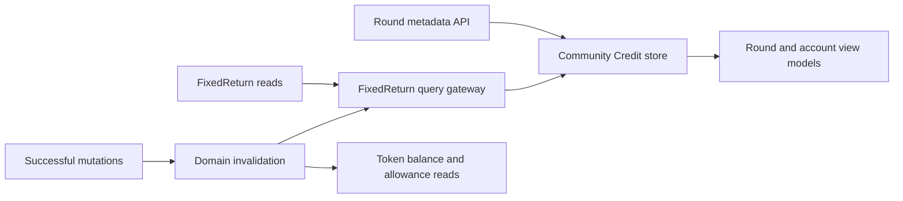

# Community Credit Read Model

**Status:** Current

**Last verified:** 2026-09-23

**Scope:** Assemble FixedReturn contract state and off-chain round metadata into the Community Credit data consumed by portal views.

Product journeys and acceptance criteria remain in [Community Credit](../../features/community-credit/README.md). FixedReturn state
transitions remain in the [FixedReturn contract documentation](../../contracts/features/fixed-return/README.md).

## Consumers

- [Community Credit](../../features/community-credit/README.md) consumes the assembled account, round, lender-position, and metadata state.
- The Credit Account, credit-call, and round-detail views consume the read model through the Community Credit store and focused queries.

## Runtime Model

## Invariants and Failure Behaviour

- `fixedReturnKeys` provides the shared query identity for offer, lender, and connected-wallet position reads.
- A failed offer or lender read is not converted into a successful empty result.
- Connected-wallet position reads preserve successful offers while representing another offer's failure explicitly.
- Account statistics remain grouped by token; values from different tokens are never summed.
- Successful mutations invalidate the FixedReturn reads and event feed affected by the operation. Lending, repayment, refund, and partial
  acceptance also invalidate reads for the round token.
- Off-chain metadata remains keyed by company and on-chain offer identifier.

## Known Gaps

- Round metadata remains off-chain and is not transactionally committed with offer creation; a failed metadata save can therefore leave a
  valid on-chain round without its intended title or purpose until the owner retries.

## Implementation Evidence

**Implementation evidence reviewed against:** `272d6bd8d455cf09e681192f3b9c6c284b63b4fa`

- [FixedReturn read and write gateways](../../../app/src/composables/fixedReturn/),
  [their focused tests](../../../app/src/composables/fixedReturn/__tests__/), and
  [metadata query tests](../../../app/src/queries/__tests__/fixedReturnOffering.queries.spec.ts)
- [Community Credit store tests](../../../app/src/stores/__tests__/communityCredit.spec.ts),
  [domain model tests](../../../app/src/utils/communityCredit/__tests__/), and
  [schema tests](../../../app/src/types/__tests__/communityCredit.schemas.spec.ts)
- [Metadata validation tests](../../../backend/src/validation/schemas/__tests__/fixedReturnOffering.test.ts)

## Related Documentation

- [Community Credit](../../features/community-credit/README.md)
- [Contract Event Feeds](../contract-event-feeds/README.md)
- [Client Data Access](../client-data-access/README.md)
