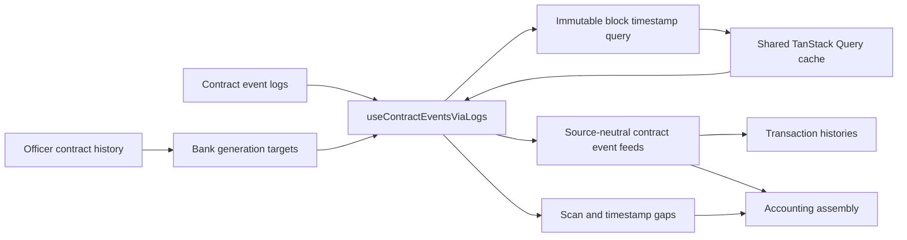

# Contract Event Feeds

**Scope:** Shared client runtime for reconstructing Bank, Expense, Payroll, Community Credit, Investor, Safe Deposit Router, and Vesting
activity directly from on-chain RPC logs.

**Last verified:** 2026-09-09

## Consumers

- [Accounts](../../features/accounts/README.md) uses Bank, Expense Account, and Cash Remuneration activity.
- [Accounting](../../features/accounting/README.md) maps contract activity into the canonical JournalEntry read model.
- [Community Credit](../../features/community-credit/README.md) uses Credit Account activity.
- [Payroll](../../features/payroll/README.md) shows Cash Remuneration activity.
- [Shareholder Management](../../features/shareholder-management/README.md) shows Investor and Safe Deposit Router activity.

## Runtime Model

## Main Flow

1. A domain feed selects the relevant contract address or generation targets.
2. `useContractEventsViaLogs` fetches and decodes the relevant logs, then resolves each distinct block timestamp through the shared TanStack
   Query client.
3. The immutable timestamp query is keyed by network and block number with infinite staleness and garbage-collection time, so concurrent
   feeds and later scans reuse one block read.
4. A decoded log enters its domain mapper only after its timestamp resolves. Missing block identity or a failed block read withholds that
   log and records a timestamp gap for completeness-aware consumers.
5. The domain mapper returns its source-neutral event feed for a transaction history or Accounting assembly.
6. Incoming Bank token transfers use every known Officer-generation Bank target, so a later Bank deployment does not hide prior transfers.

## Invariants and Failure Behaviour

- RPC logs are the only client-side source for these contract event feeds.
- A decoded event has the stable identity `<txHash>-<logIndex>`; duplicate scans collapse on that identity.
- Contract generations scan from their deployment boundary whenever it is known.
- A failed generation scan leaves the remaining generations available and records a scan gap for consumers that surface reconciliation
  state.
- A mined block timestamp is immutable and cached by network plus block number. Event feeds never substitute zero when that timestamp cannot
  be resolved; they withhold the affected log and expose its transaction hash, block number, and failure reason as a timestamp gap.
- An unavailable public client fails the event query instead of returning an empty feed that is indistinguishable from a successful scan.
- The current Bank remains a fallback target for companies without Officer history.

## Implementation Evidence

**Implementation evidence reviewed against:** `f18025018821e51a28712821bf445db8a37ce488`

- [Shared RPC log scanner](../../../app/src/composables/eventsViaLogs.ts),
  [immutable block timestamp query](../../../app/src/queries/blockTimestamp.queries.ts), and
  [shared query client](../../../app/src/queries/queryClient.ts)
- [Bank event feed](../../../app/src/composables/bank/useBankEventsViaLogs.ts) and
  [incoming Bank transfer feed](../../../app/src/composables/bank/useIncomingBankTokenTransfersViaLogs.ts)
- [Expense event feed](../../../app/src/composables/expense/useExpenseEventsViaLogs.ts) and
  [Cash Remuneration event feed](../../../app/src/composables/cashRemuneration/useCashRemunerationEventsViaLogs.ts)
- [Fixed Return event feed](../../../app/src/composables/fixedReturn/useFixedReturnEventsViaLogs.ts)
- [Investor event feed](../../../app/src/composables/investor/useInvestorEventsViaLogs.ts) and
  [Safe Deposit Router event feed](../../../app/src/composables/investor/useSafeDepositRouterEventsViaLogs.ts)
- [Vesting event feed](../../../app/src/composables/vesting/useVestingEventsViaLogs.ts)
- [Bank-generation target tests](../../../app/src/composables/bank/__tests__/useIncomingBankTokenTransfersViaLogs.spec.ts) and
  [shared scanner tests](../../../app/src/composables/__tests__/eventsViaLogs.spec.ts)

## Related Documentation

- [Transaction History](../transaction-history/README.md)
- [Accounting Read Model](../accounting-read-model/README.md)
- [Client Data Access](../client-data-access/README.md)
