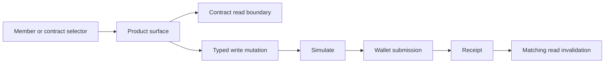

# Contract Interactions

**Status:** Current

**Last verified:** 2026-09-23

**Scope:** Shared client boundaries for reading contract data, executing writes, invalidating matching reads, and selecting contract or
member recipients.

Product permissions and outcomes remain in their feature documentation. Contract-specific invariants remain under `docs/contracts/`.

## Consumers

- Product surfaces that read or write company contracts, including Contract Management, Accounts, Community Credit, Shareholders, and
  Vesting.
- Shared member-or-contract selectors used by forms that can target either a company member or a registered contract.

## Runtime Model

## Invariants and Failure Behaviour

- Writes simulate before wallet submission, return the transaction result, and propagate rejection or decoded revert errors.
- Successful writes invalidate reads for the written address and configured chain before caller success handling completes.
- Parameterless contract reads retain successful values when sibling reads fail and expose total failure separately.
- Shared recipient selection emits an explicit member or contract selection and remains disabled while its source is unavailable.

## Known Gaps

- This capability standardizes client interaction boundaries; it does not prove that every product action currently applies the same
  authorization or recovery policy. Those guarantees remain in each feature and contract owner.

## Implementation Evidence

**Implementation evidence reviewed against:** `272d6bd8d455cf09e681192f3b9c6c284b63b4fa`

- [Contract write guide](../../../app/src/composables/contracts/README.md),
  [contract write tests](../../../app/src/composables/contracts/__tests__/useContractWritesV3.spec.ts), and
  [advanced invalidation tests](../../../app/src/composables/contracts/__tests__/useContractWritesV3.advanced.spec.ts)
- [Contract read-data tests](../../../app/src/composables/contracts/__tests__/useContractReadData.spec.ts) and
  [generic contract-function tests](../../../app/src/composables/__tests__/useContractFunction.spec.ts)
- [Board read tests](../../../app/src/composables/bod/__tests__/reads.spec.ts),
  [Board write tests](../../../app/src/composables/bod/__tests__/writes.spec.ts), and
  [Elections read tests](../../../app/src/composables/elections/__tests__/reads.spec.ts)
- [Investor read tests](../../../app/src/composables/investor/__tests__/reads.spec.ts),
  [Vesting read-factory tests](../../../app/src/composables/vesting/__tests__/reads.factory.spec.ts), and
  [Vesting write-factory tests](../../../app/src/composables/vesting/__tests__/writes.factory.spec.ts)
- [Contract result tests](../../../app/src/components/ui/inputs/__tests__/SelectContractResults.spec.ts) and
  [member-or-contract selector tests](../../../app/src/components/ui/inputs/__tests__/SelectMemberContractsInput.spec.ts)

## Related Documentation

- [Contract Management](../../features/contract-management/README.md)
- [Member Selection](../member-selection/README.md)
- [Client Data Access](../client-data-access/README.md)
