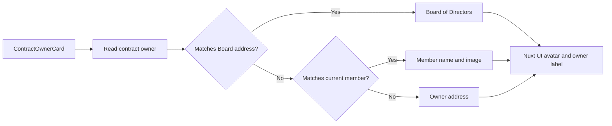

# Contract Owner Resolution — Implementation

**Scope:** Shared client-side resolution and presentation of the current owner for a company contract

**Last verified:** 2026-08-30

This capability resolves the contract's on-chain owner into a Board of Directors, a current company member, or an otherwise unknown address.
Product permissions and contract actions remain owned by their feature documentation.

## Consumers

- [Accounts](../../features/accounts/README.md) presents the current owner of Bank, Expense Account, and Cash Remuneration contracts.
- [Shareholder Management](../../features/shareholder-management/README.md) presents the current Investor owner.

## Runtime Model

## Invariants and Failure Behaviour

- The Board address takes precedence over a member lookup when both could identify the same address.
- A known current member retains the member name and image; an unknown owner falls back to the returned address.
- An image-less owner receives the avatar fallback rather than a fabricated profile image.
- A failed owner read does not report a resolved owner.

## Implementation Evidence

- [Shared owner-resolution card](../../../app/src/components/ui/ContractOwnerCard.vue)
- [Owner-resolution component tests](../../../app/src/components/ui/__tests__/ContractOwnerCard.spec.ts)

## Related Documentation

- [Accounts user journeys](../../features/accounts/README.md)
- [Shareholder Management user journeys](../../features/shareholder-management/README.md)
- [Implementation Documentation Guide](../../platform/implementation-documentation-guide.md)
