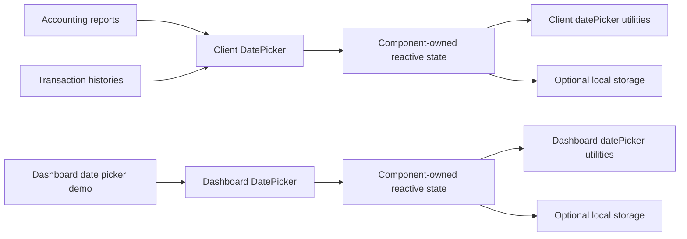

# Date Picker

**Scope:** Shared period and as-of-date selection for client accounting reports, transaction histories, and the matching dashboard
accounting picker.

**Last verified:** 2026-08-31

## Consumers

- [Accounting](../../features/accounting/README.md) uses direct date and range selection for its reports.
- [Accounts](../../features/accounts/README.md), [Community Credit](../../features/community-credit/README.md), and
  [Shareholder Management](../../features/shareholder-management/README.md) use the shared range picker directly in their transaction
  histories.
- The dashboard exposes its matching accounting picker on the public `/date-picker-demo` playground for QA and report integration.

## Runtime Model

## Invariants and Failure Behaviour

- The client and dashboard `DatePicker` components support a single as-of date and a start/end range without owning server or chain state.
- Each picker component owns the reactive selection, persistence, and interaction state used only to render that picker; its frontend-local
  `datePicker.ts` utility owns pure resolution and formatting rules.
- Transaction histories bind their `Range | undefined` filter model directly to `DatePicker` in `range` mode. Their existing storage keys
  and `data-test` selectors remain stable.
- A custom range is committed only when both boundaries exist and the start is not after the end.
- When persistence is configured, invalid stored JSON is ignored and the picker uses its default state.

## Implementation Evidence

**Implementation evidence reviewed against:** `88d98f8413b332376d860df979c963dae885d37f`

- [Client DatePicker](../../../app/src/components/ui/DatePicker.vue),
  [dashboard DatePicker](../../../dashboard/app/components/DatePicker.vue),
  [dashboard date picker demo](../../../dashboard/app/pages/date-picker-demo.vue), and
  [transaction-history filtering](../../../app/src/composables/transactions/useTransactionTable.ts)
- [Client date preset utilities](../../../app/src/utils/datePicker.ts) and
  [dashboard date preset utilities](../../../dashboard/app/utils/datePicker.ts)
- [Client picker behaviour tests](../../../app/src/components/ui/__tests__/DatePicker.spec.ts),
  [transaction-history filter tests](../../../app/src/composables/transactions/__tests__/useTransactionTable.spec.ts), and
  [date utility tests](../../../app/src/utils/__tests__/datePicker.spec.ts)

## Related Documentation

- [Client Navigation](../client-navigation/README.md) describes the feature entry points that host these controls.
