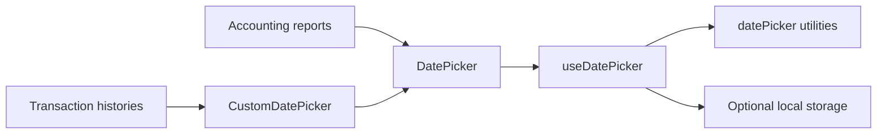

# Date Picker

**Scope:** Shared period and as-of-date selection for accounting reports and transaction histories.

**Last verified:** 2026-08-30

## Consumers

- [Accounting](../../features/accounting/README.md) uses direct date and range selection for its reports.
- [Accounts](../../features/accounts/README.md), [Community Credit](../../features/community-credit/README.md), and
  [Shareholder Management](../../features/shareholder-management/README.md) use the transaction-history range adapter.

## Runtime Model

## Invariants and Failure Behaviour

- `DatePicker` supports a single as-of date and a start/end range without owning server or chain state.
- `CustomDatePicker` preserves transaction-history callers' legacy `[start, end] | null` model while delegating range selection to
  `DatePicker`.
- A custom range is committed only when both boundaries exist and the start is not after the end.
- When persistence is configured, invalid stored JSON is ignored and the picker uses its default state.

## Implementation Evidence

- [Shared DatePicker](../../../app/src/components/ui/DatePicker.vue) and
  [transaction-history adapter](../../../app/src/components/ui/CustomDatePicker.vue)
- [Reactive selection state](../../../app/src/composables/useDatePicker.ts) and
  [date preset utilities](../../../app/src/utils/datePicker.ts)
- [Adapter behaviour tests](../../../app/src/components/ui/__tests__/CustomDatePicker.spec.ts) and
  [date utility tests](../../../app/src/utils/__tests__/datePicker.spec.ts)

## Related Documentation

- [Client Navigation](../client-navigation/README.md) describes the feature entry points that host these controls.
