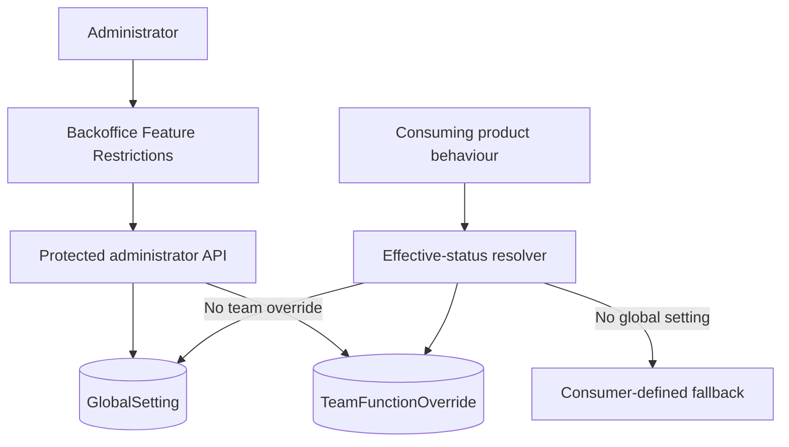

# Feature Flag Evaluation

**Scope:** Persisted global settings, team overrides, administrator APIs, and consuming feature
enforcement

**Last verified:** 2026-08-21

**Consumers:** [Feature Restrictions](../../features/backoffice/feature-restrictions/README.md) and
the Payroll claim-submission window

Feature Restrictions is the administrator-facing product capability. Feature Flag Evaluation is the
architectural capability that stores settings, resolves overrides, and supplies effective status to
consuming behaviour.

## Runtime Model

## Effective Status

Persisted status values are `enabled`, `disabled`, and `beta`. For a team-scoped lookup, the
resolver returns the team override first, then the global setting, then `null`. The consuming
feature owns the meaning of each status and the missing-setting fallback.

For the current `SUBMIT_RESTRICTION` consumer:

- `enabled` or a missing setting enforces the claim-submission window;
- `disabled` and `beta` leave submission unrestricted;
- enforcement runs on the backend, while the client mirrors the date guard for immediate feedback.

## Invariants

- Administrator CRUD routes require authentication and an administrator role.
- A team can have at most one override for a function name.
- Removing a global setting removes its team overrides.
- Backend feature enforcement remains authoritative; dashboard or client checks are presentation.
- Consumers must define explicit semantics for `beta` and the missing-setting fallback.

## Failure Behaviour

- Unknown features and teams return not-found responses.
- Duplicate features or team overrides return conflict responses.
- Invalid function names, statuses, team IDs, and payloads are rejected before mutation.
- Failed deletes do not report success.

## Implementation Evidence

- [Persistence models](../../../backend/prisma/schema.prisma)
- [Effective-status and persistence utilities](../../../backend/src/utils/featureUtils.ts)
- [Administrator feature controller](../../../backend/src/controllers/featureController.ts)
- [Administrator feature routes](../../../backend/src/routes/featureRoutes.ts)
- [Feature validation](../../../backend/src/validation/featureValidation.ts)
- [Feature utility tests](../../../backend/src/utils/__tests__/featureUtils.test.ts)
- [Feature controller tests](../../../backend/src/controllers/__tests__/featureController.test.ts)
- [Backoffice feature queries](../../../dashboard/app/queries/feature.query.ts)
- [Backoffice feature list](../../../dashboard/app/pages/features/index.vue)
- [Claim enforcement](../../../backend/src/controllers/claimController.ts)

## Related Documentation

- [Feature Restrictions User Stories](../../features/backoffice/feature-restrictions/README.md)
- [Backoffice Feature Inventory](../../features/backoffice/README.md)
- [RBAC implementation](../rbac/README.md)
- [Implementation Documentation Guide](../../platform/implementation-documentation-guide.md)
