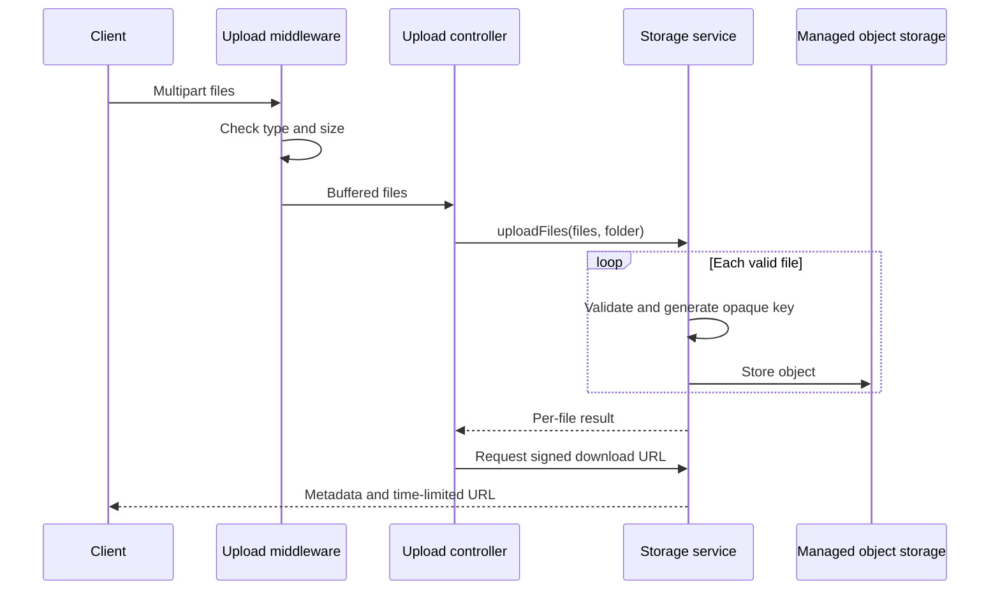

# File Storage

**Status:** Current

**Last verified:** 2026-09-09

**Scope:** Own the backend boundary for validating uploads, storing file objects, issuing time-limited download URLs, and refreshing or
deleting persisted attachment references. This capability does not own the product rules that decide when a profile image or claim
attachment may be changed.

## Consumers

- [User Profile](../../features/user-profile/README.md)
- [Payroll](../../features/payroll/README.md)
- Backend upload and storage routes

## Runtime Model

| Component          | Responsibility                                                                                   |
| ------------------ | ------------------------------------------------------------------------------------------------ |
| Upload middleware  | Buffers accepted files in memory and rejects unsupported MIME types or oversized files           |
| Upload controller  | Sends the request's file collection through the public batch-upload boundary                     |
| Storage service    | Validates each file, generates an opaque key, stores it, signs downloads, and deletes objects    |
| Attachment service | Refreshes stored URLs and performs best-effort cleanup without discarding legacy attachment data |

The single-file validation and upload steps are implementation details of `uploadFiles`. Tests exercise them through the public batch
boundary rather than expanding the production export surface.

## Main Flow

## Invariants and Failure Behaviour

- At most ten valid files are accepted by one `uploadFiles` call, and each file is checked against the shared type and size limits.
- Stored metadata contains the generated object key, MIME type, and size; the original filename is not used as the stored key.
- A storage upload failure becomes a per-file failure result rather than an unhandled exception.
- A failed attachment URL refresh preserves the original attachment entry.
- Attachment cleanup accepts legacy entries with only a non-empty object key and continues when an individual delete fails.
- Download URLs are time-limited and are generated from stored object keys.

## Known Gaps

- Attachment deletion is best-effort. A failed delete is logged, but there is no persisted retry queue or failure status for callers.

## Implementation Evidence

**Implementation evidence reviewed against:** `d00841d56e8b39d35226b80fb7cac3839aa6c058`

- [Upload route](../../../backend/src/routes/uploadRoute.ts) and [upload controller](../../../backend/src/controllers/uploadController.ts)
- [Upload middleware](../../../backend/src/utils/upload.ts) and [middleware tests](../../../backend/src/utils/__tests__/upload.test.ts)
- [Storage service](../../../backend/src/services/storageService.ts) and
  [storage tests](../../../backend/src/services/__tests__/storageService.test.ts)
- [Attachment service](../../../backend/src/services/attachmentService.ts) and
  [attachment tests](../../../backend/src/services/__tests__/attachmentService.test.ts)

## Related Documentation

- [Request Validation](../request-validation/README.md)
- [User Profile](../../features/user-profile/README.md)
- [Payroll](../../features/payroll/README.md)
- [Architectural Capability Inventory](../README.md)
