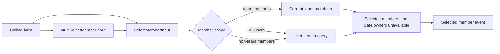

# Member Selection — Implementation

**Scope:** The shared client-side selection of one or more users across team setup, member administration, elections, Safe signers,
ownership transfers, and Vesting beneficiaries

**Last verified:** 2026-08-30

This capability provides the common selection behaviour used by several product journeys. Product permissions and outcomes remain owned by
their feature documentation; this document owns only the shared selection boundary.

## Consumers

- [Contract Management](../../features/contract-management/README.md) uses it when an owner selects a member as a contract owner.
- [Vesting](../../features/vesting/README.md) uses it when an owner selects a schedule beneficiary.
- Team setup, member administration, Board elections, and Safe signer changes use the same selection boundary in their respective forms.

## Runtime Model

## Invariants and Failure Behaviour

- A caller chooses one named scope: all users, current team members, or users who are not already team members. It cannot combine
  conflicting team restrictions.
- A user already selected in a multi-select field is not offered again.
- A current team member cannot be selected when the scope excludes team members.
- A current Safe owner cannot be selected as a new signer.
- Team-member scope reads the current team members; the other scopes use the user-search query.
- The Contract Management ownership-transfer consumer keeps Board-approval information separate from the selected-member scope, so the
  approval route never changes who is eligible for selection.

## Implementation Evidence

- [Shared multi-selection control](../../../app/src/components/utils/MultiSelectMemberInput.vue)
- [Single-member search and selection control](../../../app/src/components/utils/SelectMemberInput.vue)
- [Selection scope type](../../../app/src/types/member.ts)
- [Team setup consumer](../../../app/src/components/forms/AddTeamForm.vue)
- [Team member administration consumer](../../../app/src/components/sections/DashboardView/forms/AddMemberForm.vue)
- [Election candidate consumer](../../../app/src/components/sections/AdministrationView/forms/CreateElectionForm.vue)
- [Safe signer consumer](../../../app/src/components/sections/SafeView/forms/AddSignerModal.vue)
- [Contract ownership recipient consumer](../../../app/src/components/sections/ContractManagementView/forms/TransferOwnershipForm.vue)
- [Vesting beneficiary consumer](../../../app/src/components/sections/VestingView/forms/VestingGrantDetails.vue)
- [Selection scope behaviour tests](../../../app/src/components/utils/__tests__/SelectMemberInput.spec.ts)
- [Multi-selection behaviour tests](../../../app/src/components/utils/__tests__/MultiSelectMemberInput.spec.ts)

## Related Documentation

- [Contract Management user journeys](../../features/contract-management/README.md)
- [Vesting user journeys](../../features/vesting/README.md)
- [Implementation Documentation Guide](../../platform/implementation-documentation-guide.md)
