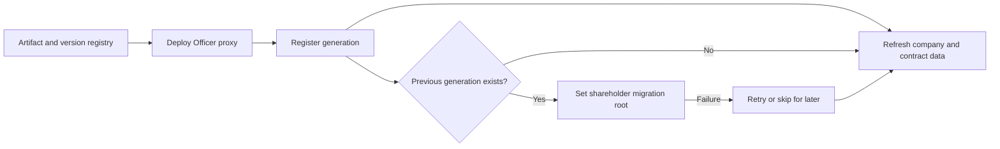

# Officer Generation Lifecycle

**Status:** Current

**Last verified:** 2026-09-23

**Scope:** Resolve contract generations, deploy and register a replacement Officer, retain prior generations, and recover the optional
shareholder-migration step.

The company-member journey remains in [Contract Management](../../features/contract-management/README.md). Officer and proxy invariants
remain in the [Officer](../../contracts/features/officer/README.md) and [Infrastructure](../../contracts/features/infrastructure/README.md)
contract documents.

## Consumers

- [Companies](../../features/companies/README.md) consumes the initial Officer deployment and registration flow.
- [Contract Management](../../features/contract-management/README.md) consumes version resolution, replacement deployment, generation
  history, legacy recovery, and shareholder-migration recovery.
- Backoffice Officer-version synchronization consumes the same registry and generation vocabulary.

## Runtime Model

## Invariants and Failure Behaviour

- Version resolution prefers the company payload, then a known beacon generation, then the current registry version.
- Deployment records the emitted proxy address and deployment block before backend registration.
- The previous Officer generation and contracts remain queryable after a replacement is registered.
- Deployment, registration, workflow lookup, and shareholder migration remain distinct failure stages.
- Failed shareholder migration retains the addresses required for retry; skipping clears pending recovery and refreshes current data.

## Known Gaps

- Shareholder migration can remain pending after the replacement Officer is registered; the dedicated recovery path is required to complete
  or deliberately skip that step.

## Implementation Evidence

**Implementation evidence reviewed against:** `272d6bd8d455cf09e681192f3b9c6c284b63b4fa`

- [Artifact registry tests](../../../app/src/artifacts/__tests__/registry.spec.ts) and
  [contract-version tests](../../../app/src/composables/contracts/__tests__/useContractVersion.spec.ts)
- [Officer deployment tests](../../../app/src/composables/contracts/__tests__/useOfficerDeployment.spec.ts),
  [redeploy workflow tests](../../../app/src/composables/contracts/__tests__/useOfficerRedeploy.spec.ts), and
  [migration recovery tests](../../../app/src/composables/contracts/__tests__/useOfficerRedeploy.retry.spec.ts)
- [Shareholder-migration orchestration tests](../../../app/src/composables/investor/__tests__/useShareholderMigration.spec.ts),
  [migration API tests](../../../backend/src/controllers/__tests__/investorMigrationController.test.ts),
  [Merkle parity tests](../../../backend/src/services/__tests__/merkleParity.test.ts), and
  [Merkle snapshot tests](../../../backend/src/services/__tests__/merkleSnapshotService.test.ts)
- [Officer address-read tests](../../../app/src/composables/officer/__tests__/reads.spec.ts),
  [contract-query tests](../../../app/src/queries/__tests__/contract.queries.spec.ts),
  [contract API tests](../../../backend/src/controllers/__tests__/contractController.test.ts), and
  [pending-action API tests](../../../backend/src/controllers/__tests__/actionController.test.ts)
- [Legacy cash-out generation tests](../../../app/src/composables/cashOut/__tests__/legacyGeneration.spec.ts),
  [Safe infrastructure selection tests](../../../app/src/constant/__tests__/safeInfra.test.ts), and
  [Safe transaction-service registration tests](../../../app/src/types/__tests__/safe.spec.ts)
- [Factory beacon tests](../../../contract/test/FactoryBeacon.spec.ts),
  [Officer deployment tests](../../../contract/test/Officer.deployments.spec.ts),
  [Officer behavior tests](../../../contract/test/Officer.spec.ts),
  [Officer upgrade tests](../../../contract/test/OfficerUpgradeModule.spec.ts), [proposal tests](../../../contract/test/Proposals.spec.ts),
  and [Safe infrastructure tests](../../../contract/test/SafeInfraDeployment.spec.ts)
- [Officer subgraph tests](../../../the-graph/tests/officer.test.ts)

## Related Documentation

- [Contract Management](../../features/contract-management/README.md)
- [Contract Event Feeds](../contract-event-feeds/README.md)
