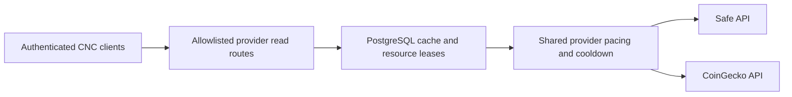

# Provider Read Coordination

**Scope:** Backend-mediated public Safe and CoinGecko reads, shared persistent caching and provider pacing.

**Last verified:** 2026-10-08

## Consumers

Safe account reads, Accounting historical rates, and the shared client currency store consume this capability. Signed proposals,
confirmations and on-chain execution retain their existing signing boundaries. Asset discovery remains separate from provider transport.

## Runtime Model

## Invariants and Failure Behaviour

- GET resources are constructed from fixed provider origins and validated network, path and query identities. Client URLs cannot select an
  arbitrary upstream host. Provider pagination stays on the exact original resource; redirects are rejected.
- API keys are backend environment variables. Requests use the CNC authentication boundary and a per-user request limit.
- PostgreSQL cache leases share identical work across processes. Provider leases serialize upstream requests and enforce a configurable
  minimum start interval. Cold histories have bounded scan size and time; failures never publish a partial snapshot.
- A 429 pauses that provider across instances. Retry-After controls the pause when present; a monthly-quota response uses its reset delay
  when supplied. Reads waiting too long return an explicit retryable status. These mechanisms do not automatically replay writes.
- Transfer and executed-transaction histories persist complete snapshots. Routine synchronization replaces an overlapping 24-hour window;
  the first active read after 24 hours performs full reconciliation. Delayed indexing outside the overlap is recovered by that scan. Each
  scan freezes its upper date bound and verifies page counts. Watermarks advance only after every page succeeds, and records deduplicate by
  transferId or safeTxHash. Sliding-window page bodies are not retained alongside the complete snapshot.
- Current market prices are requested by deduplicated provider IDs in a batch and cached for 60 seconds. Historical positive USD prices
  persist by coin ID and UTC date and never fall back to current prices. Failed prices remain unavailable. Contract lookup misses use a
  bounded negative cache rather than becoming permanent exclusions.
- The frontend suppresses layered Axios/TanStack retries for these routes, bounds provider requests, disables focus/reconnect refresh, and
  pauses periodic work while hidden. Existing query-cache identities remain authoritative for client state.
- Two Safe read lanes keep live information available during a history backfill; market requests are serialized. The shared currency query
  waits for the authenticated session. Missing optional profiles are outside this provider boundary.
- Completed Safe operations invalidate the matching server cache before client invalidation. A cache-refresh failure cannot convert a
  completed wallet operation into a failed write. Transaction detail invalidation is scoped to the Safe identified by its cached response.
- Administrator-only `GET /api/external/metrics` exposes persisted upstream-request and 429 counters plus pacing/cooldown timestamps. Keys,
  URLs and resource lease tokens are not returned.

## Configuration and rollout

Deploy the backend and apply the provider coordination database migration before deploying the client read transport. Configure SAFE_API_KEY
and the appropriate CoinGecko key/tier in backend environment variables. Default provider intervals are conservative; tune them to the
authenticated plan and monitor upstream 429s and data age. Coordination fails closed when the database is unavailable; there is no uncapped
direct-provider fallback.

## Implementation Evidence

**Implementation evidence reviewed against:** `db8d14389e87181b2f727f1fcdb02096ad0cd65f`

- [Backend provider services](../../../backend/src/services/providerReads/)
- [Provider read routes](../../../backend/src/routes/providerReadRoutes.ts)
- [Persistent coordination models](../../../backend/prisma/schema.prisma)
- [Provider coordination migration](../../../backend/prisma/migrations/20261007150000_provider_read_coordination/)
- [Client read transport](../../../app/src/lib/providerReads.ts)
- [Client HTTP retry boundary](../../../app/src/lib/axios.ts)
- [Batched market query](../../../app/src/queries/marketPrice.queries.ts)
- [Currency-store consumer](../../../app/src/stores/currencyStore.ts)
- [Backend route registration](../../../backend/src/config/serverConfig.ts)
- [Shared provider tests](../../../backend/src/services/providerReads/__tests__/gateway.test.ts)
- [Real PostgreSQL migration and multi-client proof](../../../backend/src/services/providerReads/__tests__/prismaStore.integration.test.ts)
- [Authenticated route proof](../../../backend/src/routes/__tests__/providerReadRoutes.test.ts)
- [Client queue and cooldown proof](../../../app/src/lib/__tests__/providerReads.spec.ts)

## Related Documentation

- [Client Data Access](../client-data-access/README.md)
- [Accounting Read Model](../accounting-read-model/README.md)
- [Accounts](../../features/accounts/README.md)
