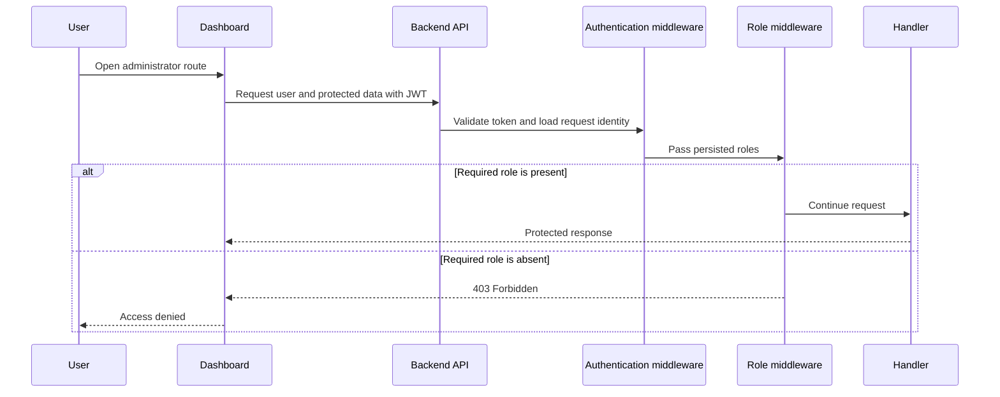

# Role-Based Access Control

**Scope:** Shared backend and dashboard authorization based on persisted user roles

**Last verified:** 2026-08-21

**Consumers:** [Backoffice features](../../features/backoffice/README.md) and every backend route protected by an
administrator role

RBAC is an architectural capability, not a product feature. It decides whether an authenticated request or dashboard
session may enter an administrator-only surface.

## Runtime Model

The persisted role set uses three values: `ROLE_USER`, `ROLE_ADMIN`, and `ROLE_SUPER_ADMIN`. New users receive
`ROLE_USER`. The shared role utilities model administrator and super-administrator inheritance, while backend middleware
remains the enforcement boundary.

## Invariants

- Backend middleware is the security boundary; dashboard checks only control navigation and presentation.
- `requireAdmin` accepts either `ROLE_ADMIN` or `ROLE_SUPER_ADMIN`.
- `requireSuperAdmin` accepts only `ROLE_SUPER_ADMIN`.
- Role middleware must run after authentication has populated `req.user.roles`.
- A missing role set denies protected access.

## Failure Behaviour and Known Gap

- Missing or insufficient roles return `403 Forbidden`.
- The dashboard redirects authenticated non-administrators to `/access-denied`.
- `requireAllRoles` currently calls `hasAnyRole`, so it accepts one matching role rather than all requested roles. No
  production route currently calls this helper, but it must not be used as an all-roles guarantee until corrected.

## Implementation Evidence

- [Role definitions and hierarchy](../../../backend/src/types/roles.ts)
- [Backend role utilities](../../../backend/src/utils/roleUtils.ts)
- [Backend role middleware](../../../backend/src/middleware/roleMiddleware.ts)
- [Authentication middleware](../../../backend/src/middleware/authMiddleware.ts)
- [Backend middleware tests](../../../backend/src/middleware/__tests__/authMiddleware.test.ts)
- [Dashboard role store](../../../dashboard/app/stores/useRoleStore.ts)
- [Dashboard route guard](../../../dashboard/app/middleware/auth.global.ts)

## Related Documentation

- [Authentication implementation](../authentication/README.md)
- [Backoffice Feature Inventory](../../features/backoffice/README.md)
- [Security Standards](../../platform/security.md)
- [Implementation Documentation Guide](../../platform/implementation-documentation-guide.md)
