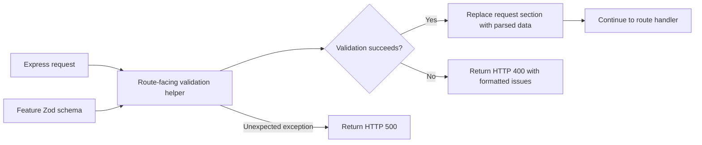

# Request Validation

**Status:** Current

**Last verified:** 2026-09-09

**Scope:** Own the backend middleware boundary that applies Zod schemas to Express request bodies, query parameters, and path parameters.
Feature-specific field rules remain with their feature schemas and feature documentation.

## Consumers

- Backend API routes
- [Authentication](../../features/authentication/README.md)
- [User Profile](../../features/user-profile/README.md)
- [Payroll](../../features/payroll/README.md)
- [Accounting](../../features/accounting/README.md)

## Runtime Model

| Component                  | Responsibility                                                                    |
| -------------------------- | --------------------------------------------------------------------------------- |
| Feature schema             | Defines accepted values, coercions, defaults, and field-level business rules      |
| Focused middleware helper  | Selects the request sections required by a route                                  |
| Internal validator         | Parses each selected section, replaces it with parsed data, and formats failures  |
| Combined request validator | Parses `{ params, query, body }` together when rules cross request-section bounds |

Only route-facing helpers are exported. The generic validator remains private so tests and consumers use the same boundaries as production
routes.

## Main Flow

## Invariants and Failure Behaviour

- Route handlers receive parsed values after successful validation, including schema coercions and defaults.
- Invalid body, query, or path data returns HTTP 400 and does not invoke the next handler.
- Cross-section rules use `validateRequest`; independent sections use the smallest focused helper needed by the route.
- Unexpected validator exceptions are logged and converted to HTTP 500 responses.
- Tests exercise the exported route-facing helpers rather than exporting internal factories for test access.

## Known Gaps

- Validation failures are returned as one formatted message; the API does not expose a structured per-field error payload.

## Implementation Evidence

**Implementation evidence reviewed against:** `d00841d56e8b39d35226b80fb7cac3839aa6c058`

- [Validation middleware](../../../backend/src/validation/middleware/validate.ts) and
  [middleware tests](../../../backend/src/validation/middleware/__tests__/validate.test.ts)
- [Validation registry](../../../backend/src/validation/index.ts)
- [Representative user schema](../../../backend/src/validation/schemas/user.ts) and
  [user-schema tests](../../../backend/src/validation/schemas/__tests__/user.test.ts)
- [Representative claim schema](../../../backend/src/validation/schemas/claim.ts) and
  [claim-schema tests](../../../backend/src/validation/__tests__/claim.test.ts)

## Related Documentation

- [Backend Zod validation guide](../../../backend/docs/zod-validation-guide.md)
- [File Storage](../file-storage/README.md)
- [Architectural Capability Inventory](../README.md)
