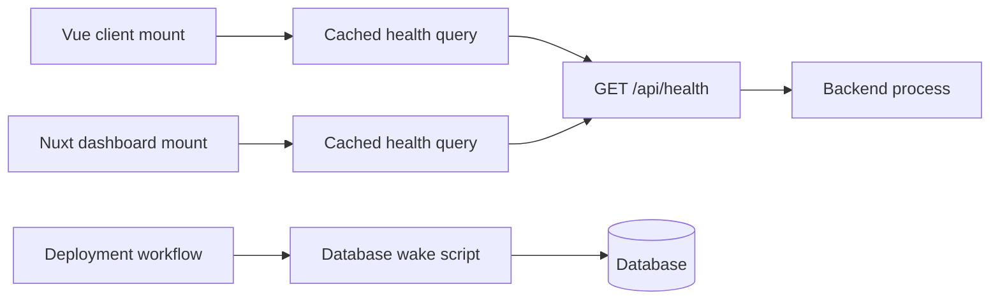

# Runtime Wake-Up

**Scope:** Non-blocking frontend health pings and deployment-time database readiness

**Last verified:** 2026-08-21

**Consumers:** The Vue client, Nuxt dashboard, backend deployment workflow, and every journey that depends on the backend being responsive
after an idle period

Runtime wake-up is a performance and deployment capability, not a product feature. It reduces the impact of idle service startup without
changing whether a user action succeeds.

## Runtime Model

The public health endpoint reports backend process availability and intentionally performs no database query. Database readiness is handled
separately by a deployment script that connects, executes a minimal query, retries failures, and exits non-zero after the retry budget is
exhausted.

## Invariants

- Frontend wake-up is non-blocking and never gates page rendering.
- Client and dashboard queries cache the result for three minutes and do not poll automatically.
- Frontend failures are logged at debug level and remain non-critical.
- The health endpoint exposes service status without database internals.
- Deployment-time database wake-up disconnects between failed attempts to avoid connection leaks.

## Failure Behaviour

- A failed frontend ping is silently tolerated; the first real API request retains its normal error and retry behaviour.
- The dashboard health request aborts after five seconds and retries twice.
- The database wake script retries ten times with a three-second delay, then terminates the deployment step with a failure.

## Implementation Evidence

- [Client wake composable](../../../app/src/composables/useBackendWake.ts)
- [Client health query](../../../app/src/queries/health.queries.ts)
- [Client app integration](../../../app/src/App.vue)
- [Client wake tests](../../../app/src/composables/__tests__/useBackendWake.spec.ts)
- [Dashboard wake composable](../../../dashboard/app/composables/useBackendWake.ts)
- [Dashboard app integration](../../../dashboard/app/app.vue)
- [Health controller](../../../backend/src/controllers/healthController.ts)
- [Health route](../../../backend/src/routes/healthRoutes.ts)
- [Database wake script](../../../backend/scripts/wake-db.ts)

## Related Documentation

- [Architecture Overview](../../platform/architecture.md)
- [Deployment Guide](../../platform/deployment.md)
- [Performance Standards](../../platform/performance.md)
- [Implementation Documentation Guide](../../platform/implementation-documentation-guide.md)
