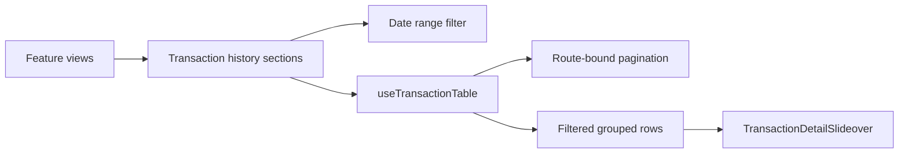

# Transaction History

**Scope:** Shared client-side filtering, pagination, and transaction-detail presentation for account, credit, and shareholder histories.

**Last verified:** 2026-08-30

## Consumers

- [Accounts](../../features/accounts/README.md) uses Bank, Expense Account, and Cash Remuneration transaction histories.
- [Community Credit](../../features/community-credit/README.md) uses the Credit Account transaction history.
- [Shareholder Management](../../features/shareholder-management/README.md) uses investor transaction history.
- [Payment Gate](../../features/payment-gate/README.md) reuses the transaction-detail slide-over for payment history.

## Runtime Model

## Invariants and Failure Behaviour

- History sections retain ownership of their query data; `useTransactionTable` only derives filtered, grouped, and paginated rows.
- A date or type-filter change resets the page and collapses expanded rows without reacting to query refreshes.
- A selected row opens its detail in `TransactionDetailSlideover`; closing it does not alter the applied filters.
- Date-range selection is documented by the [Date Picker capability](../date-picker/README.md).

## Implementation Evidence

- [Shared table state](../../../app/src/composables/transactions/useTransactionTable.ts)
- [Bank history](../../../app/src/components/sections/BankView/BankTransactions.vue),
  [Expense Account history](../../../app/src/components/sections/ExpenseAccountView/ExpenseTransactions.vue), and
  [Cash Remuneration history](../../../app/src/components/sections/CashRemunerationView/CashRemunerationTransactions.vue)
- [Credit Account history](../../../app/src/components/sections/CommunityCreditView/CreditAccountTransactions.vue) and
  [investor history](../../../app/src/components/sections/SherTokenView/InvestorsTransactions.vue)
- [Shared transaction detail slide-over](../../../app/src/components/ui/TransactionDetailSlideover.vue)

## Related Documentation

- [Date Picker](../date-picker/README.md)
- [Client Navigation](../client-navigation/README.md)
