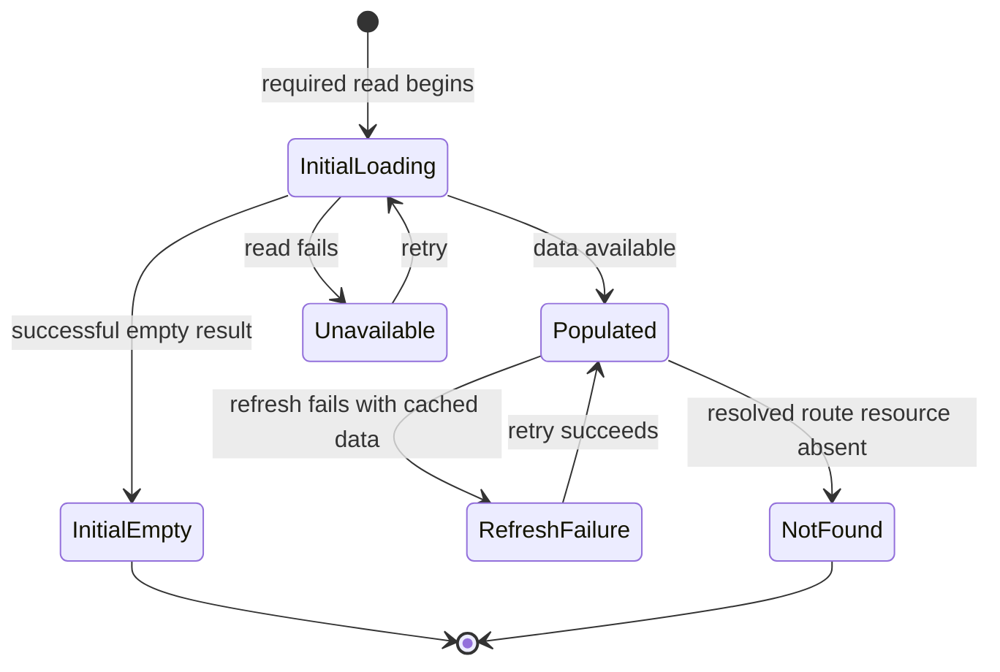

# Async UI State Framework

**Status:** Current standard

Async data is not either "loaded" or "not loaded." Every CNC surface that reads remote, indexed, or on-chain data must make the outcome
understandable and give the member an appropriate next step.

## State Model

| State                     | Meaning                                                                                     | Expected interface response                                                                                    |
| ------------------------- | ------------------------------------------------------------------------------------------- | -------------------------------------------------------------------------------------------------------------- |
| Initial loading           | The first required read has not settled.                                                    | Reserve the final layout with a skeleton and expose a polite loading status.                                   |
| Populated                 | The required data is available.                                                             | Show the usable content and its relevant actions.                                                              |
| Initial empty             | A successful read returned no records.                                                      | Explain what is absent and, when appropriate, offer the first meaningful action.                               |
| Filtered empty            | A local filter excludes otherwise available records.                                        | Preserve filters and offer an explicit reset or adjustment.                                                    |
| Unavailable               | The required read failed before usable data was available.                                  | Explain the impact, preserve route and input context, and offer a retry.                                       |
| Refresh failure           | Previously usable data remains while a newer read fails.                                    | Keep the last known data, mark it as potentially stale, and offer a targeted retry.                            |
| Not found                 | A required read settled successfully but the requested route resource is absent.            | Explain that the link or resource is unavailable and offer a safe return route; do not redirect automatically. |
| Restricted or disabled    | The data is valid but the member cannot proceed because of role, network, or product rules. | State the prerequisite or restriction without presenting an action that is guaranteed to fail.                 |
| Pending action            | A member initiated a mutation or wallet action.                                             | Lock only the affected action, show progress, and retain the surrounding context.                              |
| Action success or failure | A mutation settled.                                                                         | Confirm the resulting state or provide a recoverable error while keeping the member's input where safe.        |

An empty result is evidence only after the associated read succeeds. A failed read must never be converted to an empty list, an absent route
resource, or a silent redirect.

## Presentation Hierarchy

Choose the smallest scope that accurately contains the failed dependency:

1. Use a page state when the primary task cannot start without the data.
2. Use a section or card state when unrelated page content remains useful.
3. Use an inline state for a field, table row, or local filter result.
4. Use an action-level state for mutations; it must not replace already usable page data.

On a refresh failure, retain previously rendered information and place a visible warning close to the affected decision. Do not erase
working content merely because a newer request failed.

## Decision Path

The route layer determines whether a resolved result is not found. Query and composable layers keep the distinction between a successful
empty result and a rejected read intact.

## Recovery and Accessibility

- Retry the affected query or operation, not the whole application. It must retain the current company, route, filters, and safe form input.
- Use concrete labels such as `Try again`, `Clear filters`, or `Back to all rounds`; do not rely on an icon alone.
- Announce initial loading with a concise polite status. Use an alert for blocking errors and include both the consequence and recovery.
- Skeletons preserve layout but are not sufficient status text for assistive technology.
- Do not use colour as the sole distinction between normal, warning, and error states. Pair it with an icon and text.
- Keep focus stable for background refreshes. When a blocking error replaces the task, ensure its heading and retry control have a
  predictable keyboard path.

## Ownership Boundaries

- Queries and composables own fetch, cache, and error semantics. A failed source read must reject so consumers can distinguish it from a
  confirmed empty result.
- Routes and stores map query results to a task-specific state, including not found and prerequisites.
- Components render the state declaratively. They do not duplicate server data into mutable local state solely to model loading or errors.
- Mutations own their pending, success, and failure state. After success, invalidate or refetch the smallest relevant query set.

## Review Checklist

- Is there a distinct initial loading, confirmed empty, unavailable, and populated outcome?
- Does a route resource that is absent after a successful read avoid an automatic redirect?
- Does each unavailable outcome name the impact and provide a scoped recovery action?
- If cached data exists, is a failed refresh visible without erasing that data?
- Do filter-empty states preserve the active filters and offer a way to recover?
- Are loading, error, and action states usable by keyboard and understandable without colour alone?
- Do tests cover the state transition that could otherwise confuse failure with absence?
