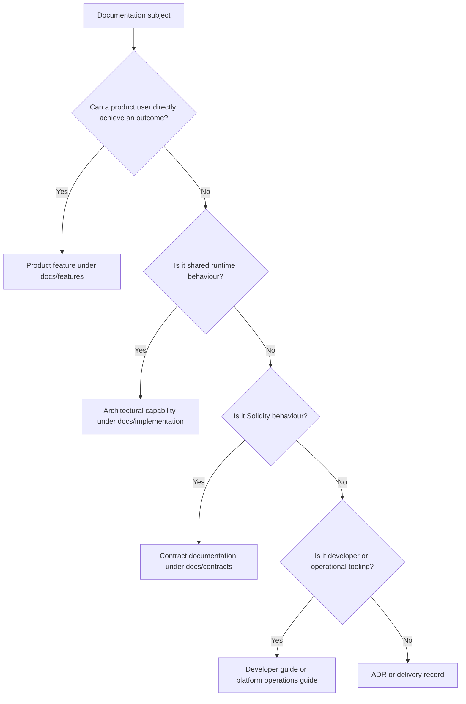

# Implementation Documentation Guide

**Status:** Current

**Last updated:** 2026-08-30

**Purpose:** Define where CNC Portal architectural capabilities live and how their current runtime behaviour is documented

## Purpose

`docs/features/` describes goals that a product user can achieve. `docs/implementation/` describes the architectural capabilities that make
those journeys possible. An architectural capability is a shared runtime guarantee, boundary, or mechanism; it is not a product feature
merely because the implementation calls it a feature.

Current implementation documentation explains what the system does now. Durable technical choices and their trade-offs belong in
[Architecture Decision Records](../adr/README.md), while active delivery plans belong in tracking issues. Exact interfaces remain in their
generated or executable owner, and code and tests remain the final proof.

## Classification Rule



A subject can have both a product and an architectural facet. In that case, split it into two linked documents:

- the feature README owns actors, journeys, user stories, and human acceptance;
- the implementation README owns components, runtime flow, invariants, failure paths, and evidence.

Do not copy the same lifecycle or rules into both places. Each document summarizes the other facet in one sentence and links to its
canonical owner.

## Documentation Ownership

| Information                                      | Canonical owner                                |
| ------------------------------------------------ | ---------------------------------------------- |
| Product intent, stories, and acceptance criteria | `docs/features/<feature>/README.md`            |
| Current shared runtime behaviour                 | `docs/implementation/<capability>/README.md`   |
| Feature-specific detail used by one journey      | A focused file beside the feature README       |
| Smart-contract behaviour                         | `docs/contracts/features/<contract>/README.md` |
| Development tooling and local workflows          | `docs/development-guide/`                      |
| Platform-wide engineering standards              | `docs/platform/`                               |
| Decisions and trade-offs                         | [`docs/adr/`](../adr/README.md)                |
| Exact HTTP or contract interfaces                | OpenAPI, ABI artifacts, and current source     |
| Executable proof                                 | Current code and tests                         |
| Active delivery and history                      | GitHub issues, pull requests, and Git          |

`docs/platform/architecture.md` remains the compact system map. It links to capability documents rather than duplicating their runtime
details.

## Capability Location and Structure

Create one directory per architectural capability:

```text
docs/implementation/<kebab-case-capability>/
├── README.md
└── details.md
```

Only add `details.md` when the verified runtime map, invariants, failures, or evidence would make the README difficult to scan. Existing
specialised filenames may remain when they have a clear audience and the README routes readers to them.

### Required README Content

1. **Title and scope** — name the system guarantee and its boundaries.
2. **Last verified** — record the date on which the current code and tests were inspected.
3. **Consumers** — link every product feature or subsystem that depends on the capability.
4. **Runtime model** — show components and responsibility boundaries.
5. **Main flow** — use Mermaid when sequence, state, hierarchy, or branching matters.
6. **Invariants and failure behaviour** — state what must remain true and what happens on failure.
7. **Known gaps** — record only gaps verified in the current implementation.
8. **Implementation evidence and revision** — link the smallest useful set of current code and tests, then record the full immutable SHA
   reviewed in the form `**Implementation evidence reviewed against:** \`<full commit SHA>\``.
9. **Related documentation** — link feature, contract, platform, or development owners.

Implementation documents do not contain product user stories, acceptance checkboxes, priorities, or `✅ Done` status. Those semantics belong
to feature review. `Last verified` records the human inspection date; the implementation-evidence SHA is a technical attestation of the
source revision inspected. It does not communicate a release version or replace human review.

## Current Behaviour and History

- Describe only behaviour verified against the current branch.
- After reviewing changed evidence, update the implementation-evidence SHA to the exact source revision inspected. Do not add delivery
  history or review prose when the current capability description is unchanged.
- Put durable proposed behaviour, migration choices, and their trade-offs in an ADR; keep active delivery plans in GitHub issues.
- Keep historical explanations in Git, issues, pull requests, or explicitly labelled historical references.
- Do not infer runtime correctness from an old completion status, branch name, or test count.
- Link exact payloads and function signatures to OpenAPI, ABIs, or source instead of copying them.

## Diagrams

Follow the [Mermaid-only diagram rule](./feature-specification-guide.md#diagram-format). Choose the diagram from the question:

- `flowchart` for context, dependencies, and responsibility boundaries;
- `sequenceDiagram` for runtime calls and failure propagation;
- `stateDiagram-v2` for lifecycle and state transitions;
- `erDiagram` for persisted relationships;
- `classDiagram` only when object structure is the subject.

## Change Process

1. Classify the subject before choosing its directory.
2. Inspect current runtime entry points, boundaries, failure handling, and representative tests.
3. Split product and architectural facets when both exist.
4. Write the compact capability README and add details only when needed.
5. Update `docs/implementation/README.md` and every affected feature or platform backlink.
6. Preserve delivery history outside the current-behaviour document.
7. Follow the [Documentation Freshness Policy](./documentation-freshness-policy.md): commit the runtime source, review every owning document
   against that revision, and refresh its implementation-evidence attestation in the same pull request.
8. Run the repository documentation validations.

## Review Checklist

- [ ] The subject is an architectural capability rather than a direct product outcome.
- [ ] Product and architectural ownership are split and cross-linked when both exist.
- [ ] The document describes verified current behaviour, not planned or historical behaviour.
- [ ] Boundaries, consumers, invariants, failures, and known gaps are explicit.
- [ ] Evidence links resolve to current code or tests.
- [ ] The implementation-evidence SHA identifies the reviewed source revision.
- [ ] Exact interfaces are linked rather than duplicated.
- [ ] Every diagram is purposeful and implemented in Mermaid.
- [ ] The implementation inventory and affected feature indexes are current.

## Validation

```bash
npm run test:docs-freshness
npm run lint:docs-freshness
npm run lint:md
npm run format:md:check
bash scripts/audit-doc-drift.sh
git diff --check
```
