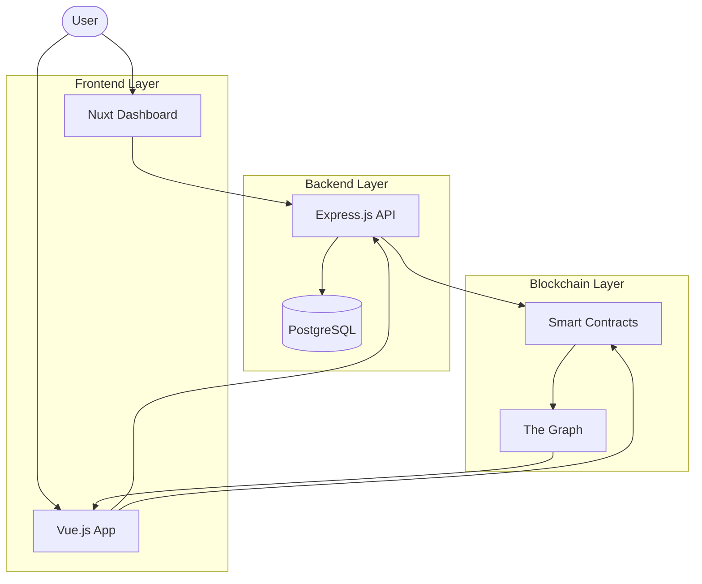

# Step 8: Add Architecture Diagrams

**Priority**: MEDIUM  
**Estimated Time**: 1-2 hours  
**Impact**: Enhances visual understanding of system architecture

## Problem

The platform documentation (especially architecture.md) mentions diagrams and architecture overviews but may lack actual visual diagrams. Visual representations help developers understand the system structure more quickly than text descriptions.

## Solution

Create or enhance visual diagrams for key architectural concepts using Mermaid (markdown-compatible) or include links to external diagrams.

## AI Prompt

```
I need to add or improve visual diagrams in the CNC Portal architecture documentation.

Context:
- Main architecture file: /Users/test/Documents/data/gc/cnc-portal/docs/platform/architecture.md
- CNC Portal has 4 main components: Dashboard (Nuxt), Frontend App (Vue), Backend API (Express), Smart Contracts (Hardhat), Subgraph (The Graph)
- Uses PostgreSQL database, JWT + SIWE authentication
- Multi-tier architecture with Web3 integration

Please add Mermaid diagrams for:

1. **System Architecture Diagram**: High-level overview showing all components and how they connect
   - Dashboard (Nuxt 3)
   - Frontend App (Vue 3)
   - Backend API (Express.js)
   - PostgreSQL Database
   - Smart Contracts (Ethereum)
   - The Graph Subgraph
   - User interactions

2. **Authentication Flow Diagram**: Visual representation of SIWE + JWT authentication
   - User wallet connection
   - SIWE message signing
   - JWT token generation
   - Request authentication
   - Token refresh flow

3. **Data Flow Diagram**: How data moves through the system
   - User actions
   - API requests
   - Database operations
   - Smart contract interactions
   - Blockchain events
   - Subgraph indexing

4. **Deployment Architecture**: Production deployment structure
   - Frontend hosting
   - API server
   - Database
   - Smart contracts on blockchain
   - CDN/Load balancing

Add these diagrams to /docs/platform/architecture.md in appropriate sections.

Use Mermaid syntax (supported by GitHub and many markdown viewers):

\`\`\`mermaid
graph TD
    A[Component A] --> B[Component B]
    B --> C[Component C]
\`\`\`

Guidelines:
- Keep diagrams clean and readable
- Use consistent color coding if possible
- Add legends where helpful
- Include brief explanations before each diagram
- Ensure diagrams are referenced in the text

Please show me the proposed diagrams before adding them to the file.
```

## Example Mermaid Diagram

Here's an example of what a system architecture diagram might look like:



## Verification

After completion, verify:

```bash
# Check if diagrams were added to architecture.md
grep -c "```mermaid" /Users/test/Documents/data/gc/cnc-portal/docs/platform/architecture.md
# Should show 3-4 mermaid diagrams

# View the diagrams
# Open the file in VS Code with Mermaid preview extension, or
# View on GitHub where Mermaid renders automatically
```

## Manual Verification

1. Open `/docs/platform/architecture.md` in VS Code or push to GitHub
2. Verify Mermaid diagrams render correctly
3. Check that diagrams are clear and informative
4. Ensure text explanations accompany diagrams

## Optional Enhancements

If time permits, consider adding diagrams to other files:

- `/docs/platform/security.md` - Security architecture diagram
- `/docs/features/stats/functional-specification.md` - Stats data flow
- `/docs/platform/deployment.md` - Deployment pipeline diagram

## Expected Result

- 3-4 Mermaid diagrams added to architecture.md
- Clear visual representation of system architecture
- Authentication flow visually explained
- Data flow diagram showing component interactions
- Deployment architecture illustrated
- All diagrams render correctly in markdown viewers

## Next Step

After completing this step, proceed to `09-future-enhancements.md`
